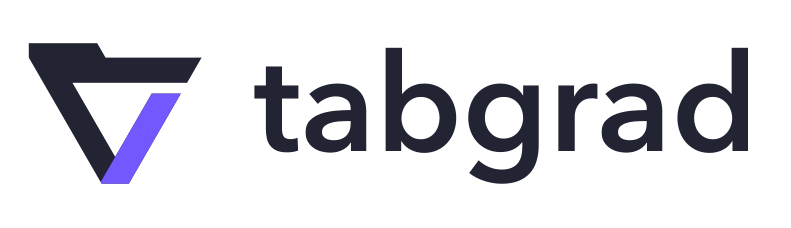

# Tabgrad brand assets

Use these assets when presenting or referring to Tabgrad. The symbol combines
a browser-tab detail with an open nabla; the horizontal logo pairs it with the
lowercase wordmark. Tabgrad's public purpose is defined in the
[root README](../../README.md).

<picture>
  <source media="(prefers-color-scheme: dark)" srcset="tabgrad-logo-dark.svg">
  
</picture>

## Choose an asset

All files are SVG vector artwork with transparent backgrounds. They contain
their own shapes and need no installed fonts, scripts or external images.

| Asset | Use |
| --- | --- |
| [Horizontal logo](tabgrad-logo.svg) | Default logo on white or light backgrounds |
| [Horizontal logo for dark backgrounds](tabgrad-logo-dark.svg) | Light wordmark and lavender accent on dark backgrounds |
| [Monochrome horizontal logo](tabgrad-logo-mono.svg) | One-color reproduction on light backgrounds |
| [Symbol](tabgrad-symbol.svg) | Standalone mark at 32 pixels or larger |
| [Symbol for dark backgrounds](tabgrad-dark.svg) | Standalone light mark on dark backgrounds |
| [Monochrome symbol](tabgrad-mono.svg) | Standalone mark in one color on light backgrounds |
| [Small symbol](tabgrad-small.svg) | Light-background use at 16–24 pixels; a wider opening and tighter canvas keep the mark legible |

The root README uses the dark horizontal logo when its viewer supports the
dark color-scheme preference, with the default logo as its fallback.

## Color palette

These are sRGB colors. The backgrounds listed here are presentation colors;
they are not filled into the SVG files.

| Color | HEX | RGB | Role |
| --- | --- | --- | --- |
| Ink | `#222333` | `34, 35, 51` | Main symbol and wordmark on light backgrounds; dark presentation background |
| Violet | `#7357FF` | `115, 87, 255` | Primary symbol accent |
| Warm white | `#F6F5F2` | `246, 245, 242` | Main symbol and wordmark on dark backgrounds; optional light presentation background |
| Lavender | `#A796FF` | `167, 150, 255` | Symbol accent on dark backgrounds |

The monochrome files use Ink for every shape. Preserve the selected color
pairing when placing the full-color logo on a suitable background.

## Typography

The wordmark uses **Avenir Next Demi Bold**, whose PostScript face name is
`AvenirNext-DemiBold`. Its letters are converted to vector outlines in the
horizontal SVGs. Displaying or placing those files does not require the font
to be installed, downloaded or embedded.

The typeface identifies the wordmark; it does not require the repository's
documentation or an application's interface to use that font. Font software
is not included or relicensed by this repository. Creating new live text in
Avenir Next requires access to an appropriately licensed copy of the font.

## Preserve the artwork

Scale the complete SVG uniformly. Preserve its viewBox, built-in spacing,
symbol-to-wordmark relationship and colors; do not stretch, rotate, skew or
retype the logo. Keep surrounding text and graphics outside its canvas.

The symbol's slanted edges share a 60-degree construction. Its main diagonal
and horizontal strokes have a perpendicular thickness of 28 units in the
256-unit design space. The small symbol deliberately enlarges the opening;
use that file rather than altering the primary symbol for a favicon.

These SVGs are the maintained source artwork, not build outputs. Edit the
vector artwork when a brand change is intended and review all affected
variants together. The logo's letters are outlines, so its source is the SVG
itself rather than an editable text layer. Temporary design studies, font
binaries and authoring scripts are not needed to use or maintain these files.
