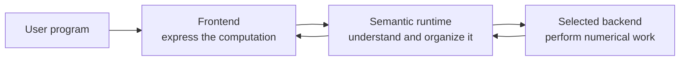

# Tabgrad architecture

This guide explains how Tabgrad turns tensor operations written in Python or
JavaScript into efficient browser computation. It is written for programmers
who understand ordinary software abstractions but have not designed a deep
learning runtime.

Start here. The documents introduce the main problems before explaining their
detailed mechanisms. When a later concept must be mentioned early, the text
gives a plain-language preview and points to the chapter that develops it. The
[glossary](glossary.md) is a lookup aid, not a prerequisite.

## Why a tensor library needs an architecture

A tensor is a collection of numbers arranged in dimensions. A tensor operation
may add two tensors, multiply matrices, select a view of existing data, or
calculate how a model parameter influenced an error. The public operation says
*what* result is wanted. It does not say where intermediate numbers should
live, which pieces can be combined, how work should run on a graphics processor
or central processor, or when memory is safe to reuse.

Consider this expression:

```python
y = torch.relu(x @ weight)
```

The program asks for a matrix multiplication followed by a rectified linear
activation. Tabgrad must check that the input shapes and data types are valid,
remember how the result was produced, preserve any information needed for
automatic differentiation, and eventually execute numerical work. It should do
that without copying every intermediate value through Python and without
defining the meaning of matrix multiplication separately for every language and
machine.

The architecture assigns each of those decisions to one owner. This is what
keeps a broad PyTorch-like interface, deferred numerical execution, training,
and two very different browser execution targets consistent with one another.

## The three responsibilities

At the highest level, Tabgrad has three responsibilities. These are conceptual
boundaries, not necessarily separate packages, threads, or processes.



The **frontend** presents tensors, modules, and operations using the conventions
of Python or JavaScript. It translates a language-specific call into a compact
request.

The **semantic runtime** is the common authority on what that request means. It
validates operations, records logical tensor state, tracks effects and
derivatives, selects only the work that has become necessary, and coordinates
its execution.

The **backend** knows how to perform the numerical work on a particular kind of
machine. Tabgrad has exactly two numerical backend families: WebGPU with kernels
written in WebGPU Shading Language (WGSL), and a central-processing-unit backend
implemented with WebAssembly. JavaScript and Pyodide coordinate work but are not
additional numerical backends.

The split matters because the parts change for different reasons. Python syntax
can improve without rewriting a matrix-multiplication kernel. The runtime can
learn to combine operations without changing a model. A backend can tune memory
layout for a device without changing PyTorch-visible behavior.

## The central decision

Tabgrad uses PyTorch-like public semantics over one TypeScript-owned,
effect-aware, incrementally lazy runtime.

- Each public call is checked and recorded immediately. The
  [operation-admission chapter](operation-admission.md) names and explains this
  synchronous semantic step.
- Pure numerical work is deferred until a result or ordered effect makes it
  necessary.
- Each finite piece of demanded work follows the same common program path,
  whether it contains one operation or many.
- Forward computation, derivative computation, gradient accumulation, and
  optimizer updates use the same runtime and backend path.
- WebGPU and WebAssembly share semantics but own their physical preparation,
  scheduling, memory, and kernels independently.
- A backend is selected explicitly. Unsupported work is rejected or translated
  into an equivalent supported program for that same target; it is never moved
  secretly to the other backend.
- Reusable compiled calls are an optional, guarded optimization over the same
  mechanism, not a second execution engine.
- Logical records, prepared work, caches, and physical allocations have bounded
  lifetimes. Tabgrad does not retain a permanent graph of everything a program
  has ever done.

This design is lazy about producing numbers, but eager about preserving program
meaning. It therefore differs from both immediate operation-at-a-time execution
and a static graph that must capture an entire model before it can run.

## Reading path

Read the documents in this order when learning the architecture:

1. [Frontends, runtime, and backends](frontends-runtime-backends.md) explains the
   three responsibility boundaries, how calls cross them, and what remains in
   backend memory.
2. [Semantic state](semantic-state.md) separates a public tensor's identity, a
   particular logical value, shared storage, an operation occurrence, derivative
   history, and physical materialization.
3. [Operation admission](operation-admission.md) follows one public call through
   validation and recording before any numerical kernel must run.
4. [Bounded lazy execution](bounded-lazy-execution.md) explains when deferred
   work becomes necessary and why each selected region is finite.
5. [Internal representations and executable programs](internal-representations.md)
   explains the two descriptions of computation and the translation between
   them.
6. [Backend execution](backend-execution.md) covers the shared backend contract
   and the deliberately different WebGPU and WebAssembly implementations.
7. [Requests, completion, and failure](execution-lifecycle.md) explains one
   invocation, asynchronous completion, cancellation, observation, transfer,
   and device loss.
8. [Automatic differentiation and training](autograd-and-training.md) shows how
   backward computation and optimizer effects reuse the ordinary path.
9. [Reusable programs and compiled callables](reusable-programs.md) explains how
   stable repeated work avoids repeated formation while retaining fresh runtime
   state.
10. [Memory and performance](memory-and-performance.md) states the complexity,
    lifetime, residency, and measurement constraints that keep the design
    practical for inference and training.
11. [Model integration boundary](model-integration.md) places model conversion,
    weights, tokenization, and preprocessing around the tensor runtime.
12. [Central architecture decision](central-decision.md) records the alternatives,
    evidence, consequences, and conditions that would justify reconsideration.

## How to interpret these documents

These documents define lasting responsibilities and constraints. They do not
claim that every described operation, model, data type, browser, or optimization
is implemented in a particular release. Supported behavior is a separate,
versioned compatibility claim backed by tests in
[the compatibility record](../compatibility.md).

Names such as `TensorValue` and `ExecutableProgram` identify architectural
concepts that implementations must preserve. They do not require one large
class for each concept. A named stateful component is justified only when it
owns an independent identity, invariant, or lifecycle; validation and
transformation can otherwise be ordinary passes over shared records.
