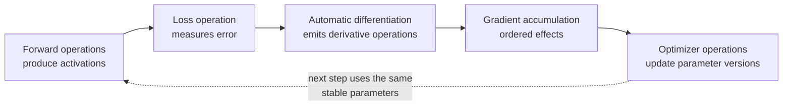
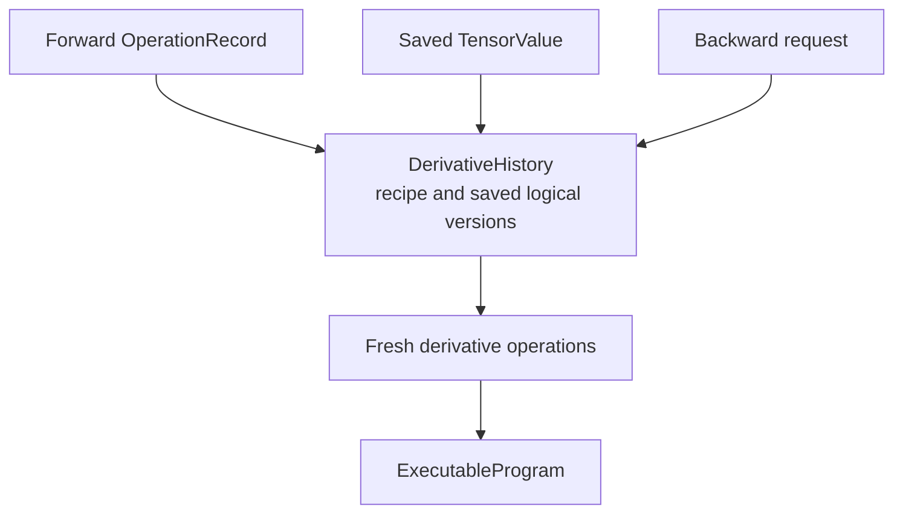

# Automatic differentiation and training

Inference evaluates a model from inputs to outputs. Training adds a loss,
calculates how model parameters influenced that loss, accumulates those
gradients, and updates the parameters. These extra steps need saved values,
mutation order, and longer lifetimes, but they do not need another numerical
engine.

Tabgrad's architecture expresses forward computation, derivative computation,
gradient accumulation, and optimizer updates through the same operation-
admission, executable-program, backend, request, and ticket path.

## The training cycle

An **activation** is an intermediate tensor value produced by the forward
calculation. Some activations must remain logically available because a
derivative recipe will need them. A **gradient** describes how a chosen output
changes with respect to another tensor. An **optimizer** uses gradients and its
own state to produce new parameter values.

Every box in the diagram becomes ordinary semantic operations and effects. The
selected backend eventually executes all required arithmetic.

## Dynamic derivative history

Automatic differentiation is dynamic: only operations that the host program
actually executed contribute derivative history. During admission, a tracked
operation records its derivative recipe and the logical values or metadata that
recipe needs.

`DerivativeHistory` owns those dynamic edges, saved logical values, expected
storage versions, random-number reservations, callbacks, and use counts. It is
independent of public tensor handles and physical buffers. A hidden saved
activation can have zero public handles while history keeps it alive for one
backward computation.

History does not execute numerical loops. When a derivative is requested, its
recipes admit fresh operations through the ordinary runtime path.

## Vector-Jacobian and Jacobian-vector products

The derivative of a tensor function can be described by a Jacobian matrix, but
forming that complete matrix is usually wasteful.

A **vector-Jacobian product (VJP)** propagates an incoming gradient backward
from outputs toward inputs. Reverse-mode training and a typical `backward()`
operation use this direction.

A **Jacobian-vector product (JVP)** propagates a chosen input direction forward
through the derivative. Both forms are derivative programs expressed in the
same backend-neutral operation vocabulary as ordinary computation.

For a reusable compiled forward, one `ProgramCallRecord` attaches a fresh
history recipe for that invocation. Traversing it can admit a fresh VJP
`ProgramCallRecord` with the incoming gradient, saved versions, and matching
random-number reservation. The runtime does not pretend that old occurrence
records are new, nor does it replay internal kernels as unrelated public
operations.

## Saved values, mutation, and aliases

Backward must observe the logical version that its forward recipe saved. If an
alias mutates shared storage in between, the expected version detects the
change. It is incorrect to read whatever bytes happen to occupy the current
physical allocation.

History owns the semantic pin and release obligation for a saved value. The
`MaterializationTable` associates that logical version with an opaque backend
reference. The backend owns the physical saved-tensor lease and may reuse its
bytes only after the history releases the pin and the last physical request
drains.

This separation allows a completed forward to release ordinary records while
retaining exactly the saved logical state that backward still needs.

## Branching and accumulation

A tensor may contribute to several later paths. Its gradient is ready only
after all required incoming contributions have arrived. Gradient accumulation
is an ordered effect because changing contribution order or losing an update can
change observable values.

Stable differentiable-leaf identity belongs to `TensorState`. An optimizer may
replace a parameter's current `TensorValue`, while gradient and optimizer state
continue to attach to that stable parameter. Mutation advances logical storage
versions and participates in the same effect order as other in-place work.

## Optimizers use the ordinary path

Optimizer operations remain ordinary by default. This keeps dynamic training
code composable and avoids a special training engine. A user can explicitly
place an entire stable training step inside a guarded compiled callable when its
variant contract covers forward, loss, VJP, accumulation, optimizer mutation,
and gradient reset.

That whole-step form still uses the same `ExecutableProgram`, request, ticket,
and backend mechanisms. It is an optional reuse boundary, not the default and
not a promise that whole-step reuse is profitable for every backend or workload.

## Retained and higher-order derivatives

Retaining history for repeated backward calls and differentiating derivative
operations require explicit lifetimes and capability contracts. The common
architecture does not forbid them: derivative operations remain inside the same
differentiable language. A compiled variant that has not implemented an
equivalent retained or higher-order recipe must miss or reject before partially
admitting its VJP.

Unsupported derivative modes fail explicitly. They do not silently detach
gradients, reuse stale history, or switch to a second implementation.

## Bounded repeated training

After warm-up, completed steps must not leave one semantic graph behind per
iteration. Forward records and histories remain only while reachable, demanded,
in flight, effect- or error-owned, or saved for a live derivative. Gradient and
optimizer state scale with live parameters and the optimizer, not the number of
completed steps.

Checkpointing or recomputation can trade arithmetic for saved-activation memory
only through an explicit policy that preserves random-number, mutation, and
error semantics. It changes which legal executable programs are formed; it does
not transfer memory ownership from a backend to automatic differentiation.
