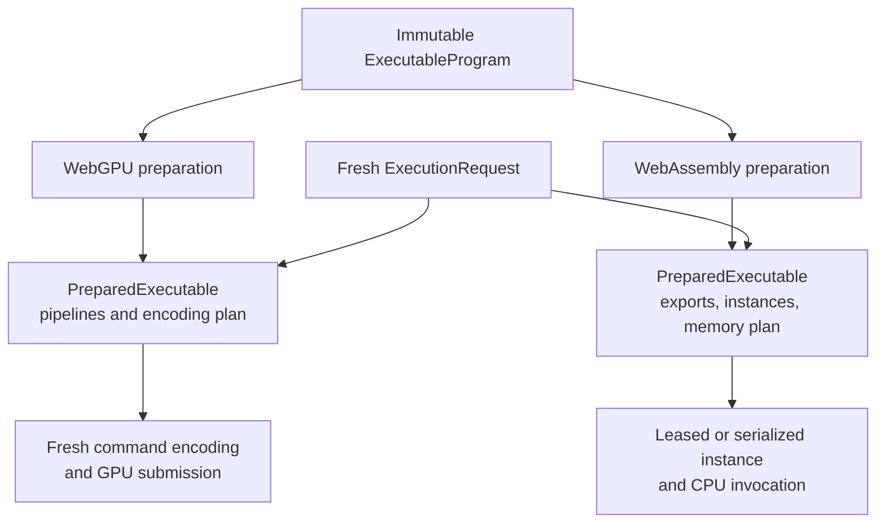

# Backend execution

Tabgrad has one semantic runtime and exactly two numerical backend families.
Both accept the same kind of finite `ExecutableProgram`, but they remain free to
choose different physical layouts, kernels, schedules, and memory strategies.
This is how the architecture shares meaning without forcing a graphics
processor and a central processor into an artificial common implementation.

## The backend execution contract

The **backend execution contract** is the agreement through which the runtime
can:

- obtain a truthful capability description;
- prepare an immutable executable program;
- bind opaque current inputs, outputs, and saved materializations;
- submit one execution request;
- receive logical result and physical-drain signals;
- request explicit observation or transfer staging; and
- close or replace a backend context without confusing generations.

The contract does not expose `GPUBuffer` objects, WebAssembly pointers, allocator
internals, pipelines, compiled exports, or a backend's private schedule to the
semantic runtime.

## Capabilities make support explicit

A backend capability description includes facts it can report reliably:
supported data types and features, buffer and binding limits, workgroup limits,
WebAssembly vector support, thread availability, and generation identity. A
backend must not invent a precise remaining-memory value when the platform does
not expose one.

Capabilities participate in validation, legal program formation, preparation,
and cache keys. A model or operation that exceeds them can be segmented only by
a legal lowering for the same explicit target. Otherwise it fails clearly.
Capability negotiation never authorizes silent movement to the other backend.

## Shared work, private preparation

Each run also supplies a fresh per-invocation package containing current
bindings, dynamic values, the backend-generation token, and cancellation state.
This package is called `ExecutionRequest`; its ownership and completion
lifecycle are explained in
[Requests, completion, and failure](execution-lifecycle.md).

The preparation key includes program structure; operation, lowering, backend,
compiler, and kernel versions; capability and specialization fingerprints; and
backend/device generation. A cache hit is valid only when all relevant facts
still match.

WebGPU command buffers are single-use, so a prepared executable provides a plan
from which each invocation encodes fresh commands. Mutable WebAssembly instances
or memories are leased per request or safely serialized; a prepared executable
does not let concurrent requests mutate the same instance accidentally.

## Deliberately different physical implementations

| Concern | WebGPU backend | WebAssembly CPU backend |
| --- | --- | --- |
| Numerical code | WebGPU Shading Language kernels | Compiled WebAssembly functions and vectorized variants |
| Main storage | Graphics-processor buffers | WebAssembly linear memory |
| Parallel work | Workgroups and device queue | Central-processing-unit instructions and optional bounded worker coordination |
| Preparation | Shader modules, pipelines, binding and encoding strategy | Modules, exports, instance strategy, memory and call plan |
| Submission | Fresh command encoding and queue submission | Invocation through a narrow application binary interface |
| Completion | Promise-based queue and mapping signals plus error scopes | Synchronous or asynchronous host completion according to the invocation context |

JavaScript may implement orchestration and small metadata work. Large numerical
loops belong in these backends.

## Kernel selection, specialization, and fusion

A backend can realize a legal program in several ways:

- select a carefully tuned kernel for a major operation such as matrix
  multiplication, normalization, or attention;
- specialize a kernel family for shape, data type, layout, vector width, or
  device limits; or
- generate or assemble a fused implementation for compatible simpler
  operations so fewer temporaries and launches are needed.

The mix need not be identical. WebGPU can combine tuned kernels with generated
WGSL for elementwise regions. WebAssembly can prefer precompiled functions and
vectorized variants, adding dynamic generation only when evidence justifies its
complexity.

The runtime has already established whether a transformation is semantically
legal. The backend decides whether and how it is profitable. A fusion cannot
ignore an effect, alias hazard, data-type rule, derivative boundary, or required
diagnostic merely because doing so would reduce dispatches.

## Physical memory and residency

The backend owns allocation, pools, staging resources, and physical leases.
The runtime sees only opaque references through the `MaterializationTable`.
Intermediate outputs can remain resident and feed later kernels without host
readback.

Logical liveness from the executable program tells the backend when virtual
storage no longer needs a value. Physical bytes are reusable only after the
semantic pin is released and every submitted physical use has drained. The
backend may retain an unpinned allocation in a bounded pool, but the allocation
is no longer associated with live tensor meaning.

## Transfers are programs, not fallback

Moving a tensor between WebGPU and WebAssembly is an explicit two-endpoint
executable program. Source staging and destination import can overlap when the
platform permits it, but the source request and staging lease remain alive until
the source side has drained.

Mixed-device operations follow their declared semantic rules. An unsupported
operation or type reports the selected target and reason. It does not quietly
execute elsewhere and then return as if no transfer occurred.

## Backend generations and loss

A backend context has an explicit generation. Reinitialization or WebGPU device
loss creates a new generation. Old callbacks and prepared entries carry their
old token and cannot mutate current owners.

All old-generation materializations and prepared executables become invalid.
Re-preparation is possible from the common program. Re-materialization is
possible only when the runtime still has a reproducible semantic source or a
valid recoverable host or external copy. A surviving tensor handle by itself is
not evidence that its bytes can be restored.

The request and error lifecycle for these cases is defined in
[Requests, completion, and failure](execution-lifecycle.md).
