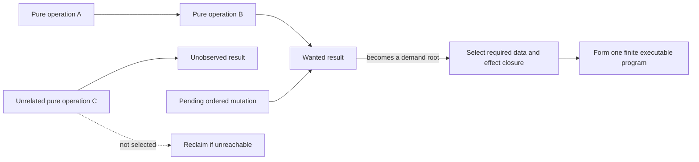

# Bounded lazy execution

Tabgrad is **lazy** about numerical payloads: a pure tensor operation may return
a logical result before its output numbers have been produced. It is not lazy
about meaning. Admission still validates every fact that is already knowable,
records effects in semantic order, and returns precise metadata or errors.

Deferring numerical work is useful only if the runtime also knows when to stop
deferring, which dependencies to select, and how to prevent pending state from
growing without bound. Tabgrad answers those questions with automatic bounded
demand regions.

## Admission, demand, and materialization

Three moments are easy to confuse:

- **Admission** understands a public call and creates its logical records.
- **Demand** says that a particular result or ordered effect must now make
  progress.
- **Materialization** means that a logical value's numerical payload exists in
  a backend.

An admitted value can remain unmaterialized. A demanded value may be submitted
but still executing. A materialized value can remain resident in backend memory
without being copied to Python or JavaScript.

## What creates demand

A **demand root** is a value or effect whose completion is now required by an
observable action or progress rule. The main roots are:

- observing or reading back tensor data;
- host control flow that depends on tensor data;
- an explicit transfer to another backend;
- a callback that requires a numerical value;
- mutation, gradient accumulation, and optimizer updates, which are mandatory
  ordered effects; and
- an explicit scoped synchronization request.

Merely inspecting static metadata such as a known shape does not demand a
payload. Creating pure work also does not schedule a timer that eventually runs
everything.

## Selecting a finite region

Starting from a root, the runtime walks backward through data and effect
dependencies and selects only the finite, not-yet-materialized closure needed
for that root. This selected closure is the **demand region**.



The region includes `A`, `B`, and the required mutation because they contribute
to the demanded result or its legal ordering. Unrelated `C` is not executed. If
its result is unreachable, its semantic records can be reclaimed.

The word **bounded** has two meanings here. Each selected region is finite and
connected to named roots, rather than being an unbounded session graph. The
records, queues, and caches used to create and execute regions also have explicit
count-and-byte budgets.

## One operation and many operations use the same path

A one-operation demand forms a one-operation executable program. In a larger
compatible chain, the runtime can translate an operation into equivalent
supported work, combine several calculations so they need fewer physical
kernels, or preserve enough dependencies for the backend to choose their
execution order. Later chapters name these mechanisms decomposition, fusion,
and scheduling. There is no separate immediate engine for the small case.

This matters for correctness and maintenance. Views, mutations, errors,
automatic differentiation, and backend selection need one set of rules, not an
eager path and a lazy path that can drift apart. It also means the runtime can
begin simply and optimize regions without changing public semantics.

## Pure work and mandatory effects

Pure work has no observable consequence when its output is never used, so it
can remain pending and later be discarded. An admitted effect cannot disappear
merely because the public tensor that led to it was dropped.

A **host entry** is one call from the Python or JavaScript frontend into the
runtime. The outermost host entry begins before any nested runtime calls and
ends when control is about to return to the JavaScript event loop. Pending
effects can coalesce inside that boundary. At its end, the runtime schedules one
microtask—JavaScript work that runs after the current call stack and before the
next event—to give mandatory effects a progress point. Pure work does not
receive a timer-based flush. This distinction avoids running dead computations
while ensuring that ordered mutations and updates do not wait forever for an
unrelated observation.

Random-number position is reserved during admission. Removing an unused random
result can therefore skip its numerical kernel without changing the semantic
sequence seen by later random operations.

## Data-dependent host control

The semantic graph records tensor operations, not an entire Python or JavaScript
program. Ordinary host control continues normally until it needs tensor data:

```python
score = model(x)
if score.item() > 0:
    result = positive_branch(score)
else:
    result = negative_branch(score)
```

`score.item()` demands only the dependencies needed to produce the scalar,
waits through the supported asynchronous observation path, and returns it. Only
the branch that Python then executes is admitted. Tabgrad does not need to
capture both branches or invent a graph break.

## Memory pressure and progress

Pressure is not a reason to execute unrelated work. The runtime handles a
count-or-byte limit in this order:

1. Reclaim unreachable or completed semantic state.
2. Evict unpinned cache entries within their own budgets.
3. For an asynchronous caller, apply bounded backpressure only when an already
   submitted completion, drain, or independent release can demonstrably free
   the needed resource.
4. Otherwise fail with a deterministic resource-exhausted error.

The last case includes a single live pure chain that continues to grow while
nothing is submitted or reclaimable. Waiting would make no progress, and
materializing arbitrary prefixes would make memory behavior surprising.
Synchronous admission also fails when it cannot reclaim enough space.

There is no universal operation-count or estimated-byte threshold that flushes
work automatically. Such a threshold confuses pressure with demand and cannot
account reliably for target-specific physical memory.

## Scoped synchronization

A full asynchronous synchronization operation can be scoped to named roots and
the runtime session responsibilities associated with them. It demands those
roots, submits mandatory effects and already-demanded work in scope, delivers
causal failures or results, and waits until every included execution has
drained.

Synchronization does not demand unrelated pure tensors. The exact public method
name and default scope are API choices; the architectural requirement is that
scope and effects are explicit.

## What this model is not

- It is not operation-at-a-time execution followed by a blocking wait.
- It is not asynchronous eager submission disguised as a graph.
- It is not a permanent graph of a model or session.
- It is not universal capture of Python or JavaScript control flow.
- It is not permission to delay semantic errors that admission can already
  identify.
- It is not permission to hide memory pressure by silently changing backend or
  executing dead work.

The next chapter explains how a selected demand region becomes the finite,
backend-ready description that both numerical backends understand.
