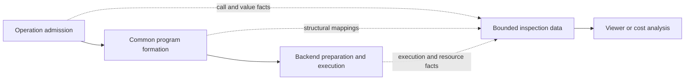

# Inspecting computation and attributing costs

A tensor runtime can answer a numerical question without keeping a permanent
record of how it answered it. Once an output is materialized and no live
responsibility needs its predecessors, retaining those predecessors would only
consume memory. That is useful for repeated inference and training, but it means
that a graph viewer cannot assume the entire history is still available when
someone opens it.

This chapter is for contributors designing inspection, cost reporting, or
transformations that affect those facilities. It explains how they cooperate
with the execution architecture without becoming another engine or changing
tensor lifetimes. Read [Semantic state](semantic-state.md) and
[Internal representations](internal-representations.md) for the underlying
owners. These are accepted architectural constraints, not a public inspection
API or a release support claim.

## First choose the question being answered

“Show the graph” can mean several different things. A developer might want to
understand the operations their model expressed, inspect the program selected
for one output, or discover what actually ran on the device. Those descriptions
are related, but they are not interchangeable.

- The **semantic perspective** describes admitted tensor calls, logical values,
  storage relationships and ordered effects. It includes only the host branches
  that were reached, not all possible Python or JavaScript paths. A selected
  output's dependencies are also not necessarily every admitted call.
- The **lowered perspective** describes the finite executable work selected
  for a demand. Lowering can decompose an operation, remove unused work or
  incorporate a reusable program. An already materialized value can appear as
  an input boundary rather than as the work that originally produced it.
- The **physical perspective** describes backend preparation and execution:
  kernels, transfers, allocations, reuse and completion. Several semantic
  operations can become one kernel, and one operation can need several kernels.

A capture therefore states its perspective, selected roots or invocation
scope, time interval, and known boundaries. An omitted operation may be outside
the selection, eliminated, already materialized or simply unavailable. Those
cases must not all be displayed as “no work.” Similarly, a prepared plan is not
evidence that every planned kernel executed successfully.

The diagram shows where these descriptions originate. Solid arrows carry the
ordinary computation; dotted arrows carry detached inspection metadata. The
inspection consumer owns its retained description, and an external viewer can
render that description without owning execution resources.

This is a responsibility map, not a requirement for a new event bus, service,
thread or class. Invocation coordination also supplies the current bindings
that connect the three descriptions. The backend still owns physical work,
and inspection does not become a route through which numerical execution must
pass.

## Capture facts before their lifetime ends

Inspection can derive a description from still-live semantic records and
executable programs. Historical inspection needs an additional, explicit
capture interval or policy that starts before the relevant facts disappear.
Enabling capture afterward cannot recover an intermediate view, reclaimed
producer or missed execution event from an output's numbers.

Consider a conceptual computation that creates a value, takes two successive
views of it, and uses the last view in two branches that later join. The views
share storage; they do not require new numerical payloads. The runtime can keep
the final layout directly instead of retaining both view calls as a chain.
After the joined result is materialized, producer dependencies can also be
reclaimed. A live dependency inspection and a complete history of public calls
therefore need different facts, even for this small computation.

If the application chooses the joined output only after those calls occurred,
an earlier capture policy must have retained candidate call metadata. Some
candidates may later be filtered out because they do not contribute to the
chosen root. Their processing and retention still count toward the capture
cost and budget. Selecting an output later does not make earlier capture free.

Admission supplies metadata-only call relationships while they are known;
formation supplies transformation relationships before they are lost; backend
execution supplies physical events at their owning boundary. This preserves
the distinction between an operation occurrence and a numerical instruction.
Inspection must not manufacture a kernel or a permanent producer edge merely
to keep a view visible.

After capture, the description is **detached**: it retains immutable metadata
and identifiers, not strong references to public tensors, live semantic records,
requests, derivative history or allocations. Closing a tensor or reclaiming
its numerical dependencies must remain possible while the description is being
read. Keeping metadata about a value does not keep its bytes recoverable.

## Connect descriptions without confusing identities

Attribution means explaining which semantic work is associated with a lowered
computation or physical event. It is a relation, not necessarily one source
name attached to one kernel. Decomposition gives one-to-many relationships;
fusion gives many-to-one relationships. Elimination and metadata-only work can
have no physical counterpart, while recomputation can give one logical value
several physical executions.

The owners preserve different parts of that relation:

| Owner | Facts supplied to inspection |
| --- | --- |
| Canonical operation definitions and admission | Operation meaning, normalized attributes, logical values, aliases, effects and concrete call relationships |
| Common formation and lowering passes | Structural relationships between semantic work and executable values/computations, including transformations |
| Runtime invocation coordination | Current occurrence identities, input/output bindings, storage versions, selected roots and request outcomes |
| Backend preparation and execution | Kernel associations, resource lifetimes, transfers, completion and available measurements |
| Inspection consumer | Detached retention, declared selection, completeness and presentation to external consumers |

Reusable programs keep structural attribution separate from current invocation
identity. A second call can use the same program with different inputs or
weights. Its program slot numbers do not identify the first call's values.
Joining information across demanded regions requires explicit value and
invocation correlation, not matching slot numbers or memory addresses.

A bounded retained structural description can be referenced by many compact
invocation records. A reusable hit must not expand every internal operation
merely to attach inspection. Expanding a graph for display is a separate,
explicit consumer cost. If a structural description has been evicted, the
consumer reports that the reference cannot be expanded rather than retaining
an executable or pretending that the graph was empty.

## Estimate arithmetic from operation meaning

A floating-point operation count, or **FLOP count**, estimates arithmetic work
under a stated counting convention. It is not elapsed time or a rate such as
FLOP/s. For example, a convention must say whether a multiply followed by an
addition counts as two operations when hardware can fuse them into one
instruction.

Estimation uses canonical operation meaning, normalized attributes and tensor
metadata. Estimator coverage belongs with that meaning, not in a second registry
that independently interprets public operations. The convention and applicable
domain must be identified so two reported totals can be compared. This does not
require a particular method or class on every operation definition.

Distinguish the semantic estimate for a selected computation from the work its
backend executes. Reading an already resident output again may perform a copy
without repeating its original arithmetic. Fusion, specialized algorithms and
recomputation can change executed work. An admitted but unused pure operation
must not be counted as executed merely because it appears in a call trace.

Metadata-based estimates should not enumerate payload elements or force a
readback. When cost depends on unknown dimensions, values or algorithm choices,
report a conditional expression, justified range or unknown result. Integer
work, comparisons and data movement do not become free because they are absent
from a floating-point count. A combined report must identify which quantities
it includes rather than turning unsupported estimation into zero.

## Account for memory at the owner of the bytes

A tensor's logical size answers how much data its shape and representation
describe. For a dense fixed-width representation, that can be derived from its
element count and element width. Other representations need their own metadata
and accounting rules; one dense formula is not a universal storage contract.

Logical size is not an allocation measurement. Several views can describe the
same backing storage. Adding their logical sizes is useful only if the question
really asks for that sum; it overstates unique storage. Conversely, a backend
can reserve more bytes than the logical payload because of alignment, padding,
temporary workspaces or reusable capacity.

Physical accounting belongs to the owners that allocate, retain and retire
resources. A report distinguishes live payload, reserved or pooled capacity,
staging, host copies and saved state, and names its scope. Backend-accounted
bytes do not establish exact browser-process or device-wide memory usage;
unavailable overhead remains explicitly unavailable.

**Peak memory** is the maximum simultaneously accounted memory within a stated
interval, not the sum of per-operation peaks. An interval beginning after
allocations were made needs an opening baseline as well as subsequent events.
Missing lifecycle events invalidate an exact peak claim. Shared resources are
counted once in the aggregate; ownership can be shared without inventing an
exact independent byte cost for each user of the allocation.

For the same reason, a fused kernel can have a measured duration without a
unique measured duration for each semantic operation. Report the fused group,
or label an allocation of that cost as an estimate under an explicit policy.
Preserve timing domains and dependency order when clocks cannot be reliably
aligned. Host notification time is not automatically device execution time.

## State, training and asynchronous lifetimes

The identity needed for attribution includes the logical version used by a
call. A stable parameter name is insufficient after an optimizer update, and a
reused physical address is not a stable value identity. Aliases share storage
identity, while their layouts and the versions they observe remain relevant.
Inspection records these facts without taking over mutation ordering.

Derivative history owns saved values and the obligations that keep them usable.
Inspection can relate backward and recomputation occurrences to their forward
context using detached identifiers, without becoming another saved-value owner.
Reports state whether their scope includes forward computation, backward,
optimizer effects and recomputation rather than silently mixing their totals.
Randomness likewise needs its algorithm and relevant reservation/state context;
a seed alone does not identify every draw or guarantee identical backend bits.

Resource lifetimes continue through asynchronous completion. A result becoming
available does not imply that all submitted physical uses have drained.
Inspection follows the [existing completion owners](execution-lifecycle.md),
including failure, cancellation and backend generation loss. It must distinguish
work that never ran from failed, cancelled or incompletely observed work.
Observation of those events cannot require a callback into a blocked Python
interpreter or make backend progress depend on a viewer responding.

## Bound capture and make incomplete information explicit

Inspection is opt-in. With capture disabled, ordinary execution must not retain
historical graphs, scan unrelated history, hash payloads or copy numerical data
for hypothetical inspection. This is a cost constraint, not a measured claim of
zero instrumentation overhead.

Enabled capture has count-and-byte budgets covering all retained metadata,
including candidate events, indexes, strings, attribution maps and structural
descriptions. Limiting only an event queue while an auxiliary index grows
forever does not bound the facility. A complete explicit graph has a cost
proportional to the description being emitted; a finite budget cannot promise
a complete arbitrarily long history.

The capture policy declares how it stops or drops information when a budget is
exhausted or the consumer fails. Partial results identify their scope and missing
segments. A full inspection sink must not delay mandatory effects, physical
drain or resource cleanup. Numerical success and successful inspection are
different outcomes.

This best-effort rule does not apply to accepting a correctness claim. If a
validation method lacks mandatory bindings or evidence, validation is unavailable
or rejected, not silently downgraded to success. It also must not turn an
otherwise successful numerical result into proof that the result was validated.

Metadata can reveal model structure, shapes, source labels or data equality.
Capture and export therefore follow explicit user policy and the project's
[local privacy boundary](../../SECURITY.md#security-and-privacy-boundaries).
Detached metadata is not automatically nonsensitive. There is no implicit
telemetry, payload export or external inspection service.

## Identity, recomputation and correctness are different guarantees

A structural fingerprint supports program reuse. It deliberately excludes
tensor payloads and current invocation identity. A content digest identifies
encoded bytes, provided the encoding and version are defined. Neither fact
alone proves that applying a program to an input produces a claimed output.
An executor can supply consistent hashes for an incorrect result.

Independent recomputation is the validation baseline: obtain a model
description, weights, input and relevant initial state, execute the specified
computation in a controlled environment, and compare under an explicit
numerical relation. Exact bits require appropriately fixed semantics; an allowed
numerical difference needs a justified rule. Receiving model artifacts does
not authorize executing arbitrary untrusted code without validation, isolation
and resource limits.

The scope must say whether it includes preprocessing, imported-state conversion,
host control flow and persistent caches. A tensor graph alone does not validate
those surrounding steps. A retained logical identity does not recreate old
payloads; replay needs a separately owned recoverable input/state record.
Likewise, an opt-in content commitment needs a version-consistent data-access
policy and its own hashing, synchronization and storage cost account.

A computational proof would establish a specified input/program/output relation
under its security and numerical assumptions, not the historical identity of a
particular GPU dispatch. Inspection metadata is not promised to supply all the
witness data such a proof could require. The architecture selects no proof
system, hardware trust dependency or arithmetic restriction for that purpose.
Ordinary execution does not acquire mandatory hashing, payload retention or
readback. The separate feasibility question is tracked in
[research issue #89](https://github.com/isaacperez/tabgrad/issues/89), not treated
as a guarantee of this design.

## Decision, alternatives and evidence

The [architectural assessment](https://github.com/isaacperez/tabgrad/issues/88#issuecomment-5800308846),
[independent challenge](https://github.com/isaacperez/tabgrad/issues/88#issuecomment-5800309257)
and [acceptance record](https://github.com/isaacperez/tabgrad/issues/88#issuecomment-5808698394)
support preserving the existing semantic, program, invocation and physical
owners, with the capture and attribution obligations defined here. The study
compared four alternatives:

1. Derive everything from live state. This remains useful for a bounded current
   region, but cannot recover discarded calls or missed physical events.
2. Capture bounded detached metadata at existing boundaries. This preserves
   requested facts without transferring numerical ownership, at an explicit
   capture and retention cost.
3. Use an explicit reusable/capture scope for stronger analysis. This complements
   ordinary inspection and structure reuse; it does not require every dynamic
   Python call to enter a static mode.
4. Revise central representations or lifetime obligations. A bounded revision
   remains a legitimate option when an evidenced guarantee requires it, but the
   examined traces did not require replacing the central owners. Keeping all
   history forever would additionally conflict with bounded reclamation.

The decision combines live inspection with optional bounded capture and reuses
explicit program boundaries where appropriate. It does not prescribe a universal
event framework, a public schema or an extra execution engine. Source traces
established where information is lost and which owner can supply it; conceptual
traces examined transformations, state and asynchronous execution. Those traces
are not measurements of capture overhead or proof performance.

Reconsider the boundary if a concrete required guarantee cannot fit detached
bounded capture, if a selected proof profile requires incompatible witnesses or
numerical semantics, or if representative measurements contradict the cost
assumptions. Extending attribution or adding a cost rule alone does not require
replacing the execution architecture.
