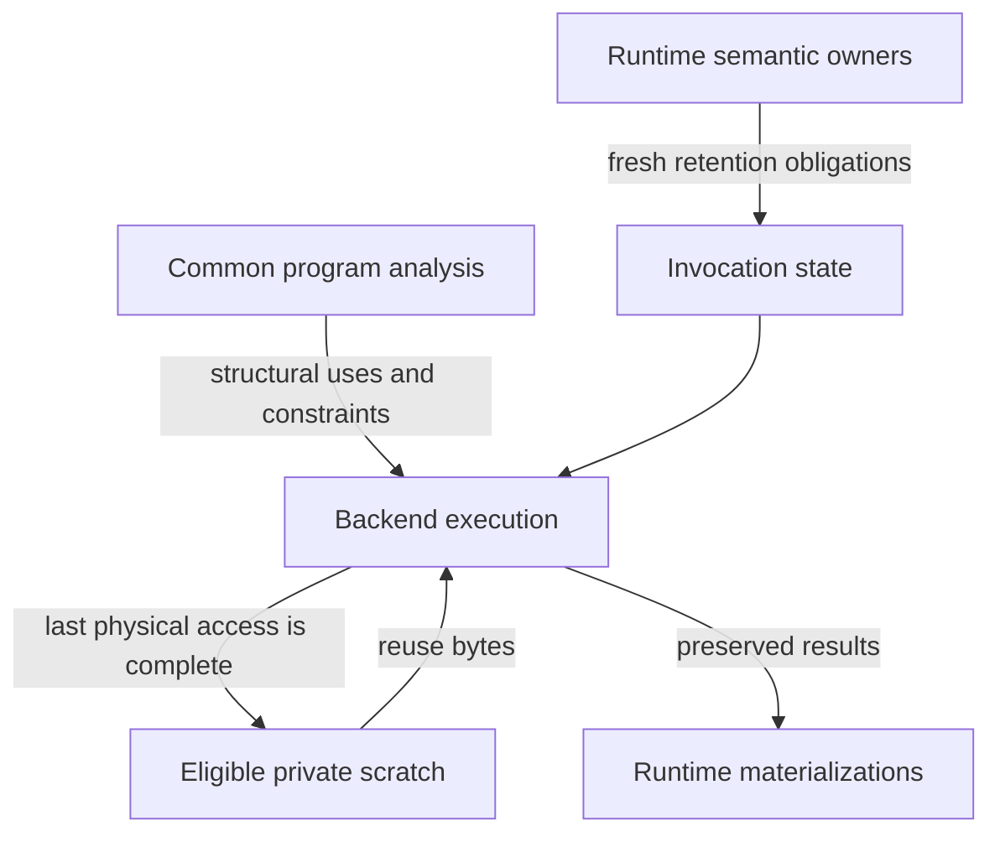

# CPU intermediate memory reuse

This chapter explains how Tabgrad separates permission to discard a logical
value from permission to overwrite its physical bytes. It is for contributors
who understand the frontend/runtime/backend split but need to reason about
memory inside one execution. It records an accepted architectural boundary,
not a release support claim or a required layout for implementation classes.

## Why freeing everything at the end is not enough

A sequence of tensor operations produces intermediate results. Keeping storage
for every result until the entire sequence finishes is straightforward: each
operation has somewhere to write, and earlier values remain available. It can
also make peak memory grow with the length of a computation even when each
step needs only the immediately preceding result.

Releasing those allocations after execution prevents a leak, but does not
reduce the peak that execution must fit. **Scratch storage** means storage used
temporarily to carry intermediate values through an invocation. Reusing scratch
can reduce that peak without changing the calculation. The difficulty is
knowing which intermediate values are genuinely temporary.

The finite program selected for an observation is not the whole application.
A value that has no more readers in that program may still be observable
through a public tensor handle, needed by another pending computation, or
retained for derivative work. A backend that sees only its selected program
cannot infer that these owners have disappeared.

## Three questions, three responsibilities

The decision uses existing responsibilities rather than introducing another
planner or execution engine. Each execution combines structural facts with
fresh ownership obligations:

| Question | Responsible owner | Information it contributes |
| --- | --- | --- |
| Which computations use each value inside this program? | Common program analysis | Structural uses, dependencies and logical release constraints |
| Which values must survive this invocation? | Semantic runtime | External-retention obligations from handles, pending consumers, requests and other semantic owners |
| When can these bytes safely hold a different value? | Selected backend | Actual physical accesses, completion, allocation ownership and reuse |

An **external-retention obligation** means that a value must remain usable
beyond its selected internal uses. External here means outside those uses, not
outside the browser or runtime. A pending computation in the same session is
enough to create such an obligation.

Structural facts belong with the immutable program or common analysis of it.
Current handles and request identities do not: the same program can run with
different owners on different invocations. The runtime therefore supplies
retention with the invocation, separately from reusable program structure.

The following arrows represent information supplied to execution, not separate
threads or a prescribed sequence of function calls:

The backend can choose its own schedule. Common use facts do not prescribe
kernel order, addresses or a universal memory plan. A reordered or fused
execution must preserve the logical constraints and establish the last
physical access in its actual schedule; it cannot blindly decrement counts
from a different schedule.

## Following a value through a small computation

Consider a conceptual chain in which each step adds a retained constant to the
previous result. Assume equal-sized, independently stored values and kernels
whose output must not overlap either input. This is an illustration of
lifetimes, not a runnable API example or a guarantee for arbitrary graphs.

While a step runs, the constant, previous result and new output all need
storage. Once the kernel returns successfully, the previous result can become
scratch if no later selected operation reads it and no external owner needs it.
The next step can use those bytes for its new output. A chain of many steps can
therefore use a small rotating working set instead of an allocation for every
step. This does not mean overwriting an input while its kernel still reads it.

Now retain a handle to a middle result. Even after its last use in the chain,
that result must remain observable, so its allocation is not scratch. The same
holds when the handle is closed but an unexecuted branch still needs that
result. Repeated input positions also matter: an operation that consumes a
value twice contributes two uses when the analysis counts input occurrences.
The producer and consumer of that analysis must agree on the counting unit.

In a reference-counted semantic model, a useful way to derive retention is to
distinguish references belonging to the selected internal uses from references
belonging to other owners. That is a reasoning model, not permission to
subtract arbitrary counters: aliases, storage sharing, saved derivatives and
effects must be represented by their authoritative ownership rules. A logical
value becoming disposable does not establish that shared storage is disposable.

## Take ownership facts at the execution boundary

Backend preparation can suspend while modules or other resources become ready.
During that wait, user code can close handles or enqueue other observations.
The runtime should establish fresh retention at execution admission rather
than freeze it inside reusable program formation.

For serialized synchronous CPU execution, this boundary is immediately before
execution starts, with no intervening suspension that could invalidate the
facts. Capturing earlier can conservatively preserve values whose owners have
since gone away. Avoiding that excess retention is useful even when the earlier
snapshot would still be safe.

Asynchronous execution requires more than a momentary count. The relevant
semantic obligations and physical leases must remain valid while work is in
flight. The CPU rule does not let another backend reuse memory merely because
its host-side dispatch returned. Whole-request completion and drain remain
governed by [the execution lifecycle](execution-lifecycle.md).

## Last physical access is not always whole-request drain

An invocation can contain several kernels. In synchronous CPU execution, one
kernel's return can establish that its accesses have ended even though later
kernels in the invocation have not run. The backend may recycle private
scratch at that point when all logical and physical conditions allow it.

This is narrower than releasing every resource owned by the request. Resources
whose outstanding uses are tracked by a request ticket remain protected until
those uses drain. `ExecutionTicket.drained` is the whole-request guarantee;
it does not forbid the backend from proving that its own private temporary
storage has no remaining accesses earlier. Nor does an internal scratch
decision authorize releasing a borrowed resident input owned elsewhere.

The distinction preserves both goals: long programs need not retain every
temporary until the end, and externally leased or asynchronously used resources
cannot be reclaimed early on the strength of a logical use count alone.

## Failure must preserve recoverability

Execution owns the allocations it creates for temporary and result values. A
resident input supplied by the runtime is **borrowed**: execution may read it,
but must not turn it into scratch whose overwrite would destroy a still-owned
value or the only materialization from which retry can proceed.

If execution fails, invocation-created allocations are reclaimed without
releasing borrowed allocations or publishing an incomplete set of results.
Semantic producers remain available when they are the recoverable source for
retry. Cleanup must also be safe when a temporary was released and its physical
range reused before the failure; historical allocation records do not create
new ownership of that reused range.

On success, the runtime publishes the required surviving materializations
before detaching the semantic dependencies that execution has satisfied.
A subsequent host-readback failure is a different event from execution
failure: already valid resident results must not be discarded merely to repeat
successful numerical work. Backend loss remains subject to the separate
generation and recoverability rules in [backend execution](backend-execution.md).

## Alternatives and the reason for the decision

Whole-program allocation is a valid conservative strategy. It avoids reuse
analysis but lets dead scratch contribute to the execution peak. Keeping it
as a fallback does not change semantic behavior.

Another correct strategy lets each backend derive local use facts while the
runtime supplies external retention. It respects semantic ownership, but can
repeat structural analysis needed by the common runtime. The accepted boundary
shares logical facts and leaves actual physical scheduling and reclamation to
the backend. It does not require a specific array, map, cache or method signature.

Purely local last-use reclamation, without runtime retention, is not an
alternative with equivalent semantics: it can destroy values that another
handle or pending branch still needs. Likewise, adopting a common physical
schedule merely to share counts would erase an intentional backend boundary.

The supporting [research record](https://github.com/isaacperez/tabgrad/issues/67#issuecomment-5756719872)
compared these responsibilities through bounded scalar CPU experiments and
independent challenge. It demonstrated lower peak allocator payload in closed
chains and preserved shared and retained values, including failure recovery
after scratch reuse. It also found bookkeeping overhead when all intermediates
had to remain live. The decision accepts that ownership boundary, not the
prototype as production code or a claim that reuse always makes execution faster.

## Costs, limits and conditions for reconsideration

Structural use analysis should stay proportional to selected values and input
occurrences. A chain's constant scratch payload does not imply constant host
metadata: program records, retention facts and cleanup bookkeeping still scale
with selected work. Allocator search, alignment and fragmentation are additional
costs that must be evaluated independently.

Payload bytes, aligned allocated ranges, WebAssembly linear-memory capacity
and total process memory are different measurements. Reuse can reduce the first
two without shrinking the memory already reserved by WebAssembly. Likewise,
reducing peak payload may add host work when little or nothing is reclaimable.
Comparisons must include retained-only workloads rather than select only cases
where the optimization saves storage.

The research evidence covers a bounded scalar, contiguous CPU workload, not
browser latency, full models, GPU completion, arbitrary layouts or training.
Those limits restrict performance and compatibility claims; they do not waive
the architectural obligation to preserve aliases, effects or saved values.

Reconsider the representation or reclamation strategy when measurements show
that analysis, allocator fragmentation or failure bookkeeping outweighs its
benefit. Revisit the boundary itself only if an execution or ownership model
cannot express its actual preservation obligations through it. More complex
scheduling, views and asynchronous work need their own physical safety evidence,
not an assumption that a successful CPU chain validates them.
