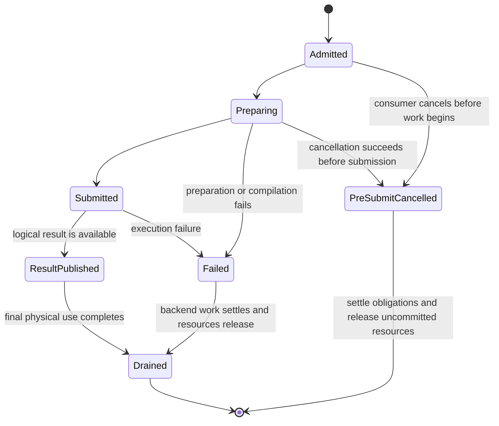
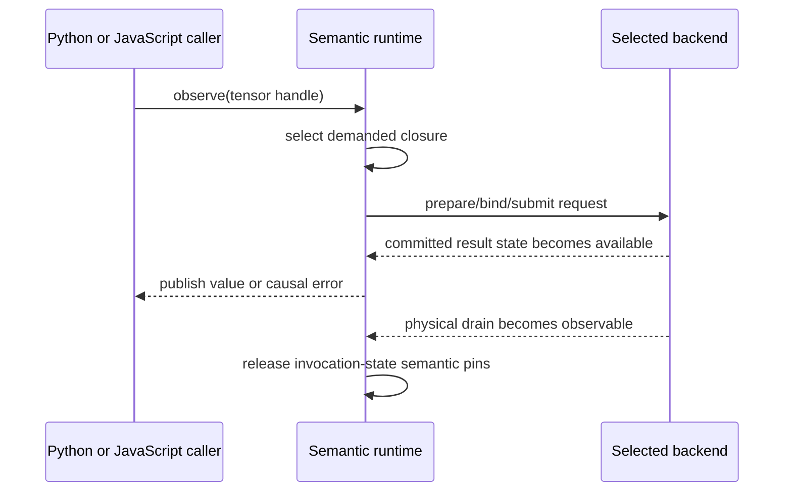
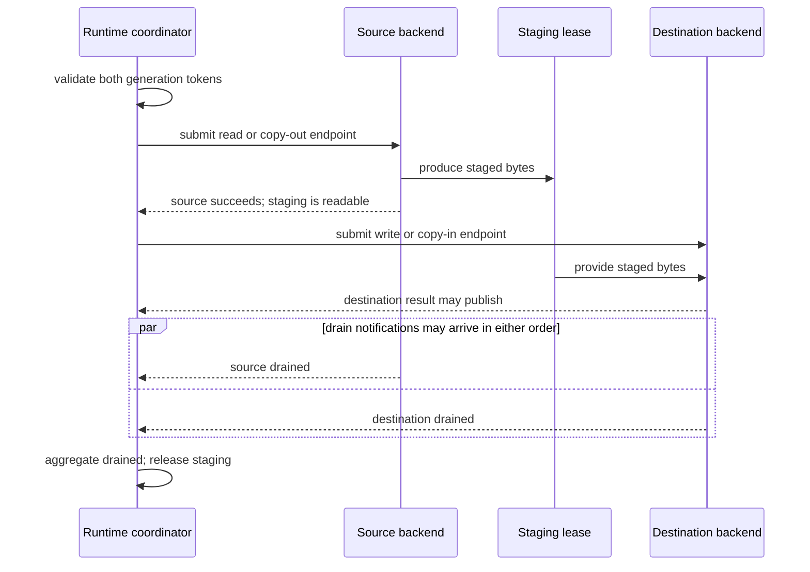

# Requests, completion, and failure

Preparing a reusable program and executing it once are different lifetimes. A
prepared WebGPU pipeline or WebAssembly module can survive many calls, while
each call needs fresh bindings, output identities, effects, errors, and
completion state. This chapter defines that per-invocation boundary.

## A fresh invocation

`ExecutionRequest` contains only per-run information: current program-slot
bindings to opaque physical references, dynamic values, backend-generation
tokens, and cancellation state. For ordinary computation this is the input view
passed to the selected backend. An explicit transfer uses a coordinator-owned
composite request with two endpoint generations and a staging lease, as
described later in this chapter. Neither form owns reusable program structure or
permanent model state.

The immutable program associated with an invocation remains request-scoped.
Successful resident materializations retain their opaque physical references,
not the complete program that produced or later consumed them. A retained
failure may keep its request program for diagnosis because the failure object,
not an unrelated tensor lifetime, then owns that metadata.

`RuntimeSession` owns the fresh semantic state associated with that request:

- occurrence, output, and derivative-history identities;
- mutation-version and random-number commitments;
- semantic pins and their release obligations;
- causal errors; and
- one `ExecutionTicket`.

The backend continues to own the physical allocation or lease behind every
opaque binding.

This is one invocation lifecycle, not two cooperating state machines.
`ExecutionRequest` is the backend-facing input view. `ExecutionTicket` is the
read-only asynchronous result/drain view returned to the runtime or caller. An
implementation can back both with one compact invocation-state allocation while
preserving the contractual distinction between what is submitted and what can
be observed.

The diagram below shows this public aggregate lifecycle. For compute work,
preparation means preparing and binding the selected backend. For a transfer,
the same aggregate states cover coordinator validation, staging, and the
endpoint operations described later; no single backend prepares the complete
route.

Preparation can be skipped on a valid prepared-cache hit. The lifecycle still
creates a fresh request and ticket.

## Result and drain are separate

`ExecutionTicket.result` controls publication of the logical result or its
failure to a consumer. `ExecutionTicket.drained` means that all physical work
owned by the request has completed and request resources may be released or
reused.

The distinction prevents a common asynchronous bug. A consumer can receive or
stop waiting for a result while graphics-processor work, mapping, or a backend
callback still holds a physical buffer. Reusing that memory at result time would
allow later work to overwrite it before the earlier submission has finished.

## Cancellation

Cancellation removes a consumer's interest; it does not automatically destroy
work that the runtime or backend still owns.

- Cancelling after submission detaches the consumer. Producer resources survive
  until drain or explicit runtime close.
- Cancelling a consumer never cancels an admitted mandatory mutation or effect.
- Submitted effects are not silently undone.
- Before submission, uncommitted resources can be released.
- A reserved random-number or mutation position can be restored only when a
  guarded transaction proves that it was never published or observed and that
  no concurrent admission crossed it. Otherwise the interval is retired while
  preserving global order.

This makes rollback a proven exceptional case, not an assumption hidden behind
a cancel button.

## Causal errors

Known metadata and support errors occur during operation admission. Preparation,
compilation, execution, and device failures are asynchronous. They retain:

- the causal operation occurrence, identified structurally within the retained
  program, and its stable source provenance;
- the executable program, declared execution domain, and relevant backend
  endpoints;
- the phase that failed; and
- the native cause.

WebGPU uses both rejected promises and appropriately scoped device errors. A
detected failure remains owned until an observation, synchronization, or close
boundary responsible for it delivers the error. Dropping a tensor handle cannot
erase an admitted effect or a failure that has no other public result.

## Observation from JavaScript and Python

An observation owns a request and its result state. JavaScript exposes a
Promise for that observation; Python offers ordinary methods and optional
awaitable methods over the same state. A Promise observes a transition rather
than being the only mechanism capable of driving it. Request admission,
submission and completion publication have explicit advancement that both
synchronous observation and asynchronous notification can use without creating
another invocation lifecycle.

The [Python observation decision](python-observation.md) selects shared waiting
for pending GPU results without native JSPI. Python and semantic state share an
interpreter worker; the independent backend can finish while that worker is
parked. Ready host values and prepared CPU execution remain local. A supported
managed entry establishes readiness and admission before Python runs; arbitrary
raw interpreter entry is not implied. Work cannot depend on a local callback
whose event loop is blocked by that same observation.

The arrows show logical transitions, not a requirement that a consumer-side
Promise callback runs at each step. Synchronous observation validates shared
request/generation state directly; asynchronous notification advances the same
publication. Newly relevant transitions are processed without repeatedly
rescanning retained history. Required ordered effects also progress at the
managed-entry boundary.

Reentrant Python-to-JavaScript-to-Python callbacks propagate and restore runtime
and diagnostic context explicitly. Python task cancellation detaches its
consumer from the JavaScript promise; it does not cancel an already owned
producer.

These are general observation capabilities, not a promise that every frontend
entry exposes every variant. The [Python integration contract](python-integration.md#observe-results-without-blocking-browser-progress)
defines the managed script entry, ordinary `tolist()`, and the
explicit awaitable observation. Its host and task-lifetime restrictions keep
binding shutdown distinct from cancelling one observation waiter.

## Explicit transfer

A backend transfer is a transfer-domain `ExecutableProgram` with a declared
source, destination, byte and layout contract, and completion dependencies. The
runtime coordinator owns one composite request containing both captured
generation tokens, the staging lease, and the state of the two opaque endpoint
operations. The program is not prepared or executed as though either compute
backend owned the other.

The aggregate `ExecutionTicket.result` succeeds only when the destination
materialization can be published. It otherwise settles with the causal failure
or cancellation. Its `drained` signal settles only after every endpoint that
actually started has drained and staging is no longer in use. Source drain alone
does not authorize staging reuse when the destination may still read it.

Cancellation and partial failure preserve that ownership:

- cancellation before source submission releases staging immediately;
- cancellation after source submission waits for source drain and suppresses
  the destination phase if that phase has not started;
- cancellation after destination submission waits for destination drain and
  follows the same result-publication and externally visible mutation rules as
  compute work;
- source failure leaves the destination unpublished and unmodified;
- destination failure after a possible partial write invalidates destination
  storage but does not invalidate a still-valid source; and
- loss or replacement of either captured generation makes the composite result
  fail or become stale, prevents publication into a newer generation, and
  retains staging until every started endpoint drains or its generation owner
  performs terminal cleanup.

The transfer remains visible in diagnostics and cannot be confused with
fallback.

## Device loss and stale callbacks

Device loss retires the affected backend generation. Recreating the backend
context creates a new generation; callbacks, materializations, and prepared
entries from the retired generation cannot update that new owner. A request can
be re-prepared and re-materialized only from a reproducible semantic source or
valid recoverable copy. Otherwise it fails deterministically and identifies the
lost backend state.

For an independent worker owner, terminal retirement and physical drain must
also remain distinct. An independently progressing supervisor can retire a
generation and wake its consumers, which validate committed request state
rather than trusting a notification. Retirement before result acceptance
prevents that acceptance; it does not undo a previously accepted host value.
Terminating the worker does not acknowledge GPU drain or prove hardware memory
reclamation. Unconfirmed resources remain accounted for and quarantined from
reuse. Attempting replacement preparation is not a guarantee that another
adapter or device will be available.

## Closing a runtime session

Closing a `RuntimeSession` stops new admission, settles or rejects every
outstanding responsibility, delivers owned failures, waits or cancels according
to the documented close contract, releases semantic pins, and releases backend-
context references after physical drain. The session then becomes closed.

Closing is a lifecycle boundary, not a second execution mode. It cannot report
success while submitted effects, undelivered errors, or backend-owned physical
resources retained for an invocation remain undrained or otherwise unaccounted
for.
