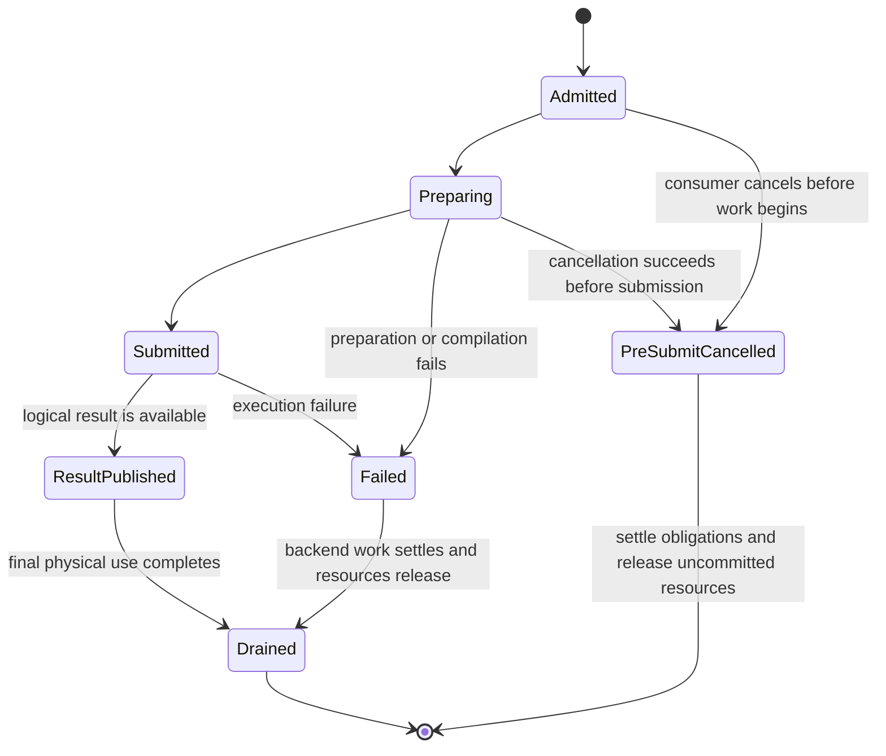
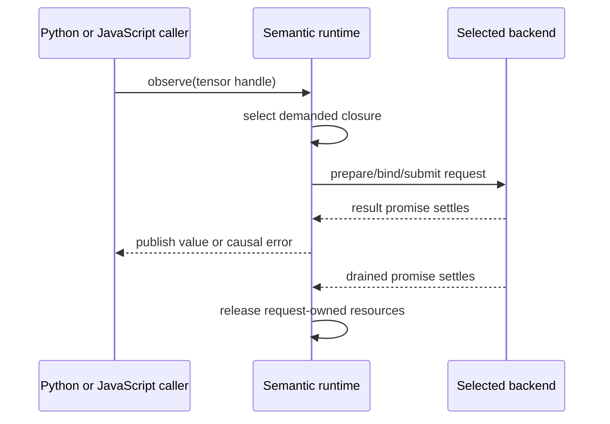

# Requests, completion, and failure

Preparing a reusable program and executing it once are different lifetimes. A
prepared WebGPU pipeline or WebAssembly module can survive many calls, while
each call needs fresh bindings, output identities, effects, errors, and
completion state. This chapter defines that per-invocation boundary.

## A fresh invocation

`ExecutionRequest` contains only per-run information passed to a backend:
current semantic bindings, dynamic values, backend-generation tokens, and
cancellation state. It does not own reusable program structure or permanent
model state.

The surrounding fresh invocation state owns:

- occurrence, output, and derivative-history identities;
- mutation-version and random-number commitments;
- semantic pins and their release obligations;
- causal errors; and
- one `ExecutionTicket`.

The backend continues to own the physical allocation or lease behind every
opaque binding.

Preparation can be skipped on a valid prepared-cache hit. The lifecycle still
creates a fresh request and ticket.

## Result and drain are separate

`ExecutionTicket.result` controls publication of the logical result or its
failure to a consumer. `ExecutionTicket.drained` means that all physical work
owned by the request has completed and request resources may be released or
reused.

The distinction prevents a common asynchronous bug. A consumer can receive or
stop waiting for a result while graphics-processor work, mapping, or a backend
callback still holds a physical buffer. Reusing that memory at result time would
allow later work to overwrite it before the earlier submission has finished.

## Cancellation

Cancellation removes a consumer's interest; it does not automatically destroy
work that the runtime or backend still owns.

- Cancelling after submission detaches the consumer. Producer resources survive
  until drain or explicit runtime close.
- Cancelling a consumer never cancels an admitted mandatory mutation or effect.
- Submitted effects are not silently undone.
- Before submission, uncommitted resources can be released.
- A reserved random-number or mutation position can be restored only when a
  guarded transaction proves that it was never published or observed and that
  no concurrent admission crossed it. Otherwise the interval is retired while
  preserving global order.

This makes rollback a proven exceptional case, not an assumption hidden behind
a cancel button.

## Causal errors

Known metadata and support errors occur during operation admission. Preparation,
compilation, execution, and device failures are asynchronous. They retain:

- the causal operation and stable source provenance;
- the executable program and selected backend;
- the phase that failed; and
- the native cause.

WebGPU uses both rejected promises and appropriately scoped device errors. A
detected failure remains owned until an observation, synchronization, or close
boundary responsible for it delivers the error. Dropping a tensor handle cannot
erase an admitted effect or a failure that has no other public result.

## Observation from JavaScript and Python

The canonical observation is asynchronous and owns one promise per logical
observation. JavaScript exposes that asynchronous surface directly. Python
always has an awaitable surface.

A synchronous-looking Python `item()` is allowed only when `can_run_sync()` can
prove that the complete entry stack is suspendible through JavaScript Promise
Integration (JSPI), such as a Pyodide `runPythonAsync` or `callPromising` path.
If numerical work is still pending under a non-suspendible `runPython` entry,
the call fails before starting work. A scalar that is already available in host
memory may return synchronously.

Reentrant Python-to-JavaScript-to-Python callbacks propagate and restore runtime
and diagnostic context explicitly. Python task cancellation detaches its
consumer from the JavaScript promise; it does not cancel an already owned
producer.

## Explicit transfer

A backend transfer has a source endpoint and a destination endpoint in one
executable program. The destination can begin when source staging becomes
readable, while the source ticket and staging lease stay owned until source
drain. The transfer is observable in diagnostics and cannot be confused with
fallback.

## Device loss and stale callbacks

Device loss creates a new backend generation. Callbacks, materializations, and
prepared entries from the old generation cannot update a new owner. A request
can be re-prepared and re-materialized only from a reproducible semantic source
or valid recoverable copy. Otherwise it fails deterministically and identifies
the lost backend state.

## Closing a runtime session

Closing a `RuntimeSession` stops new admission, settles or rejects every
outstanding responsibility, delivers owned failures, waits or cancels according
to the documented close contract, releases semantic pins, and releases backend-
context references after physical drain. The session then becomes closed.

Closing is a lifecycle boundary, not a second execution mode. It cannot report
success while submitted effects, undelivered errors, or request-owned physical
resources remain unaccounted for.
