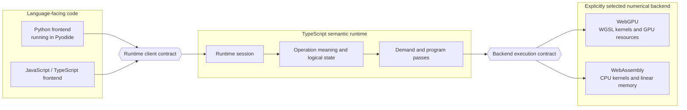
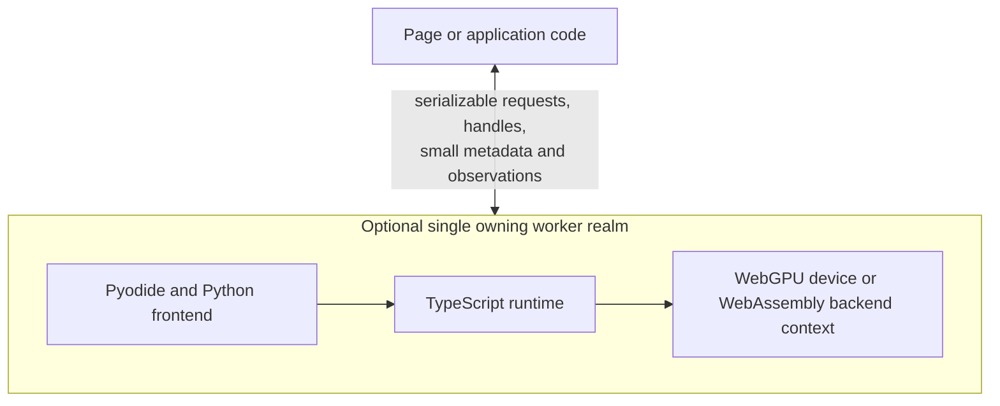

# Frontends, runtime, and backends

The high-level architecture separates how users express tensor work, how
Tabgrad understands that work, and how a machine executes it. This chapter
explains those responsibilities before introducing the internal records used by
the runtime.

## Boundaries and contracts

A **boundary** is the conceptual point where responsibility changes. A
**contract** is the set of requests, results, and rules that the two sides agree
to exchange across that boundary. Neither word implies a network connection,
process, worker, serialization format, or data copy. Two components in the same
JavaScript realm can cross a boundary with an ordinary function call.

When the two sides use different calling mechanisms, a small **transport
adapter** can preserve the contract while changing how a request travels. For
example, an adapter can translate a Pyodide call or carry a message to a Web
Worker. It does not interpret tensor operations, plan computation, or execute
kernels. It is therefore not a fourth engine.

The rounded contract nodes describe agreements between owners. They do not
contain another copy of tensor semantics.

## Frontends: express the computation

The Python frontend presents the supported PyTorch-compatible surface: tensor
objects, modules, functions, argument conventions, and Python exceptions. The
JavaScript and TypeScript frontend presents equivalent native browser-facing
objects and calls. Both translate into the same **runtime client contract**,
which is the semantic runtime's language-neutral entry surface.

A frontend owns:

- language-specific public objects and naming;
- argument collection and language-level normalization that cannot affect
  tensor meaning;
- the presentation of returned handles, metadata, promises, awaitables, and
  errors; and
- deterministic release of managed Pyodide proxies.

A frontend does not own numerical arithmetic, backend selection policy,
storage, automatic differentiation, fusion, or a private definition of an
operation. If Python and JavaScript could assign different shapes or gradients
to the same canonical operation, the boundary would have failed.

### Handles instead of repeated payload copies

A public tensor normally carries a stable numeric **handle** and small metadata
such as shape, data type, and device. The handle identifies state owned by the
runtime. It is not a copy of the tensor's numerical payload and it is not a
WebGPU buffer or WebAssembly address.

Frontend metadata is a convenience snapshot, not a second source of truth. It
is derived from the handle's current runtime state and must be refreshed or
version-checked when an allowed operation can change public metadata. This
prevents Python and JavaScript wrappers from disagreeing with the runtime after
a view or in-place metadata mutation.

The payload enters or leaves this ownership boundary only for explicit import,
export, transfer, or observation. Chained operations pass handles, so model
weights and intermediate activations can remain resident in backend memory.

## The semantic runtime: understand and organize the computation

The runtime is the only authority on the meaning shared by both frontends and
both backends. It owns:

- canonical operation definitions and semantic validation;
- logical tensor, storage, alias, mutation, random-number, and derivative state;
- selection of a finite set of work when a value or effect is demanded;
- construction of an immutable program for one compute target or one explicit
  transfer route;
- request, completion, error, and semantic-reclamation lifecycles; and
- coordination with the selected compute backend or with both endpoints of an
  explicit transfer.

The word *runtime* names this responsibility, not one enormous
`RuntimeEngine` class. One `RuntimeSession` is the stateful owner for a frontend
execution environment. It scopes handles, semantic records and indexes,
gradient mode, random-number and effect order, error ownership, budgets,
backend-context references, and the open/closing/closed lifecycle. Immutable
operation definitions may be shared between sessions.

The runtime does not multiply matrices or traverse large numerical arrays in
JavaScript. It describes and coordinates that work so a numerical backend can
perform it efficiently.

Backend contexts sit behind explicit generation, quota, close, and lease
contracts. A context can be dedicated to one runtime session or safely shared
between sessions when startup, isolation, memory, and concurrency evidence
supports that implementation. This physical choice remains behind the
contract: sharing cannot merge handle namespaces, effect order, errors, or
session lifecycles.

## Backends: perform the numerical work

For numerical computation, the backend execution contract lets the runtime ask
an explicitly selected target about capabilities, prepare a finite
compute-domain program, bind current inputs and outputs, submit work, observe
completion, and manage opaque physical references. The same contract exposes
opaque source and destination endpoint operations for an explicit transfer; the
runtime, rather than either backend, coordinates the complete route and its
staging lifetime. The contract preserves common semantics but does not force the
two backends to use the same internal strategy.

Each backend owns:

- physical layout and storage allocation;
- memory pools and reusable physical leases;
- kernel selection, generation, and specialization;
- translation from the common program into backend-specific work and its
  physical schedule;
- compilation, command encoding, barriers, and dispatch;
- prepared-work and kernel caches;
- asynchronous completion, readback, and native failure capture; and
- device or backend-generation recovery.

The WebGPU backend owns graphics-processor buffers, pipelines, bind groups, and
queue submission. Its numerical kernels use WebGPU Shading Language. The CPU
backend combines a TypeScript host adapter with Rust-authored kernels compiled
into prebuilt WebAssembly modules. It owns imported linear memory, compiled
modules and instances, scalar or vector variant selection, and any worker
coordination used for CPU execution. The Rust compiler is part of the build;
the browser loads its output without installing Rust or another native runtime.
The detailed boundary is explained in
[WebAssembly CPU backend](webassembly-cpu-backend.md).

JavaScript is the host language for coordination, not a slow third numerical
backend. Pyodide supplies a Python interpreter, not a NumPy or PyTorch execution
engine. No existing tensor engine sits underneath these backends.

## Logical ownership is not physical deployment

The boundaries above do not dictate a thread layout. In a simple JavaScript
application, the frontend and runtime can call each other directly. When a
worker is used, Pyodide, the TypeScript runtime, and the WebGPU device live in
the same JavaScript realm. This keeps live Python proxies and `GPUBuffer`
objects out of worker messages.

Moving a boundary to a worker may improve interface responsiveness, but it does
not change tensor semantics. Large tensor payloads should not shuttle through
messages merely because the deployment uses a worker.

## End-to-end example

For `result = relu(x @ weight)`:

1. The frontend sends handles for `x` and `weight` plus the requested operation.
2. The runtime validates matrix shapes and infers output metadata without
   needing output numbers.
3. The runtime records the logical result and returns its handle. The matrix
   multiplication may still be pending.
4. The activation call is validated and linked to that pending result.
5. When the numbers become necessary, the runtime selects exactly the pending
   dependencies needed for `result` and forms a finite program.
6. The selected backend prepares and submits kernels, retaining intermediate
   data in its own memory.
7. A later operation can consume the resident result by reference. Only an
   explicit observation copies numbers into a form Python or JavaScript can
   inspect.

The following chapters explain the logical records and execution stages that
make this sequence precise.
