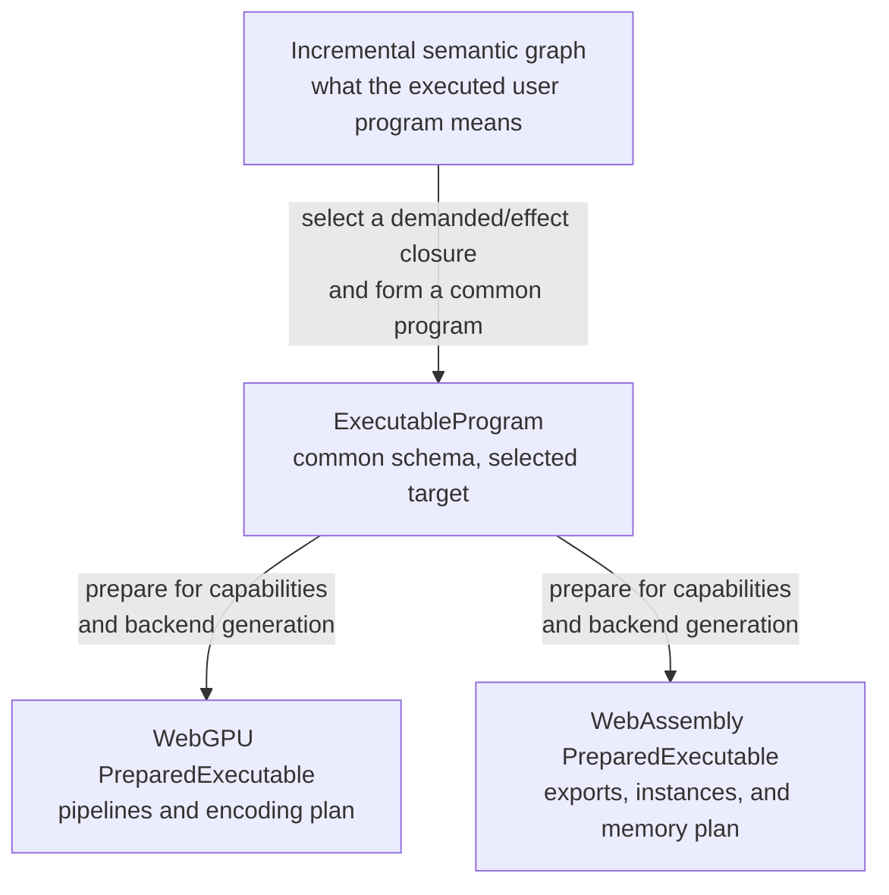

# Internal representations and executable programs

An **intermediate representation** is structured data that describes a
computation so another part of a system can inspect and transform it. The common
abbreviation is **IR**. Tabgrad needs two internal descriptions because the
meaning accumulated while user code runs has a different lifetime and purpose
from the finite work a backend must execute now.

There is also a third, backend-private preparation level. It is not another
common IR because it contains physical choices that are intentionally different
for WebGPU and WebAssembly.

## The three descriptions

The questions are different:

1. The incremental semantic graph asks, “What tensor operations did the host
   program actually perform, and what do their values and effects mean?”
2. `ExecutableProgram` asks, “What finite work in the common executable
   vocabulary is required for these roots on this selected backend and its
   declared capabilities?”
3. `PreparedExecutable` asks, “How will this backend execute that program on
   this backend or device generation?”

Combining these levels would either leak public semantics and historical state
into kernels or leak physical buffers and pipelines into a supposedly reusable
program.

## Level one: the incremental semantic graph

Operation admission creates `OperationRecord` and `TensorValue` objects and
indexes their data and effect dependencies. Together they form the reclaimable
semantic graph described in [Semantic state](semantic-state.md).

This representation is dynamic. It contains operations from the branch that
Python or JavaScript actually executed, not every branch that could have run. It
can contain pending, materialized, and effectful records. Its identities are
specific to occurrences in a runtime session, and records disappear when their
semantic responsibilities end.

The semantic graph is therefore not suitable as a cache key or as a physical
backend program. It contains more occurrence identity and lifetime state than a
reusable execution needs.

## From a demand region to a program

When a demand root appears, program-formation passes walk the exact selected
closure. A **pass** is a transformation or analysis over records. It need not be
a long-lived stateful object.

The passes can:

- preserve and verify authoritative data and effect dependencies;
- translate rich operations into a backend-neutral executable vocabulary when
  a legal decomposition is needed;
- canonicalize equivalent structure;
- remove work that is dead within the selected region;
- identify groups that may legally be fused;
- calculate logical liveness and virtual storage reuse;
- retain stable diagnostic provenance; and
- record guards and abstract capability requirements.

This translation from public semantic operations to the common executable
vocabulary is **semantic lowering**. *Lowering* means moving from a richer,
higher-level description to a more concrete one while preserving its contract.
Semantic lowering still does not select a physical kernel, buffer address, or
dispatch geometry.

## Level two: `ExecutableProgram`

`ExecutableProgram` is an immutable, structurally hashable description of one
finite unit of executable work. There is one program schema, not separate
“common” and “target-profiled” program types. Each executable value names its
execution domain and records the target-profile assumptions needed to keep the
work legal. Its computation vocabulary remains common to both numerical
backends and contains no physical kernel or resource. It contains:

- program values and virtual storage slots;
- versioned backend-neutral `LoweredComputation` records;
- symbolic shape and layout facts;
- compact access and alias facts;
- authoritative data and effect dependencies;
- logical liveness and release constraints;
- specialization guards and abstract capability requirements; and
- stable diagnostic provenance back to semantic operations.

A `LoweredComputation` is one versioned unit in the backend-neutral executable
vocabulary. It states a concrete computation and its logical inputs, outputs,
attributes, and constraints after public-language details have been removed,
but before a backend chooses kernels or physical memory. The named record gives
both backends a stable, testable meaning to consume without requiring every
backend to understand the full public API.

It deliberately excludes:

- model weights and other tensor payloads;
- concrete storage identifiers, pointers, or buffer addresses;
- occurrence-specific mutation-version identifiers;
- request, output, history, error, or ticket identities; and
- a captured backend or device generation.

The exclusions make structure reusable. Weights are persistent runtime-bound
tensor and storage state. Training can replace their current `TensorValue`
without changing stable parameter identity or invalidating a program solely
because bytes changed.

Diagnostic provenance inside the program is likewise structural: it identifies
stable operation names and source slots. Fresh occurrence identifiers and the
mapping from this invocation to those slots belong to invocation state. A cache
hit can therefore report the current call without retaining or impersonating an
older semantic occurrence.

Target profiling does not make the physical schedule common. It records only
the backend-family and capability facts needed to keep the shared executable
vocabulary legal and truthful. Two targets can therefore produce different
values of the same `ExecutableProgram` schema without creating two semantic
engines.

## Level three: backend-private preparation

Preparing a program chooses physical details for one backend and capability
fingerprint. The opaque result is `PreparedExecutable`. WebGPU preparation can
own pipelines, bind-group strategy, and a command-encoding plan. WebAssembly
preparation can own modules, compiled exports, instance strategy, and a linear-
memory plan.

`PreparedExecutable` is reusable while its full key remains valid, but it is not
portable between backends or device generations and it is not an invocation in
progress. A fresh execution request supplies current bindings and produces a
fresh completion lifecycle.

## Legal transformations versus profitable physical choices

The runtime and backend have complementary responsibilities:

| Decision | Owner |
| --- | --- |
| Whether a decomposition, reorder, or fusion preserves operation, alias, effect, data-type, and derivative meaning | `OperationDefinition` and common program passes |
| Whether the legal transformation is supported and profitable on current capabilities | Selected backend |
| Which kernels, layouts, workgroup sizes, calls, barriers, buffers, and submissions implement it | Selected backend |
| When a finite program may enter a backend and how conflicting semantic requests are ordered | Runtime invocation coordination |
| How independent physical work overlaps while respecting program dependencies and release constraints | Selected backend |

A **schedule** is the chosen order and grouping of work subject to dependencies.
The common program owns the dependencies and logical release constraints. The
backend owns the physical schedule. Tabgrad does not need a stateful
`ExecutionPlanner` that independently rediscovers both sets of facts; selection,
formation, and common planning are passes, while backend scheduling remains
private.

## Mixed ordinary and reusable work

A selected region can contain ordinary `OperationRecord` objects and
tagged `ProgramCallRecord` objects. Program formation semantically incorporates
a reusable call's program into the selected result, remapping boundary values,
virtual storage, dependencies, guards, capabilities, and mutation transitions.

The output is one native `ExecutableProgram`, not an opaque nested-program
instruction that a backend must interpret. If the reusable call already
materialized and drained, later work may instead bind its backend-resident
output without reading it back to the host.

Semantic incorporation must not mean copying every child computation on every
hot invocation. On the first structural combination, a flat-composition cache
may form and normalize the complete program. Its key uses the already computed
fingerprints of reusable children, their boundary remaps, the structural
description of new ordinary segments, and the target profile. A hit reuses the
flat program and creates only fresh invocation bindings, identities, guards,
history, and lifecycle state.

This is a cache over ordinary `ExecutableProgram` values, not a new composite
IR or stateful planner. On a miss, flattening is proportional to the complete
formed program. On a hit, lookup and attachment are proportional to the number
of child calls, boundary values, guards, and new ordinary records rather than
to every computation inside an unchanged reusable child. Sending opaque nested
calls to each backend or always materializing their boundaries would merely
move complexity or discard fusion opportunities.

## Complexity and bounded caches

For `S` selected semantic operations, `E` selected dependency or effect edges,
and `A` compact rank, access, and symbolic facts, traversal and first-time
program formation must be proportional to `S + E + A`, apart from explicitly
justified bounded allocation factors. The default path performs no global sort,
pairwise alias scan, per-element access-set construction, or scan of unrelated
graph history. A repeated flat-composition hit obeys the boundary-proportional
cost above and does not traverse unchanged child computations.

Structural program caches and backend prepared caches have independent count-
and-byte budgets, but their keys deliberately cover different lifetimes. A
structural-program key includes program-format and semantic-lowering versions,
structural child fingerprints, target-profile assumptions, specialization, and
every semantic fact that can change the formed program. It excludes physical
backend generation, compiler and kernel state. A prepared-executable key adds
the selected backend, compiler and kernel versions, capability fingerprint,
specialization, and backend/device generation. Device recreation can therefore
invalidate physical preparation without needlessly invalidating reusable common
program structure. A hit never reuses occurrence-specific semantic identities.
