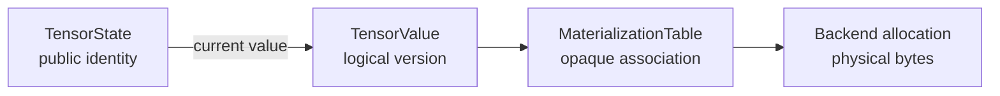

# Memory and performance

Efficiency is an architectural requirement for Tabgrad because tensor payloads,
model weights, activations, compilation, dispatch, transfers, and retained
derivative state can all dominate browser workloads. The architecture therefore
makes costs and ownership inspectable. It does not assume that clean interfaces
are automatically fast, nor that a fast kernel makes the whole runtime fast.

This chapter states structural constraints. It does not claim measured speed or
memory support for a release. Measurements and support claims require the
evidence defined by [the performance policy](../performance.md) and
[the compatibility record](../compatibility.md).

## Three kinds of lifetime

The public identity, logical value, and physical bytes can begin and end at
different times:

- A `TensorState` lives while a public handle or another stable owner needs that
  tensor identity.
- A `TensorValue` lives while semantic dependencies, derivative history,
  effects, requests, or errors need that version.
- A backend allocation lives through every physical use and can then be returned
  to a bounded pool even after its semantic association ends.

Finishing a kernel does not imply host export. Dropping a public handle does not
imply immediate physical release when an alias, saved derivative, submitted
request, or pool still owns a legitimate lifetime.

## Required complexity bounds

Let `rank` be a tensor's number of dimensions, `arity` the number of operation
arguments, `S` the number of selected semantic operations, `E` the number of
selected data or effect edges, and `A` the compact rank, access, and symbolic
facts needed by the selected program.

The architecture requires:

- tensor and view metadata proportional to `rank`, with no payload copy for a
  valid view;
- average constant-time handle and alias-version lookup;
- no mutation scan across every alias;
- admission proportional to `arity` plus compact rank and access facts;
- demand selection, program formation, and backward traversal proportional to
  `S + E + A`, apart from justified bounded allocation factors; and
- no scan of unrelated graph history, pairwise alias comparison, global sort,
  or per-element access set on the default path.

These bounds keep host work tied to the computation being used rather than to
everything a session has ever performed.

## Semantic pins, physical leases, and drain

A semantic pin states that a logical materialization must remain usable. Its
owner—such as derivative history or an invocation—also owns the release
obligation. The backend's physical lease states that bytes or another resource
are reserved for physical use.

The two lifetimes end under different conditions:

1. Semantic reachability and history determine when the pin can be released.
2. `ExecutionTicket.drained` determines when the last physical use has finished.
3. Only after both facts permit it can the backend reuse the bytes for an
   unrelated value.

Logical liveness in `ExecutableProgram` can plan virtual storage reuse. The
backend remains the owner of physical reuse, barriers, and pools.

## Bounded owner-specific state

Independent stores need independent count-and-byte budgets because pressure in
one does not justify evicting live state from another. This includes:

- semantic records and indexes;
- derivative history and saved logical values;
- executable programs and lowering results;
- backend prepared executables, kernels, and pipelines;
- compiled variants and diagnostic records;
- pending and in-flight requests;
- staging allocations; and
- WebAssembly and WebGPU memory pools.

Every budget defines what can be pinned, what can be evicted, what event can
make progress, and what deterministic error occurs when neither reclamation nor
bounded backpressure can help. A hidden unbounded cache is an architectural
violation even if it improves a short benchmark.

Repeated inference and training should reach a plateau after warm-up for
completed semantic records, histories, variants, prepared state, and reusable
physical resources. Live sequence data, model state, and in-flight work still
scale with their real inputs.

## Weights, gradients, and key-value caches

Model weights are persistent runtime-bound `TensorState` and `StorageState`, not
payload embedded in an executable-program fingerprint. Their current logical
values can change during training while parameter identity remains stable.

Gradient and optimizer state scale with live parameters and optimizer choice,
not with completed training steps. Saved activations scale with live derivative
work and the chosen legal checkpointing policy.

A transformer's key-value cache stores attention keys and values from earlier
tokens. Mutable preallocated cache storage grows with configured capacity and
used tokens. Appending a token writes the new range rather than copying the
existing cache. Dynamic used length should remain a program input or guard where
legal, not a distinct compiled variant for every position.

The architecture allows fused or streaming attention implementations that avoid
materializing a complete quadratic attention matrix. It does not require such a
matrix as an intermediate representation.

## Where time goes

End-to-end latency and throughput can include:

| Cost | Typical source |
| --- | --- |
| Download and startup | JavaScript, optional Pyodide, WebAssembly modules, kernel metadata, and initialization |
| Model loading | Reading, validating, decoding, and placing weights |
| Frontend bridge | Python-to-TypeScript or application-to-worker calls |
| Admission and formation | Semantic validation, selected-closure traversal, lowering, and program construction |
| Preparation and compilation | Shader, pipeline, module, export, and specialization work |
| Dispatch | Backend calls, command encoding, submissions, and workgroup launches |
| Numerical execution | Useful arithmetic on the central processor or graphics processor |
| Allocation and peak memory | Outputs, temporaries, weights, saved activations, caches, and staging |
| Transfer | Movement between host, WebAssembly, and WebGPU memory |
| Synchronization and readback | Waiting for completion or making values host-readable |

An optimization can reduce one cost while increasing another. Fusion may remove
launches and temporaries but increase compilation time or register pressure.
Quantization may reduce weight bytes but require specialized kernels and
conversion. A worker may improve page responsiveness while adding message and
synchronization cost.

## Measurement and observability

Performance comparisons separate cold setup from warm execution and record
bridge, admission, formation, compilation, dispatch, numerical work, transfer,
synchronization, readback, logical memory, backend bytes, and process resident
memory when relevant. Both alternatives use identical operations, inputs,
hardware, backend, cache state, and observation boundaries.

The runtime must be able to attribute formed programs, selected roots, kernels
or backend calls, cache decisions, allocations, transfers, waits, results, and
drains without changing semantics. Detailed tracing can be optional in
production, but the ownership boundaries must not make these costs impossible to
observe.

Inference, backward computation, optimizer updates, and token-by-token generation
are distinct representative workloads. A narrow operation microbenchmark does
not establish whole-model performance, and architecture evidence does not
establish release support.
