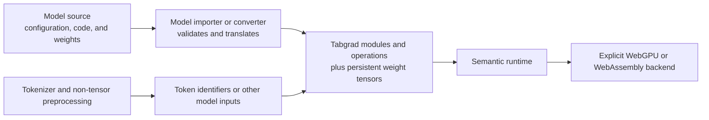

# Model integration boundary

Tabgrad's tensor runtime is the execution foundation for a model; it is not the
whole model-import pipeline. Model configuration, weight formats, code
conversion, tokenization, and other preprocessing have different responsibilities
and dependencies. Keeping them above the runtime prevents one model ecosystem
from becoming a second source of tensor semantics.

## The end-to-end boundary

The importer can understand an external model's naming, configuration, files,
and supported code patterns. Its output uses Tabgrad's public modules and
operations and binds weights as ordinary persistent tensor state. Once model
execution begins, every tensor operation follows the same runtime and backend
architecture as hand-written Tabgrad code.

## What an importer owns

A model importer or conversion tool can own:

- reading and validating model configuration;
- mapping named parameters and buffers to Tabgrad tensors;
- decoding a supported weight format and placing data without avoidable copies;
- translating supported model structure into Tabgrad modules and operations;
- preparing explicitly selected reusable callables where their guards are
  valid;
- segmenting weights or execution according to declared backend limits; and
- reporting unsupported model constructs precisely.

It does not own the meaning of tensor operations, automatic differentiation,
backend fallback, physical scheduling, or a model-specific numerical engine.
The runtime's canonical `OperationDefinition` records remain the only semantic
authority.

An offline conversion process may inspect source that uses PyTorch, NumPy, or
other Python facilities. That does not make those libraries runtime dependencies
or browser numerical backends. Executable model code delivered to Tabgrad must
express tensor computation through supported Tabgrad operations; non-tensor
conversion work stays outside the execution core.

## Weights and persistent state

Weights are data, not executable-program structure. An importer creates or
loads them as persistent runtime-bound `TensorState` and `StorageState` objects.
An `ExecutableProgram` binds their current values at invocation time rather than
embedding payload bytes or physical addresses in its structural key.

This supports both inference and training. An optimizer can change the current
logical value and storage version while stable parameter identity remains the
same. A reusable callable resolves the current-generation materialization of an
explicitly captured parameter once per invocation.

Large weights should move toward their final owner through the fewest practical
copies. Streaming and segmentation belong to importer and backend policy, while
the runtime preserves explicit device, data-type, and error semantics.

## Tokenization and preprocessing

A tokenizer converts text to token identifiers and converts generated identifiers
back to text. Image, audio, and structured-data models have analogous
preprocessing. These transformations are not tensor backends.

Tokenization can use a separately evaluated JavaScript library, a model-specific
implementation, or another browser-compatible component. That choice has its own
format coverage, licensing, package-size, performance, and maintenance criteria.
It may produce ordinary arrays or tensors as model inputs, but it cannot define
or override tensor-operation semantics.

Keeping tokenization separate also prevents a tokenizer dependency from being
loaded by applications that only use the tensor runtime or models with different
preprocessing.

## Operation families used by decoder models

The architecture can represent the kinds of state and data flow exercised by
conventional transformer decoders, including:

- root mean square normalization (RMSNorm);
- rotary position embeddings (RoPE);
- grouped-query attention;
- gated multilayer perceptrons;
- fixed-capacity key-value cache append;
- scaled matrix multiplication with 8-bit integer weights; and
- bounded forward, vector-Jacobian-product, gradient-accumulation, and optimizer
  sequences.

This statement is about architectural expressiveness, not model support. A
specific model requires verified operation definitions, data types, kernels,
weight conversion, memory fit, numerical agreement, and browser/backend coverage.
Convolutional or recurrent state used by some model families likewise requires
its own operation and kernel evidence.

## Capability and fit

Browsers and devices expose finite buffer, binding, workgroup, data-type,
WebAssembly vector, and thread capabilities. An importer can choose a legal
segmentation for the user's explicit backend when the model definition permits
it. If weights, context, or required operations cannot fit the declared
capabilities, loading or execution fails with a useful explanation.

Tabgrad does not silently shrink a model, change precision, remove layers, or
move work to the other backend. A model's parameter count alone cannot establish
that it fits every browser or device.

## What the central architecture decides

The central architecture decides where integration belongs and which runtime
boundaries it must respect. It does not select a Hugging Face importer package,
tokenizer dependency, weight container, public loading API, or list of supported
models. Those choices can be made independently as long as they do not create a
third backend, duplicate the semantic registry, transport tensor payloads
through Python for each operation, or bypass explicit capability and error rules.
