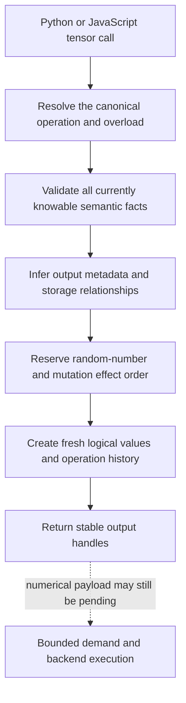

# Operation admission

Calling a tensor operation has two different consequences. Tabgrad must
understand and validate the call immediately, but it often does not need to
produce the output numbers immediately. **Operation admission** is the common
runtime path that performs the first responsibility and records enough
information for the second.

This separation gives the public API familiar eager behavior where it matters:
an invalid shape, argument, data type, device, layout, or known unsupported case
does not become a mysterious failure much later. At the same time, valid pure
operations can remain pending long enough to be combined and executed
efficiently.

## One path for both frontends

Python and JavaScript calls enter the same TypeScript admission path. The
frontend may normalize language syntax, but only the runtime's canonical
`OperationDefinition` decides tensor meaning.

Admission performs these steps:

1. Resolve a canonical `OperationDefinition` and overload.
2. Normalize attributes whose meaning is independent of the source language.
3. Validate arguments, shapes, data types, devices, layouts, alias rules, and
   capabilities that are already known.
4. Infer output metadata and record a view or logical storage transition without
   moving payload bytes when no numerical work is needed.
5. Reserve semantic order for random-number generation and mutation effects.
6. Create fresh output `TensorState`, `TensorValue`, and `OperationRecord`
   identities as required.
7. Attach derivative facts only when gradient tracking is active.
8. Update bounded dependency, effect, and reachability indexes and return public
   handles.

The named records are explained in [Semantic state](semantic-state.md).

## Metadata is useful before numbers exist

For input shapes `[1, 2]` and `[2, 3]`, the runtime can infer that matrix
multiplication produces shape `[1, 3]` without calculating its three output
numbers. A valid reshape or transpose may create only view metadata. This is why
the frontend can immediately return a useful tensor handle even when its payload
is deferred.

Metadata inference is not a numerical backend. It is semantic reasoning over
small descriptions such as ranks, dimensions, strides, data types, and alias
relationships.

## Rich operations and later decomposition

A public operation remains a canonical semantic operation at admission. It is
not automatically exploded into many low-level operations just because a
backend might eventually use them. Keeping the rich operation intact preserves
its public validation, error, alias, and derivative rules and leaves room for a
specialized kernel.

When finite work is selected, a later semantic translation may legally
**decompose** the operation into a backend-neutral executable vocabulary. A
decomposition is valid only when it preserves observable meaning. It is not an
excuse for a backend to reinterpret the public call or silently substitute a
different device.

## Effects need order even when arithmetic is deferred

Pure work can be dropped without execution when its result becomes unreachable.
Effects cannot. Mutation, gradient accumulation, optimizer updates, and
random-number position have observable order.

Admission therefore records effect relationships before backend execution. A
random operation reserves its semantic position so removing an unused output
does not cause later random operations to draw different values. A mutation
advances its shared logical storage version once, even though the corresponding
physical write may be submitted asynchronously.

This is what *effect-aware* means in the architecture: optimization can reorder
or combine work only within the ordering constraints that preserve externally
visible behavior.

## Dynamic automatic differentiation starts here

Only calls that the host program actually reaches are admitted. If Python takes
one branch of an `if` statement, operations in the other branch do not appear in
the semantic graph. When gradient tracking is enabled, each reached operation
contributes the derivative recipe and saved logical facts needed for later
backward computation.

Admission does not execute backward arithmetic. When gradients are requested,
automatic differentiation emits more operations through this same path. The
full training flow is described in
[Automatic differentiation and training](autograd-and-training.md).

## Error timing

Errors occur at the earliest layer that has enough truthful information to
identify them:

| Error class | Owner and timing |
| --- | --- |
| Invalid arguments, incompatible known shapes, invalid aliasing, or known unsupported behavior | Synchronous admission error before a numerical request is started |
| Unsupported capability discovered while forming or preparing target work | Explicit formation or preparation failure associated with the causal operation and backend |
| Shader compilation, WebAssembly invocation, device, or asynchronous execution failure | Asynchronous failure retained by the request lifecycle until an owning observation, synchronization, or close boundary delivers it |

No dropped pure tensor may erase an already admitted effect or an asynchronous
failure. No backend failure is rewritten as successful execution on the other
backend.

## Cost boundary

Admission works on operation arity, tensor rank, layout/access facts, and small
semantic records. It must not scan tensor elements, every existing alias, or an
unrelated historical graph. Its target complexity is proportional to the call's
arguments plus the compact metadata it must inspect. Numerical size belongs to
the selected backend, not to this path.
