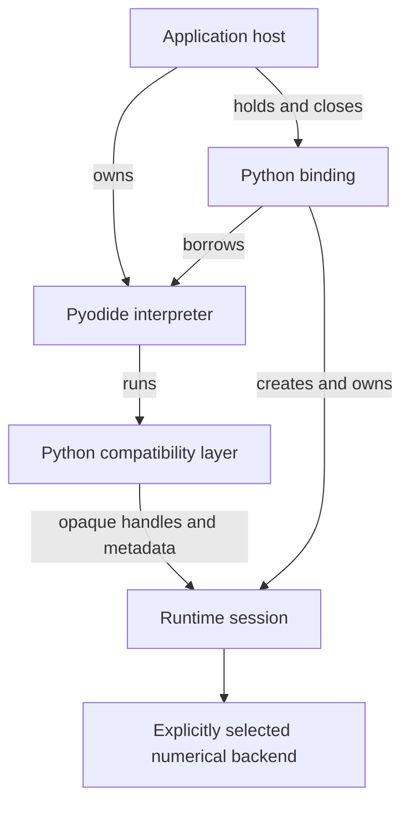
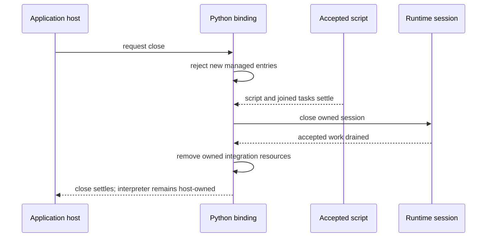

# Python integration with the shared runtime

A Python interpreter can execute a function named `torch.add` without knowing
anything about a Tabgrad tensor or its backend. Making that function useful
requires a connection between two systems: Pyodide runs the Python program,
while Tabgrad owns the meaning and execution of tensor operations. That
connection must also account for resources that outlive a function call, such
as a pending result or a Python reference kept by user code.

This chapter explains the accepted integration contract for contributors who
understand Python and JavaScript but are unfamiliar with their interaction in
a browser. It develops the [frontend boundary](frontends-runtime-backends.md),
not a second tensor engine. It records design constraints rather than release
support; [compatibility records](../compatibility.md) establish the supported
API and tested environments of a release.

If Pyodide itself is unfamiliar, start with
[Python in the browser](../concepts/python-in-the-browser.md). That chapter
distinguishes the Python language, its interpreter, and the numerical engine.
Here the question becomes how to connect them without duplicating tensor
semantics or losing track of resources. The
[managed-session flow](../flows/managed-python-session.md) then follows the
contract through one application interaction.

## Separate three questions before choosing an owner

First, who runs the Python program? Pyodide provides the interpreter that
evaluates ordinary Python code and makes JavaScript objects accessible to it.
The application that loads that interpreter is the **host**. The host may use
Python for tasks unrelated to Tabgrad, so the interpreter cannot be treated as
an exclusively owned tensor resource.

Second, who knows what a tensor operation means? Tabgrad's shared semantic
runtime owns that knowledge. A **runtime session** groups tensor work and its
resources under one lifetime. The Python compatibility layer translates Python
calls into that runtime's operations; it does not define another graph or
repeat numerical work in Python. The selected backend performs the arithmetic.

Third, who coordinates the relationship? A **binding** connects the host's
interpreter to one session and manages entry and shutdown. It needs a separate
lifetime because neither a Python function returning nor the host retaining a
variable says when tensor work is safe to release. The following sections
define that relationship precisely. These are ownership boundaries within an
integration, not a requirement for three processes or network services.

## Attach an interpreter without taking ownership of it

The application host loads a supported, pinned Pyodide build and supplies its
interpreter instance to Tabgrad's attachment entry, `attachPython`. The returned
**binding** associates that interpreter with one runtime session. The binding
owns the session it creates, but borrows the interpreter. This distinction
means closing Tabgrad releases tensor resources without destroying the host's
Python environment or unrelated Python objects.

Python integration has a separate browser entry module. Importing the direct
JavaScript tensor API must not import or initialize Pyodide. The application
can serve both integrations as static assets; people opening the application
do not install Python, Rust, a package manager, or a native tensor engine.

The arrows describe ownership or calls, not messages between processes. The
Python frontend and runtime share one JavaScript realm, so the connection does
not require serialization. The [deployment boundary](frontends-runtime-backends.md#logical-ownership-is-not-physical-deployment)
also permits an application-owned worker; attachment itself is not a worker
manager.

Only one attachment may be pending or active for an interpreter. A competing
attachment fails before it can install a second session. Accepting a borrowed
tensor session with ambiguous shutdown responsibility is outside this
contract. An all-in-one convenience loader could compose this attachment
boundary, but does not justify coupling Python startup to the JavaScript API.

## Run scripts under an explicit lifetime contract

The binding's `runPythonAsync(source)` entry executes a script and resolves
without exporting an arbitrary Python result to JavaScript. This keeps a
script result from silently becoming another resource the application must
release. Any temporary Python proxy returned by the underlying execution API
is destroyed before the managed entry settles. Host code that obtains Python
objects through other Pyodide APIs owns those objects and their proxies.

One managed entry may run at a time. Overlap is rejected rather than queued.
The host must not concurrently drive the borrowed interpreter through raw
Pyodide calls during a managed run. This is a cooperation contract, not a
security sandbox or a mechanism for detecting every possible interpreter call.

Repeated entries use the interpreter's existing global namespace: a variable
assigned in one script can remain available to another. Attachment helpers must
not pollute or overwrite those user globals. Closing the binding preserves
user variables; a retained tensor, module, or function still refers to the old
closed binding and cannot silently acquire the session of a later attachment.

Scripts must await or join tasks they start before their managed entry returns.
An escaped background task is outside this contract. Serializing entry calls
does not prove that arbitrary Python tasks or JavaScript callbacks have stopped,
and it does not introduce a hidden task scheduler or cancellation of host work.

Closing the binding is idempotent and cooperative. It rejects new managed
entries, lets an accepted entry settle, drains the owned session, and cleans up
owned integration resources. It cannot forcibly interrupt an infinite Python
loop or promise to finish while user code waits forever for an external event.

The script-settlement step applies when a managed entry is active. A failed
entry still settles: failure does not remove the binding's cleanup obligation.
The runtime's detailed completion and drain distinction is defined in
[Requests, completion, and failure](execution-lifecycle.md).

## Keep Python tensors thin, but genuinely Python-facing

A Python tensor wrapper owns a public handle to runtime state. In this
same-realm integration, that handle is the existing opaque JavaScript tensor
object. Pyodide can present it to Python and return the original object to
JavaScript, where the runtime validates its identity and session association.
No independent numeric-identifier table is needed simply to make that trip.

The wrapper does not contain a second graph, operation registry, or numerical
implementation. Python spellings such as `torch.add`, `Tensor.add`, and tensor
`+` normalize into the same canonical runtime operation. The frontend owns
Python argument binding and exception presentation; the runtime owns shared
shape, dtype, device, and operation semantics.

Being thin does not mean exposing JavaScript strings as a compatible Python
API. Metadata must use appropriately bounded Python `torch.Size`, dtype, and
device objects, with behavior established against the named PyTorch reference.
Their content comes from runtime state, not an independently inferred shape or
device. The [metadata freshness rule](frontends-runtime-backends.md#handles-instead-of-repeated-payload-copies)
also applies when public metadata can change.

Unsupported inputs and overloads fail explicitly. A restricted float32 path
must not silently convert inferred integer tensors into float32, emulate an
unsupported mutating overload, or choose another backend. Exact operation
coverage and intentional PyTorch differences belong in the compatibility
record rather than being inferred from this architectural boundary.

## Give wrappers, proxies, and requests different owners

Cross-language resources are not interchangeable. A **proxy** makes an object
from one language accessible to the other. It can keep that object alive, but
it is not the tensor's numerical allocation. Likewise, a **buffer view** exposes
a bounded part of memory without granting ownership of the whole interpreter
heap. Keeping these distinctions explicit prevents both leaks and premature
release.

| Resource | Owner and release obligation |
| --- | --- |
| Python tensor wrapper | Owns one public runtime handle; a one-shot `weakref.finalize` callback releases it without retaining the wrapper itself. |
| Values needed by a pending result | Retained by the runtime's logical dependencies, independently of the input wrapper's lifetime. |
| Accepted observation or execution | Retains runtime leases until settlement and drain, even if its public waiter disappears. |
| Borrowed Python argument proxy | Used only within its borrowing scope; not retained as a long-lived JavaScript owner. |
| Acquired Python buffer view | Released in `finally` before returning or awaiting across the bridge. |
| Explicitly owned host Python proxy | Destroyed on every success and failure path by the code that acquired ownership. |
| Runtime session | Closed and drained by the binding even when Python references survive. |

An expression must not require the user to close every temporary tensor by
hand. Wrapper finalization releases the public handle; the runtime continues
to retain any exact values still needed by other results or requests. Closing
the binding provides the deterministic session-resource boundary. Finalizers
that run afterward must be harmless and idempotent.

Python collection of cycles is not deterministic. A user-held object or
exception traceback can legitimately retain a tensor. Tests and diagnostics
must distinguish that ownership from an accidental bridge reference; clearing
user exceptions or forcing collection after every operation would conceal the
problem rather than establish an ordinary-use lifetime guarantee.

## Move bulk data only where the user imports or observes it

Passing a tensor to an operation is different from importing its numbers.
Operations exchange handles and small arguments. They must not convert each
intermediate result into a Python container merely because the next call is
written in Python.

For flat float32 list or tuple input, conversion builds a Python `array('f')`,
borrows its validated contiguous float32 view synchronously, and lets the
runtime create an owned host array. Only the bounded view is read, never the
entire backing Pyodide heap. Argument conversion is frontend work; addition
and other numerical computation remain backend work.

The corresponding CPU data path has distinct costs:

| Boundary | Data movement |
| --- | --- |
| Python import | Convert the input container to a float buffer and copy its bounded view into runtime-owned host data. |
| Backend demand | Upload required imported values into CPU linear memory. |
| Chained operations | Pass handles; keep intermediate numerical results in backend memory. |
| Explicit observation | Read back into a copied JavaScript array, copy into a Python float buffer, and produce the Python list locally. |

This is not a zero-copy claim. Container allocation, input normalization,
runtime import, backend upload, readback, and Python output conversion are
different costs. Their counts and retained memory must be measured separately
under the [performance policy](../performance.md); the absence of a numeric
handle table does not establish a speed advantage.

## Observe results without blocking browser progress

Producing a Python list requires actual numbers, so `tolist()` is an
observation, not a metadata lookup. Both the synchronous-looking `tolist()`
and the explicit Tabgrad extension `tolist_async()` use the same asynchronous
runtime observation path. Neither selects another engine or recomputes the
answer in Python.

JavaScript Promise Integration (JSPI) allows a suitable WebAssembly entry stack
to suspend while JavaScript continues making progress. The synchronous-looking
surface is permitted only in a supported suspendible managed entry. Its guard
runs before demanding numerical work; without the required capability or entry
context, it raises a clear capability/context error. The awaitable surface
remains the explicit alternative. This attachment contract does not promise a
synchronous shortcut for cached host data or every raw Pyodide entry route.

Capabilities are checked, not inferred from a browser name. The research used
Pyodide's experimental `can_run_sync` facility, so integration must pin and
probe that dependency rather than assume its interface is stable. Tested
Pyodide versions and browser support are versioned facts, not guarantees made
by this chapter.

Cancelling a Python observation waiter detaches that consumer; it does not
cancel already accepted runtime work. Its resource leases remain until the
producer settles and drains, including during close. Input errors preserve
their synchronous admission timing and appropriate Python exception class.
Asynchronous backend errors preserve code, phase, operation provenance, and
cause through the Python error presentation. Lifecycle and browser-capability
errors must remain distinguishable from PyTorch semantic errors.

## Load static Python assets transactionally

Tabgrad maintains its compatibility layer as ordinary Python source and
distributes it as versioned static assets. Attachment loads those assets through
Pyodide's filesystem and import facilities, and registers a private JavaScript
bridge module. This route needs neither a wheel installer nor NumPy, and does
not publish a package called `torch` to a registry. The controlled `torch`
namespace belongs to Tabgrad's independent compatibility layer.

Loading can fail after some resources have been acquired. Attachment therefore
acts as a transaction: reject conflicting installed or imported `torch` and
private bridge names before mutation, check artifact integrity and version,
and track the exact files, import-path changes, and module entries it owns.
Failure unwinds owned changes instead of leaving half an attachment installed.

Cleanup removes or restores resources only while their identities remain owned
by the binding. It must not delete a replacement installed by the host.
Unregistering a JavaScript module alone is insufficient because Python's
`sys.modules` import cache can retain it. Successful close also removes owned
registration state without altering user globals. References the user retains
remain tied to the old closed binding, not rebound to a new session.

## Decision, alternatives, and limits of the evidence

The [accepted research record](https://github.com/isaacperez/tabgrad/issues/43#issuecomment-5600702674)
compares the alternatives and preserves the method, sources, failed pilots,
raw results, and independent challenge. The
[approval record](https://github.com/isaacperez/tabgrad/issues/43#issuecomment-5600895653)
accepts the contract. Its material tradeoffs are:

| Choice | Reason and cost |
| --- | --- |
| Host-owned interpreter attachment rather than an all-in-one initializer | Fits existing Pyodide applications and keeps JavaScript independent; the host is responsible for interpreter loading and cooperation. |
| Fixed session binding rather than global active-session switching | Makes ownership and stale references explicit; overlapping attachment or managed execution is rejected. |
| Existing opaque objects rather than a numeric handle table | Avoids a second mapping and its release rules in one realm; a serialized transport would need a separate representation. |
| Static Python source rather than a wheel installation path | Avoids an installer dependency; artifact consistency and transactional import cleanup still require an explicit owner. |
| Wrapper finalization plus session close rather than closing every expression temporary | Preserves ordinary Python use and escaping live values; cycle collection is not deterministic. |
| One asynchronous observation path with guarded suspension | Preserves browser progress and shared semantics; synchronous-looking calls have an explicit entry-context restriction. |

The probe exercised both object and numeric routes through real Tabgrad
JavaScript and WebAssembly artifacts, using Pyodide 314.0.6 in Chrome
153.0.8010.36 and Firefox 155.0. The intended compatibility oracle was PyTorch
2.14.0, but the probe did not execute official PyTorch. Its successful cases
support the interoperation mechanisms, not production API parity or performance
superiority. Forced collection in repetition tests does not establish normal
collection cadence; interpreter heap size is not total browser memory. No
absent-JSPI browser or general LLM workload was established by that evidence.

Reconsider the private transport when measured object/proxy costs or a required
serialization boundary justify another representation. Reconsider the managed
execution contract if concurrent sessions or escaped background tasks become
required behavior; adding a scheduler silently would change ownership. Changes
to Pyodide's proxy, import, or suspension facilities require renewed versioned
evidence. None of these conditions justifies duplicating tensor semantics in
Python or introducing an implicit numerical fallback.
