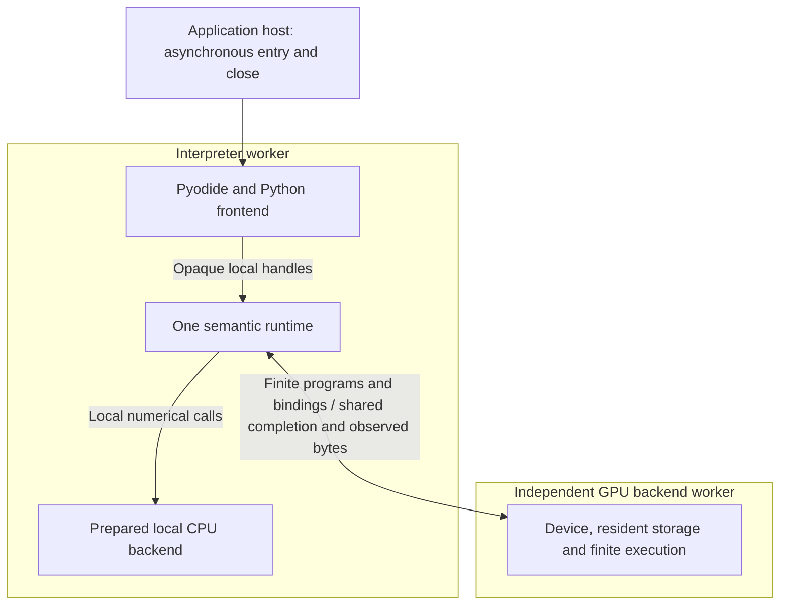
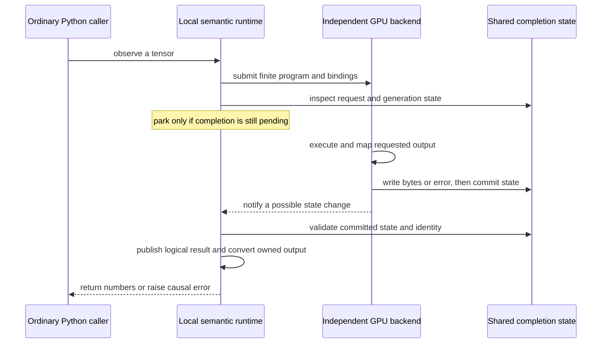

# Ordinary Python observation and independent backend progress

**Decision:** accepted on 2026-09-10 under
[research issue #52](https://github.com/isaacperez/tabgrad/issues/52), with an
[explicit decision record](https://github.com/isaacperez/tabgrad/issues/52#issuecomment-5622218870).

This chapter explains how an ordinary Python call can wait for GPU-produced
numbers without requiring JavaScript Promise Integration (JSPI). It is for a
programmer who understands synchronous and asynchronous functions but is new
to executing Python tensor code in a browser. Start with
[Pyodide's role](../concepts/python-in-the-browser.md) if the interpreter and
numerical backend distinction is unfamiliar.

The question is not whether the GPU can calculate a value. It is how Python
obtains that value at the point where its program needs it, while preserving
browser progress, resource ownership and efficient execution. The accepted
answer uses shared memory between an interpreter worker and an independently
progressing GPU backend worker. It keeps one semantic runtime, not two engines.
This is an architectural contract, not a claim that a release implements every
surface or supports every browser. Those claims require
[compatibility evidence](../compatibility.md).

## Why observation is different from recording an operation

A tensor handle can identify a result whose numbers have not been calculated.
For example, recording an addition can validate its inputs, determine the
output shape and return a handle without reading the result. The next tensor
operation can use that handle in the same way. Tabgrad's
[incrementally lazy execution](bounded-lazy-execution.md) uses this distinction
to organize finite regions of numerical work.

An **observation** crosses that boundary: it asks for actual numbers outside
the tensor runtime. A Python `item()` must produce a scalar; `tolist()` must
produce ordinary Python values. A tensor-dependent Python condition also needs
a value before it can choose a branch. These are conceptual examples of the
contract, not an operation-coverage claim or a runnable installation example.

WebGPU submission does not make its result immediately readable by JavaScript.
The backend must wait for the appropriate buffer mapping before accessing the
readback bytes. JavaScript normally represents that wait with a Promise. A
browser worker executes its JavaScript tasks and Promise continuations on its
own event loop. Blocking that worker does not allow its queued continuations
to run secretly underneath the blocked function.

Consequently, a synchronous wrapper around a Promise is not enough. If the
wrapper blocks the worker that must submit work, process completion or publish
the result, it creates a circular dependency. Busy spinning does not break
that dependency, and `Atomics.waitAsync()` still returns an asynchronous result
rather than supplying a synchronous Python stack with its answer.

There are two fundamentally different ways to make progress. One can suspend
the interpreter stack and let that same worker run other tasks, or one can
park the interpreter worker and make completion progress elsewhere. JSPI
provides the first mechanism on eligible browser and interpreter stacks.
Tabgrad selects the second mechanism for its managed Python GPU profile.

## Decision: keep semantics local and GPU completion independent

A **dedicated worker** is a browser execution environment with its own event
loop. A **shared buffer**, exposed by `SharedArrayBuffer`, is memory that
cooperating workers can access without passing ownership back and forth.
Atomic operations let them coordinate access to that memory. `Atomics.wait()`
first compares a shared value with the expected value: if they differ, it
returns without parking. Otherwise it enrolls the waiter and parks the eligible
worker until notification or timeout. Changing the value alone does not wake
an enrolled waiter. Neither term refers to the browser
`SharedWorker` API: this design uses ordinary dedicated workers.

The interpreter worker contains Pyodide, the Python frontend and the semantic
runtime. The runtime remains the authority on validation, logical tensor
identities, operation history, effects and the association between a logical
result and its physical storage. The backend worker owns the WebGPU device,
resident allocations, preparation, submission and physical completion. The
application host admits scripts and coordinates closure from an environment
that continues to run while Python is parked.

The following map shows execution placement. Its arrows carry calls, finite
program descriptions or completion records, not copies of a model's tensors
at every language boundary.

Keeping Python and semantic state together preserves ordinary local calls and
immediate input errors. Python wrappers hold opaque JavaScript tensor objects;
they do not serialize a semantic request to another engine for every operation.
The remote boundary belongs below that shared meaning, at finite backend work.
Its resource identifiers refer to backend-owned allocations, not live Python
proxies or transferable `GPUBuffer` objects.

The integrating application loads Pyodide in the interpreter worker. An
existing page-owned interpreter cannot be moved there while preserving its
objects and globals. A library-supplied bootstrap can compose the integration,
but does not authorize silently replacing an application interpreter. Worker
placement is a real host requirement, separate from the isolation requirement
explained below. The complete attachment and borrowed-interpreter contract
remains in [Python integration](python-integration.md).

## One completion path with two ways to observe it

Shared waiting changes more than where a message travels. Accepted requests
and completion publication must have explicit state transitions. Synchronous
observation and asynchronous notification advance the same transitions;
Promises expose those transitions to asynchronous callers but are not their
only driver. An observation cannot depend on an unpublished local callback
that cannot run until that observation returns.

This preserves one invocation lifecycle. It does not create a synchronous
engine beside an asynchronous engine. Work advancement examines newly relevant
requests and completions rather than repeatedly scanning all retained operation
history. Mandatory ordered effects still progress at the managed-entry
boundary under the ordinary runtime contract.

Consider an ordinary Python observation of a pending GPU result. The runtime
selects the demanded region and submits it to the backend owner. That owner
can prepare and execute work even while the interpreter worker waits. It writes
the result or error and commits a request-tagged completion state before waking
the consumer. The consumer checks the authoritative state, publishes the
logical result and returns its Python representation.

The notification is a hint to inspect state, not proof of success. Completion
before waiting must work too: checking an atomic predicate and enrolling the
waiter must not lose a notification between inspection and sleep. Physical
resource drain is deliberately omitted from this success diagram because it
has a different lifetime from returning the logical result.

JavaScript retains an asynchronous observation surface. Python retains optional
awaitable observations, such as `tolist_async()`, for deliberate concurrency;
ordinary tensor code does not need to use them. Both surfaces observe the
same owned request and result. A synchronous shared wait parks the entire
interpreter worker, including its local Python asynchronous tasks. Such tasks
can run at explicit await points, but the required completion path cannot
depend on them while the worker is parked.

Internal Python-to-JavaScript-to-Python callbacks belong to the current
invocation. They are not new host entries queued behind their own caller.
Runtime and diagnostic context must be propagated and restored explicitly.
Neither JSPI nor a browser event loop supplies that application contract
automatically.

## Prepare CPU execution before entering Python

Waiting for GPU work does not justify sending local CPU work to another worker.
Ready host data can be returned locally. Prepared WebAssembly CPU kernels can
also execute synchronously in the interpreter worker. The remaining obstacle
is asynchronous preparation: fetching, checking and compiling a kernel module
cannot become a local Promise on which an already blocked Python call depends.

For managed Python, prepare the selected CPU kernel module once before the
first managed script enters the interpreter, inside the host's existing
asynchronous run boundary. The host reserves admission before preparation
begins. This makes concurrent runs reject immediately and lets close join
accepted preparation as well as script execution. A preparation failure
settles the accepted host call explicitly instead of leaving Python waiting.

The compiled module is reusable; bounded context memory and instances can be
created synchronously from it when needed. Preparing a module does not compute
any tensors or change lazy numerical evaluation. It adds a startup cost even
if that script never demands CPU arithmetic, which is the cost of guaranteeing
local CPU readiness without stack suspension. It is not preparation per tensor
or per operation. The [CPU backend contract](webassembly-cpu-backend.md#one-portable-scalar-module-and-one-fixed-vector-module)
retains lazy asynchronous preparation for direct JavaScript use. GPU-specific
asynchronous preparation can progress in its independent backend worker.

## Keep result bytes and physical resources bounded

The runtime normally exchanges program and allocation identities with the
backend. GPU intermediates remain resident. Repeated stable programs distinguish
a reusable definition from each invocation's changing bindings; they must not
rebuild or serialize the entire unchanged program on every call. Forward,
backward and optimizer work use this same
[finite program boundary](internal-representations.md).

Only an explicit host observation needs output bytes. For an output of
**B bytes**, the shared route adds one B-byte copy from mapped GPU readback
memory into shared storage, before conversion into owned Python output. This
is additional to readback and Python conversion, not a zero-copy route. It
does not require an intermediate readback for each operation. Converting a
vector into a Python list also allocates Python objects; B alone does not
describe the list's total memory cost.

Known-size output receives bounded capacity before publication. When output
size genuinely depends on execution, the producer can announce metadata and
wait for a bounded storage grant before publishing bytes. The blocked consumer
must be able to handle that handshake without a queued callback on its own
event loop. Terminal and error state has reserved capacity, so inability to
allocate a result cannot itself prevent failure delivery.

Three events must remain distinct: a consumer accepts a result, a consumer
detaches, and physical use drains. Cancelling an awaitable Python task can
detach it while the backend still owns admitted work and mappings. The backend
retains its leases until the physical obligations end. Complete result, drain
and cancellation contracts remain in
[Requests, completion, and failure](execution-lifecycle.md).

A **generation** identifies one lifetime of a backend owner. Every response
must match its request and generation. If the producer fails, an independently
progressing supervisor can retire that generation and wake affected consumers
without writing the producer's partially filled result payload. A response
from a retired generation cannot publish into a replacement owner. Retirement
before result acceptance prevents that acceptance; it does not undo a value
already accepted before retirement.

Worker termination is not an acknowledgement of GPU drain. Unconfirmed storage
remains quarantined and unavailable for reuse; a missing owner cannot honestly
report physical counters as zero. Recovery means retiring invalid state and
attempting new backend preparation, not guaranteeing that the browser will
supply another adapter. Graceful close instead joins accepted preparation,
script and joined tasks, drains owned execution and removes only owned binding
resources. It preserves the borrowed interpreter. It cannot resolve an
arbitrary infinite loop or an entry that awaits the close which is joining it.

## Hosting requirements are part of the decision

Shared memory requires the browser's effective cross-origin isolation and a
secure context. An **origin** identifies a scheme, host and port; isolation is
a browser policy that restricts how a document interacts with other origins
so sensitive shared-memory mechanisms can be exposed. It is not a server-side
tensor service, and it does not send model data to a remote machine.

A common deployment uses `Cross-Origin-Opener-Policy: same-origin` and
`Cross-Origin-Embedder-Policy: require-corp` on the application document.
The opener policy separates incompatible browsing contexts; the embedder
policy requires loaded cross-origin resources to opt in appropriately. A
compatible `credentialless` policy is another deployment choice where
supported, not a universally interchangeable header. Cross-origin assets can
use the required CORS or CORP permissions; they need not all be self-hosted.
Embedded documents also depend on ancestor and permissions-policy conditions.

The host must verify effective `crossOriginIsolated` and the required APIs,
not merely assume that setting two header strings succeeded. Tabgrad cannot
set the navigation response's headers from an imported script. Static hosting
must support the necessary configuration, and applications must account for
effects on popup/opener relationships, third-party assets and embedding.
See the browser's
[shared-memory security requirements](https://developer.mozilla.org/en-US/docs/Web/JavaScript/Reference/Global_Objects/SharedArrayBuffer#security_requirements).

Native JSPI is not a requirement of this design. WebGPU availability remains
an independent requirement involving browser, operating system, driver,
adapter, features and limits. Updating a browser alone does not guarantee that
all those requirements are met. The portable CPU modules do not become
threaded modules merely because Python GPU observation uses shared memory.
Direct JavaScript CPU use retains its separate deployment requirements.

## Alternatives and why they were not selected

Native **JSPI** lets an eligible WebAssembly stack suspend for JavaScript
asynchronous work and later resume. With suitable Pyodide entry, ordinary
Python methods can therefore wait while callbacks progress in the same worker.
This is the closest alternative to a Promise-driven local runtime, and it can
avoid the shared-memory output copy and isolation requirement. Its costs are
browser capability, eligible entry/callback stacks and the pinned interpreter's
experimental suspension integration. It was a working baseline, not rejected
because it was hypothetical. The inspected stable Safari environment lacked
native JSPI, while its shared-wait fixture executed successfully.

Moving the **whole semantic runtime** to the independent worker would let its
Promise queue progress unchanged. However, Python's immediate validation,
handle identity and operation admission would then cross a synchronous remote
boundary. Batching that traffic must not defer known errors or duplicate
semantic state in the frontend. The chosen backend-only cut preserves semantic
locality, at the explicit cost of changing request advancement in the runtime.

**Asyncify** instruments WebAssembly so execution can unwind and resume around
asynchronous calls. Applying it here would require a coherent interpreter,
dynamic-module and JavaScript-glue build, not merely recompiling Tabgrad's CPU
kernels. It was considered as a real custom-build alternative, but no such
validated Pyodide distribution or comparative cost was established by this
research. Generic Asyncify overhead estimates are not Tabgrad measurements.

A **Service Worker plus synchronous worker XMLHttpRequest** is another real
browser-side bridge: a Service Worker can mediate a request made by a blocked
worker. It brings registration, control, scope, lifetime and transport rules
that the selected independent backend design does not need. It matters most
when non-isolated hosting is required. That requirement is not part of this
accepted Python GPU profile; no bulk Tabgrad implementation of this alternative
was demonstrated. The source inspection is linked from the research issue.

Synchronous worker GPU mapping, such as the inspected experimental `mapSync`
direction, could simplify the particular mapping wait. Experimental flags do
not establish a portable stable baseline, and synchronous mapping alone would
not solve asynchronous interpreter or kernel preparation. It remains a reason
to reconsider the mechanism when supported evidence changes, not a hidden
dependency of this decision.

Finally, shipping **JSPI plus an automatic shared-memory fallback** would expose
two different task-progress behaviors and two critical lifecycle paths. The
existence of two working experiments does not justify that maintenance cost.
Tabgrad selects one mechanism here; a future replacement must preserve the
host, semantic and backend contracts and receive its own evidence-backed
decision. There is no numerical fallback to CPU when GPU admission fails.

## What the investigation established, and what it did not

The [research issue](https://github.com/isaacperez/tabgrad/issues/52) owns the
methods, source revisions, exact environments, failed attempts, raw-evidence
references and independent challenges. This section preserves the facts that
explain the decision rather than copying the experimental chronology. Its
[cost and managed-entry summary](https://github.com/isaacperez/tabgrad/issues/52#issuecomment-5622366200)
retains the contrary timing observations and distinguishes public summaries
from original reproduction artifacts.

The scalar and progress investigations exercised ordinary nested Python
observation and data-dependent branching with real GPU-produced values in
Chrome and Firefox, comparing JSPI and shared waiting. A separate stable
Safari 26.6.2 fixture passed seven shared-wait groups with native JSPI absent.
That is stronger evidence for JSPI independence than masking a feature on a
browser that actually implements it. It is still bounded desktop evidence,
not certification of mobile browsers, embedded views or complete models.

Physical-lease, generation, variable-size output and managed-entry probes
examined result acceptance, stale replies, mapping lifetimes, shutdown and
actual cancellation of an awaitable Python task. They establish the behavior
of those fixtures, not verification of a production implementation. A Firefox
adapter-recreation failure also occurred in a plain-JavaScript control;
removing Python or JSPI did not remove that observed recovery limit.

Cost probes covered ready host data, prepared real CPU arithmetic, output
lengths up to 65,536 float32 elements, regions with 1, 4 and 16 dependent GPU
operations, and repeated observations. Each route retained 146 observations
including warmups. The largest explicitly accounted GPU API payload was
768 KiB. Sampled Pyodide linear-memory extent remained 30 MiB; that is reserved
linear-memory extent, not heap usage, process memory, an unsampled peak or a
long-running leak proof. No full model or all-core stress workload was used.

The timing results do not establish a winner. In one 16-operation cohort,
observation-through-Python-list medians were 1.270 ms for direct JSPI and
6.355 ms for shared waiting; other cohorts reversed the order. A separate
balanced, same-producer 52-observation control did not reproduce a large
consistent blocking penalty. That control kept the shared copy in both modes,
so it cannot erase the original topology difference or measure that extra copy
in isolation. Native allocator and display-link warnings remained unexplained.
Comparative performance verification is therefore **INCOMPLETE_DIAGNOSTICS**,
not a clean benchmark pass or an equivalence result.

The accepted rationale is consequently structural and conditional: preserve
ordinary Python code without mandatory JSPI, accept the deployment constraints,
keep one semantic owner, and bound transport by demanded programs and observed
bytes rather than forcing every intermediate through Python. Real program
serialization, cache reuse, long-running retention and model throughput need
their own production evidence. A fixture parameter selecting a computation's
depth is not measurement of real `ExecutableProgram` transport.

## Superseded choices and conditions for reconsideration

The earlier [observation investigation #19](https://github.com/isaacperez/tabgrad/issues/19)
remains historical JSPI feasibility evidence. The
[attachment investigation #43](https://github.com/isaacperez/tabgrad/issues/43)
still supports borrowed interpreter ownership, local opaque handles, static
Python assets, transactional registration and wrapper/session lifetimes.
This decision supersedes mandatory JSPI suspension, same-worker GPU placement,
Promise-only advancement and first-demand asynchronous CPU compilation inside
managed Python. It does not replace the central semantic graph, finite program,
automatic differentiation or backend ABI contracts.

Reconsider the waiting mechanism if non-isolated or page-owned interpreter
embedding becomes a requirement, required callback concurrency cannot tolerate
parking the interpreter, or representative measurements show unacceptable
startup, observation-copy, latency or retention costs. Stable synchronous GPU
mapping or a simpler well-supported interpreter suspension facility may also
justify a new comparison. Reconsideration must include lifecycle and deployment
costs, not merely the fastest scalar timing. None of these possibilities
justifies maintaining two engines or silently changing the selected backend.
