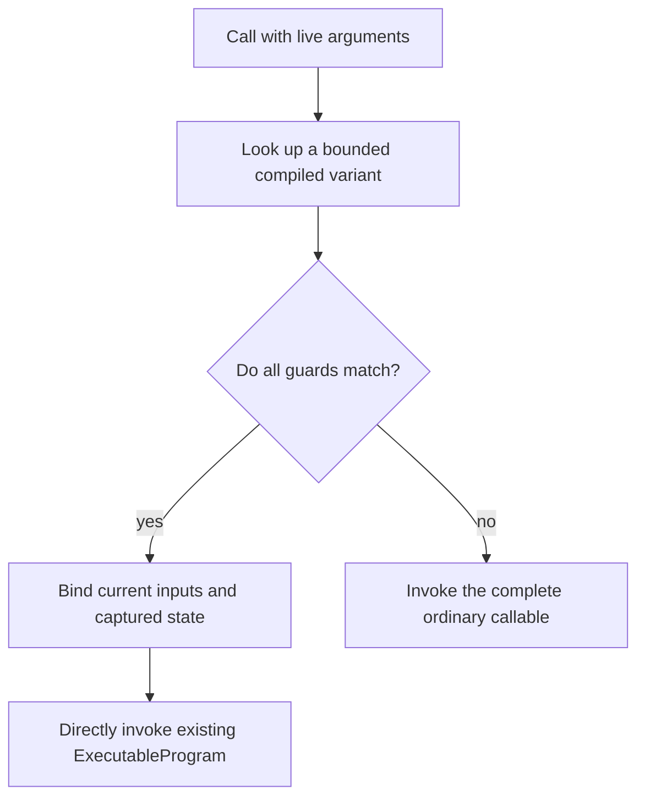

# Reusable programs and compiled callables

Lazy program formation removes unnecessary work and exposes fusion, but a stable
decoder or training region may execute many times. Re-admitting and rebuilding
the same structure for every token or iteration can become a material host cost
even when kernels and pipelines are cached.

Tabgrad addresses this with two levels of reuse. The ordinary path reuses
bounded structural, lowering, and prepared caches. A narrower direct invocation
seam can invoke an existing `ExecutableProgram` without reconstructing every
operation. An optional frontend `CompiledCallable` applies guards and chooses
between that seam and the complete ordinary callable.

## Ordinary structural reuse

The default PyTorch-like path remains suitable for dynamic control flow:

1. Execute the actual Python or JavaScript function.
2. Admit fresh operation occurrences.
3. Select a bounded demand closure.
4. Compute its structural fingerprint.
5. Reuse legal common or backend preparation when cache keys match.

Fresh semantic occurrences still cost work proportional to the executed calls,
but backend compilation and stable program transformations need not repeat.

## Direct invocation of an existing program

The runtime also exposes an internal seam that binds live values to an existing
`ExecutableProgram`. A **binding recipe** maps ordinary call inputs by role and
argument position. It can also name parameters or buffers that the callable
explicitly captures.

Only explicitly captured persistent state refers to stable `TensorState` or
`StorageState` owners. A recipe never captures:

- WebGPU buffers or WebAssembly pointers;
- a backend/device generation;
- ordinary input values from the call that created the program;
- a particular current `TensorValue` for mutable state; or
- old outputs, histories, errors, or tickets.

Each invocation binds current arguments, resolves current-generation
materializations for captured state exactly once, and creates fresh occurrence,
output, derivative-history, random-number, error, and ticket identities. A
missing current materialization fails before submission instead of using a
stale physical reference.

## The guarded callable adapter

`CompiledCallable` is an optional frontend adapter over direct invocation. A
**guard** is a condition that proves a reusable variant still has the same
semantic and generated-work assumptions. Guards cover every relevant fact,
including shape, data type, device, layout, gradient requirement, alias
relations, training mode, capabilities, and specialization values.

On a guard miss, the adapter performs zero partial direct execution and invokes
the complete ordinary callable with the original live arguments. It does not
mix half of one variant with half of the fallback, suppress an effect, or leave
a random-number reservation behind.

Current sequence length or token position can be a guarded dynamic value when
the program supports it. It must not create a new compiled variant for every
token merely because the number changes.

## Grad-enabled reuse

A direct or compiled forward can participate in ordinary dynamic automatic
differentiation only when its variant installs fresh, semantically equivalent
`DerivativeHistory`, saved logical state and version ownership, and a reusable
VJP recipe. A variant can instead declare itself inference-only; a call that
requires gradients or training must then miss or reject before partial
execution.

Mixed selected work is not passed to a backend as opaque nested calls. Program
formation expands ordinary operations and reusable program calls into one
common `ExecutableProgram`, with remapped values, virtual storage, dependencies,
effects, guards, capabilities, and mutation transitions. An already
materialized and drained program boundary can remain as a backend-resident input
without host readback.

An explicitly compiled whole training step is legal only as another fully
guarded variant of this same mechanism. It does not create a special optimizer
or training intermediate representation.

## Bounded state and diagnostics

Variant and diagnostic tables have independent count-and-byte budgets, pinning
rules, and deterministic eviction behavior. Reuse never justifies retaining
unbounded shapes, token positions, source traces, failure objects, programs, or
prepared executables.

A reusable hit path is proportional to live inputs, outputs, guards, saved
slots, captured-state resolutions, and program invocations. It must not rebuild
all internal forward and backward operation records under a different name.

## Reuse is a capability, profitability is policy

Direct program invocation is a semantic runtime capability on both backends.
Whether a particular compiled variant saves enough time to use is a backend-
and-workload policy. Cold compilation, guard cost, host work removed, backend
work, cache memory, and miss frequency all matter.

The architecture makes no universal claim that compiled execution is faster,
and it does not make a public capture mode the ordinary contract. A backend can
decline a compiled variant on profitability grounds while the complete ordinary
path remains correct. Performance decisions follow the measurement rules in
[Memory and performance](memory-and-performance.md).
