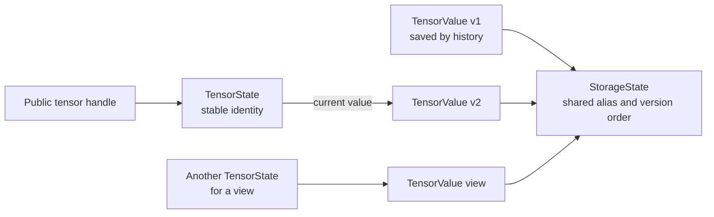
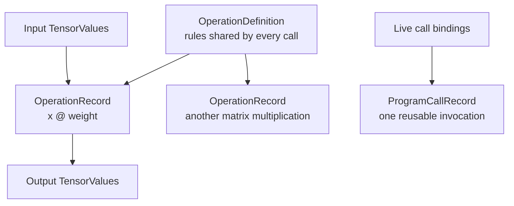
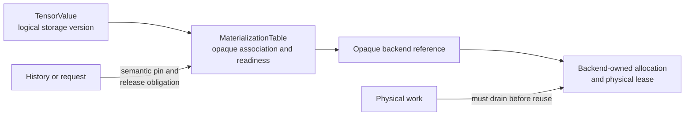

# Semantic state

Lazy execution, views, in-place mutation, and training all depend on one basic
distinction: a public tensor, a particular version of its value, and the memory
holding its numbers are not the same thing. Treating them as one object appears
simple until an alias changes shared storage or backward computation needs an
older value.

This chapter introduces the runtime records that give each identity and
lifetime one owner. They are **semantic records**: they describe the meaning of
the program independently of a WebGPU buffer or WebAssembly address.

## Identity, value, and storage

Suppose a parameter called `weight` is updated by an optimizer. User code still
refers to the same parameter, but its numerical value has changed. Now suppose a
slice is a view of the parameter. The view has its own tensor identity and
layout, while both tensors share storage. Finally, automatic differentiation may
need the value that existed before the update.

One undifferentiated tensor object cannot express all of those facts cleanly.
Tabgrad separates them:

- `TensorState` is the stable identity exposed through a public handle.
- `TensorValue` is one immutable logical version observed by a computation.
- `StorageState` is the shared logical storage and mutation-version identity
  used by aliases.



A `TensorValue` describes shape, data type, device, layout or view, producer,
dependencies, and the logical storage version it observes. It does not contain a
backend address. A view can therefore be represented with metadata proportional
to its number of dimensions rather than by copying its payload.

`StorageState` maintains the current mutation version and ordered writer or
effect state. Aliases consult this shared record, so a mutation does not scan
every alias. A later use can find the current version in average constant time.

## Definitions and occurrences

The rules for an operation must also be separate from one call to that
operation.

An `OperationDefinition` is the canonical schema for an operation. It owns
argument normalization, metadata and data-type rules, device rules, alias and
mutation effects, derivative recipes, equivalent ways to express the operation
using supported operations, capability requirements, and stable diagnostic
identity. These equivalent expressions are introduced as *decompositions* in
[Operation admission](operation-admission.md). For example, the definition
states what a matrix multiplication means for every caller.

An `OperationRecord` represents one admitted occurrence with concrete inputs,
outputs, normalized attributes, source information, dependencies, ordered
effects, and derivative facts. Every call to matrix multiplication gets a fresh
record even though all calls share one definition.

A `ProgramCallRecord` is the specialized operation record used when one
occurrence invokes an already reusable executable program. It preserves the
same semantic position as an ordinary operation occurrence; it is not an opaque
shortcut around effects or automatic differentiation.

This specialization does not require a separate record store or graph. A
compact implementation can represent it as a tagged `OperationRecord` whose
payload refers to immutable reusable-program structure and a boundary-binding
recipe. It follows the same indexing, reachability, error, and reclamation rules
as every other operation occurrence.



## Derivative history

When gradients are tracked, the runtime needs a lifetime that can outlive an
ordinary forward record. `DerivativeHistory` owns dynamic derivative edges and
recipes, saved logical values and their expected storage versions,
random-number reservations, callback ordering, and explicit use counts.

These facts are not three copies of the derivative rule. The
`OperationDefinition` supplies the reusable rule, an admitted occurrence binds
that rule to concrete inputs and outputs, and `DerivativeHistory` retains only
the bound facts whose derivative lifetime is still live.

This ownership is deliberate. A saved activation can have no public tensor
handle and still remain alive because backward computation needs it. Conversely,
dropped public tensors do not force the runtime to retain an entire historical
graph. When a reusable program participates in differentiation, its
`ProgramCallRecord` can attach a recipe for a fresh vector-Jacobian-product
program to fresh history for that invocation.

Derivative history owns the obligation to keep a logical saved value usable. It
does not own a graphics-processor buffer, WebAssembly pointer, or allocator
lease.

## Materialization

A logical value is **materialized** when its numerical payload exists in an
execution backend. The `MaterializationTable` maps a logical storage version and
a backend/device generation to an opaque backend allocation reference, together
with readiness and last-writer facts.

The word *table* is literal: it can be an ordinary index owned by
`RuntimeSession`. It is not a second allocator or execution service.



The ownership line is exact:

- runtime history or an invocation owns a semantic pin and the obligation to
  release it;
- the `MaterializationTable` owns the opaque association between logical state
  and a backend reference; and
- the backend owns allocation, pooling, the physical lease, and byte reuse.

The backend may reuse those bytes only after semantic liveness permits release
and the last physical use has drained. A logical identity alone cannot recreate
lost bytes after a device generation changes; recovery also requires a
reproducible computation or a valid recoverable copy.

## Mutation and aliases

A mutation is admitted in semantic order. It advances shared logical storage by
one version and creates the corresponding new logical value relationship. The
physical write may finish later, so the materialization entry carries a writer
dependency that prevents readers from observing the new version too early.

Consider this sequence:

```python
base = torch.tensor([10, 20, 30, 40])
view = base[1:3]
pending = view * 2
base[1] = 99
```

The runtime must preserve the value that `pending` is semantically entitled to
read. Depending on the operation rules and lifetime facts, execution may order
work, retain a version, or copy only when necessary. It may not let deferred
execution accidentally read the later `99`. If backward saved an expected
version that was invalidated by mutation, it reports the mutation instead of
silently using changed bytes.

An optimizer update can replace the current `TensorValue` of a parameter.
`TensorState` and the differentiable leaf identity remain stable, so gradients
and optimizer state continue to attach to the parameter the user knows.

## The incremental semantic graph

The collection of `TensorValue` and `OperationRecord` objects plus dependency
and effect indexes forms the **incremental semantic graph**. It records only the
tensor operations that the host program actually executes. It is not a captured
copy of all Python or JavaScript control flow and it is not a permanent model
session graph.

Records are reclaimed once they are unreachable, completed, not saved by live
derivative history, and not retained by an effect, request, or undelivered error.
Ordinary maps and objects are a valid initial physical representation behind
stable identifiers. Compact arenas are a replaceable implementation
optimization, not a separate architectural layer.

## Responsibility summary

| Record | Owns | Deliberately excludes |
| --- | --- | --- |
| `OperationDefinition` | Rules shared by every occurrence of one operation | Concrete calls, kernels, and buffers |
| `TensorState` | Stable public and differentiable identity | Historical payloads and physical storage |
| `TensorValue` | One immutable logical value version and its metadata | Mutable public identity and backend addresses |
| `StorageState` | Shared alias identity, mutation version, and writer order | WebGPU buffers and WebAssembly pointers |
| `OperationRecord` | One admitted occurrence, its dependencies, effects, and provenance | Backend preparation |
| `ProgramCallRecord` | Tagged `OperationRecord` variant for one semantic invocation of a reusable program | Another graph, store, or reused occurrence state |
| `DerivativeHistory` | Dynamic derivative recipes and saved logical lifetimes | Physical allocation and leases |
| `MaterializationTable` | Logical-to-opaque-physical association and readiness | Allocation policy and byte ownership |
