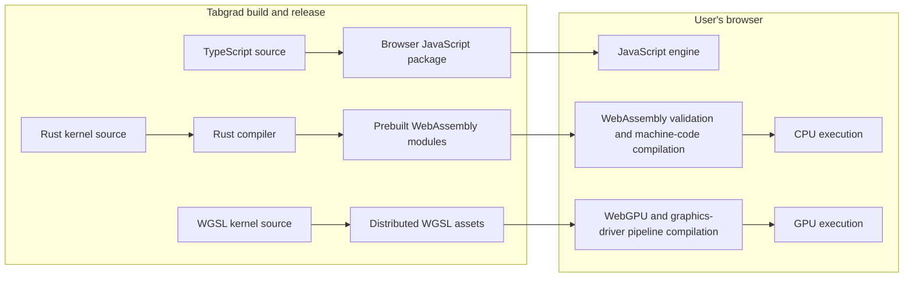
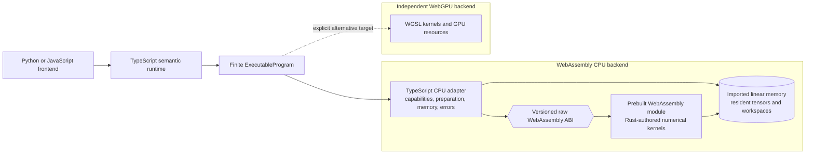
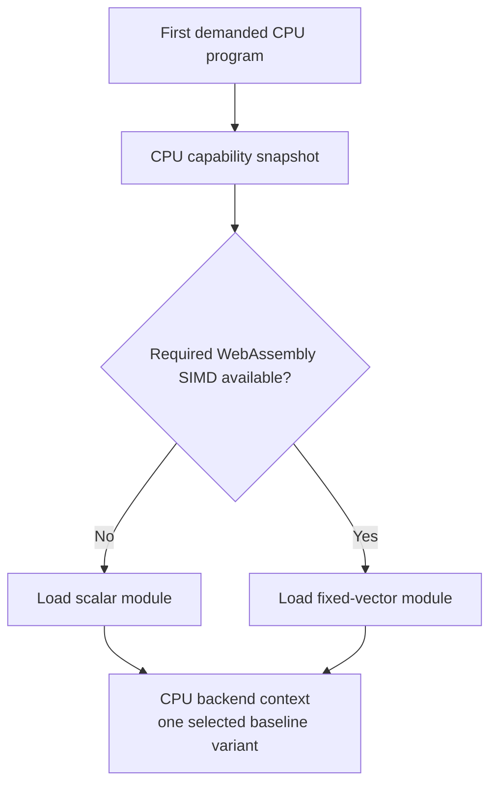
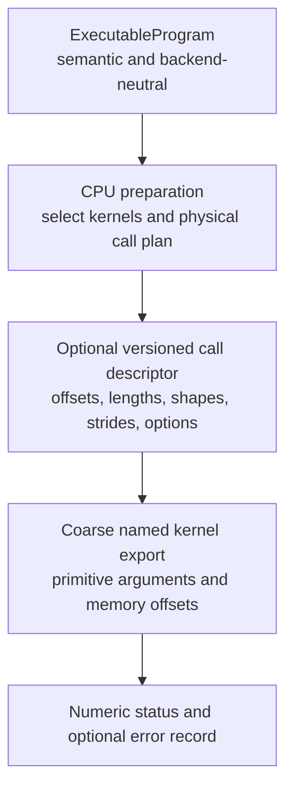
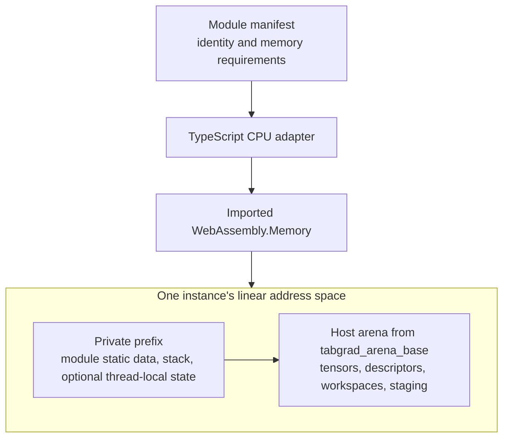

# WebAssembly CPU backend

This chapter explains how Tabgrad turns CPU kernel source into numerical work
that a browser can execute. It is written for contributors who know JavaScript
or systems programming but have not designed a WebAssembly tensor backend.

Saying that “the CPU backend uses WebAssembly” leaves several important
questions unanswered. WebAssembly is the executable format understood by the
browser; it is not the language in which people must author every kernel. It
also does not decide who owns linear memory, how TypeScript passes tensor
locations to compiled code, which vector instructions a browser supports, or
how a failure becomes a useful Tabgrad error. Those decisions determine whether
the backend can remain simple, fast, and usable without installing development
tools on the end user's computer.

Tabgrad therefore separates three roles inside the CPU path:

- Rust is the source language for CPU numerical kernels.
- The build produces WebAssembly modules before the library is distributed.
- A TypeScript adapter inside the CPU backend loads one compatible module,
  owns its memory and instances, and connects it to Tabgrad's ordinary backend
  execution contract.

The browser receives prebuilt JavaScript, WebAssembly, and WebGPU Shading
Language assets. Rust and Cargo are build-time tools, not browser requirements
and not runtime dependencies downloaded or installed by an end user.

## What is compiled, and where

Zero-install browser use does not mean that no compilation occurs. It means
that the person running Tabgrad does not install a compiler or native tensor
library. The expensive and reproducible source build happens when Tabgrad is
produced; the browser performs only the platform compilation needed to execute
portable assets on the user's actual CPU and GPU.

WebAssembly is a portable instruction format, not the final machine code for
every processor. A browser can compile and instantiate it while the response is
being streamed, then reuse the resulting stateless module for multiple
instances or workers. WGSL remains portable shader source because the browser
and graphics driver must translate it for the selected GPU. Pipeline creation
is therefore a visible asynchronous preparation cost that the WebGPU backend
can cache but cannot pretend does not exist.

## Browser reach and capability checks

Baseline WebAssembly is widely available in modern browsers, but neither
Tabgrad nor a standard can guarantee execution in every browser configuration.
A content-security policy can prohibit WebAssembly compilation, an older engine
can lack a required instruction feature, memory limits vary, and embedded web
views can expose a narrower platform. The scalar module minimizes the required
CPU feature set; the fixed-vector module is selected only after its exact
WebAssembly SIMD requirements have been validated.

WebGPU has a narrower compatibility surface. It requires a secure browser
context, a browser implementation, a usable graphics adapter, and sufficient
device features and limits. Tabgrad checks those facts rather than inferring
them from a browser name. If an explicitly selected backend is unavailable or
cannot admit a program, the request fails with that reason; unavailability does
not silently move numerical work to the other backend.

The standards and browser APIs provide the mechanism. A Tabgrad release's
supported browsers, devices, features, and data types remain bounded claims in
the [compatibility record](../compatibility.md), backed by tests in those exact
environments.

## How the CPU path fits into Tabgrad

The TypeScript semantic runtime remains the only owner of tensor meaning,
automatic differentiation, demand selection, and executable-program formation.
The CPU backend does not repeat those responsibilities in Rust. It receives a
finite [`ExecutableProgram`](internal-representations.md), prepares CPU work for
that program, and invokes compiled kernels over backend-resident data.

The two backend branches share the program's semantics, not an implementation.
Choosing the CPU path does not route numerical loops through JavaScript.
Choosing WebGPU does not invoke the WebAssembly module. Moving data between the
two is an explicit transfer program, never a hidden fallback.

## Why Rust is a build language rather than a browser layer

A browser cannot execute Rust source directly. During development and release,
the Rust compiler translates the kernel library into WebAssembly bytecode. The
browser then validates, compiles, and instantiates that bytecode through its
standard WebAssembly API. This is ahead-of-time translation from Rust to a
portable browser artifact; it does not prescribe how a browser internally
turns WebAssembly into machine instructions.

Rust was selected after a bounded comparison with AssemblyScript, Zig, direct
TypeScript emission, handwritten WebAssembly text, and binding generators. Rust
and Zig produced the same relevant performance class in the experiment. Rust
was chosen because Tabgrad expects the language and toolchain to impose less
long-term maintenance churn while still providing explicit memory control and
portable scalar and vector kernels. The private application binary interface
described below deliberately prevents this source-language choice from leaking
into the semantic runtime or public API.

TypeScript is still required on the host side because browser WebAssembly and
WebGPU APIs are JavaScript APIs. Its job is orchestration and small metadata
work: it selects an artifact, owns memory and instances, binds offsets, invokes
kernels, and translates status into structured errors. Per-element arithmetic
and other large numerical loops belong in Rust-authored WebAssembly kernels.

## One portable scalar module and one fixed-vector module

The portable CPU distribution contains two baseline WebAssembly modules built
from the same kernel contract:

1. The **scalar module** uses the baseline WebAssembly instruction set and is
   the compatible choice when the required vector feature is unavailable.
2. The **fixed-vector module** uses WebAssembly single-instruction,
   multiple-data instructions, commonly called WebAssembly SIMD, to process a
   fixed number of values per instruction.

The CPU backend obtains its capability facts once, selects the compatible
variant, and lazily compiles and instantiates that variant when CPU execution
first needs it. A context uses one selected baseline module; it does not
instantiate both and race them. Selection is visible in the backend capability
and diagnostic state, but it does not change tensor semantics.

Splitting the kernel library into more modules is not automatically an
optimization. It can reduce the bytes needed for one workload while increasing
requests, compilation work, metadata, and cache complexity. A different module
partition is valid only when comparable size and startup measurements justify
it and the partition preserves the memory contract described below.

## The private raw WebAssembly ABI

An **application binary interface**, or ABI, is the exact low-level agreement
between separately compiled code and its caller. Here it is the private
boundary between the TypeScript CPU adapter and a WebAssembly module. It is not
the frontend contract and it is not `ExecutableProgram` serialized into linear
memory.

Tabgrad owns and versions this ABI. Calls cross it using WebAssembly primitive
numbers and offsets into linear memory. A simple kernel can receive fixed
primitive arguments directly. A kernel with many shapes, strides, offsets, or
options can receive the offset of a versioned descriptor written into memory.
Rust objects, JavaScript arrays, strings, closures, WebAssembly SIMD values, and
allocator-owned pointers do not cross the boundary.

The distinction keeps both sides small:

- `ExecutableProgram` describes legal finite computation for any backend.
- CPU preparation chooses a private sequence of coarse kernel calls.
- The ABI describes how one such call refers to bytes in one WebAssembly
  memory.

Named exports are the simplest default for coarse kernel families. Tabgrad does
not add an opcode interpreter or a second scheduler merely to reduce the export
count. The exact export grouping remains private and may change with the ABI
version; public frontends and semantic records cannot depend on it.

Every ordinary kernel call returns a numeric status. The TypeScript adapter
maps that status and, when needed, a caller-owned error record in linear memory
to a structured Tabgrad error. A trap, incompatible manifest, out-of-memory
condition, or corrupted contract quarantines the affected backend context when
continuing could reuse invalid state. It never triggers a JavaScript numerical
fallback.

Binding generators such as `wasm-bindgen` and packaging wrappers such as
`wasm-pack` are not part of this boundary. They solve useful high-level Rust to
JavaScript interoperability problems, but their generated object and memory
conventions would make the hot numerical contract less explicit. A generated
binding can be reconsidered only if it preserves the raw ABI, ownership, size,
and call-overhead requirements with simpler total maintenance.

## Version 1 manifest and addition ABI

The first concrete raw ABI profile gives the general boundary above an exact,
small instance. The generated JSON manifest has schema version 1 and module
version 1. It declares ABI version 1, 32-bit addresses, non-shared memory, the
`add-f32` capability, one `env.memory` import, an initial 32-page memory, a
maximum 1024-page memory, and 16-byte host-arena alignment. Each scalar or
`simd128` variant records its relative path, byte length, required features, and
SHA-256 digest.

The adapter validates the manifest before using it, selects one variant from a
WebAssembly feature probe, fetches only that module, verifies its byte length
and digest, compiles it, and inspects the compiled module's actual imports. A
module must import exactly one non-shared memory as `env.memory`; an additional
or renamed import is an ABI mismatch. The adapter then creates the bounded
memory, instantiates the compiled module, and validates these exports:

| Export | Signature | Meaning |
| --- | --- | --- |
| `tabgrad_abi_version` | `() -> u32` | Returns `1` for this ABI profile. |
| `tabgrad_capabilities` | `() -> u32` | Returns a bit set containing the `add-f32` capability. |
| `tabgrad_arena_base` | `() -> u32` | Returns the first byte available to the host allocator. |
| `tabgrad_add_f32` | `(left_offset, right_offset, output_offset, length) -> u32` | Adds two contiguous `float32` input ranges into a distinct output range. |

All offsets and the length are WebAssembly `i32` values interpreted as unsigned
32-bit integers. The kernel checks four-byte alignment, checked byte ranges
within the imported memory, and non-overlap between the output and either
input. Input-to-input aliasing is legal. Status 0 means success; status 1 means
misalignment, status 2 means an out-of-bounds range, and status 3 means output
overlap. A nonzero status becomes a structured adapter error. A trap quarantines
the context because its physical state can no longer be assumed valid.

The scalar and SIMD modules are compiled from the same Rust source with
opposite fixed `simd128` target-feature settings. The SIMD kernel performs
four-lane addition and handles its remaining zero to three elements with the
scalar tail. Neither module allocates, owns tensor metadata, interprets an
operation stream, or calls JavaScript per element.

## Memory belongs to the CPU backend context

WebAssembly kernels read and write a contiguous byte array called **linear
memory**. The TypeScript CPU adapter creates and imports that memory into the
selected module. The CPU backend context therefore owns the memory, arena,
module instance, reusable workspaces, allocation pools, and request leases as
one coherent physical lifetime.

The distributed module manifest records enough information to reject an
incompatible artifact before execution: module and ABI versions, content hash,
address width, shared-memory mode, import requirements, minimum and maximum
memory bounds, and required alignments. The module exports
`tabgrad_arena_base()`, which returns the first byte the host may use for tensor
storage and workspaces. Bytes below that boundary remain private to compiled
module state such as static data, stack, or thread-local storage.

Growing a non-shared `WebAssembly.Memory` can detach the JavaScript views that
pointed at its earlier buffer. Shared memory growth can leave earlier views with
their old length. The CPU adapter renews every cached typed-array view after a
growth operation; callers cannot retain raw views as stable tensor identity.
Opaque physical references and backend-generation checks keep this mechanism
behind the backend contract.

An invocation using 32-bit WebAssembly addresses must place its complete
working set in the memory imported by that module instance. Giving the call a
“shard identifier” cannot allow it to dereference a second instance's memory.
Work that does not fit has only three honest outcomes:

- co-locate the required tensors and workspace in one compatible memory;
- use an explicitly planned and measured tiling or staging route whose copies
  and lifetimes are visible to the backend; or
- reject the request with a resource or capability error.

Memory64 or multiple memories can change this constraint only after the
required browsers, toolchains, ABI, and measurements support them. They are not
part of the portable CPU baseline.

## Requests, reuse, and concurrency

Prepared CPU work can retain a module, resolved exports, layout decisions, and
a physical call plan. Each invocation still receives fresh bindings,
generation identity, cancellation state, and leases through the ordinary
`ExecutionRequest`. Tensor data and reusable workspaces remain resident in the
context's linear memory across compatible calls, which avoids repeated
JavaScript-to-WebAssembly payload copies.

The baseline path can serialize access to a mutable instance or lease an
independent instance and memory to a request. In either case, one invocation
cannot race another through unowned mutable memory. A logical result may become
available before all physical use ends; allocations return to a pool only after
both semantic pins and [`ExecutionTicket.drained`](execution-lifecycle.md) allow
reuse.

Web Workers, shared memory, and atomic instructions are an optional CPU
acceleration profile, not a requirement of the portable scalar and vector
modules. A threaded profile is valid only when the browser is cross-origin
isolated where required, capability admission is explicit, TypeScript retains
worker lifecycle and scheduling ownership, and each instance's private stack,
static data, and thread-local storage regions are proven disjoint. Demonstrating
that an atomic instruction executes is not sufficient evidence for safe
production concurrency, cancellation, or memory reuse.

## Performance consequences for inference and training

The design exposes the costs that matter without making a benchmark promise.
A finite executable program can become a small number of coarse WebAssembly
calls over resident inputs, outputs, weights, activations, gradients, and
workspace. Backward computation and optimizer updates use the same preparation,
memory, invocation, and error path as inference rather than copying data into a
separate training engine.

The following invariants protect that path:

- tensor payloads do not cross the ABI as JavaScript arrays;
- calls are not made once per tensor element;
- intermediates remain in linear memory unless an explicit observation or
  transfer requires movement;
- preparation and module compilation are reusable under bounded cache and
  generation rules;
- workspace and allocation reuse obey semantic pins and physical drain; and
- scalar, vector, module-partition, worker, tiling, and fusion decisions remain
  separately measurable.

These properties make efficient transformer inference and training possible;
they do not establish complete large-language-model throughput, production
memory scaling, a supported parameter count, quantization, 16-bit floating
point (`float16`) and brain floating point (`bfloat16`) data types, fused
attention, automatic
differentiation at scale, complete Safari coverage, or production threading.
Those claims require representative measurements under
[the performance policy](../performance.md) and explicit entries in
[the compatibility record](../compatibility.md).

WebAssembly and WebGPU remove important ceilings, but neither makes an
untuned tensor library fast automatically. WebAssembly can execute compact
compiled loops without JavaScript arithmetic and can use fixed-width vectors,
yet it does not automatically provide a browser equivalent of every
hardware-specific native math library. WebGPU exposes massive parallelism and
modern compute pipelines, yet a small operation can lose more time to pipeline
preparation, dispatch, synchronization, or transfer than it saves in
arithmetic. Kernel quality, fusion, layout, residency, bounded reuse, workload
size, and the actual device determine the result.

The architecture is designed so those costs can be optimized and measured:
coarse calls avoid per-element boundary overhead, resident buffers avoid
avoidable copies, backend-private lowering permits target-specific kernels, and
the common semantic runtime prevents those optimizations from changing tensor
meaning. It deliberately makes no promise that CPU execution equals a mature
native Basic Linear Algebra Subprograms library or that WebGPU wins for every
operation.

## Evidence and alternatives

The accepted decision comes from
[research issue #31](https://github.com/isaacperez/tabgrad/issues/31). Its
[complete report](https://github.com/isaacperez/tabgrad/issues/31#issuecomment-5579515513)
records the method, browser and toolchain environments, correctness probes,
artifact inspection, timing and memory observations, limitations, and the
comparison among Rust, AssemblyScript, Zig, direct TypeScript emission,
handwritten WebAssembly text, and generated bindings. The
[reproduction bundle](https://gist.github.com/isaacperez/482c010e1f98f1575776812c134bbdeb)
preserves the bounded experiment, and the
[approval record](https://github.com/isaacperez/tabgrad/issues/31#issuecomment-5579658179)
identifies the exact accepted architecture.

The experiment established the feasibility and relative maintenance shape of
the boundary; it was not a complete large-language-model benchmark. In
particular, the close Rust and Zig kernel results do not justify a claim that
one source language inherently produces faster WebAssembly. The choice of Rust
is a maintenance decision between candidates in the same observed performance
class, protected by an ABI that keeps the source language replaceable.

The platform behavior summarized above follows the
[WebAssembly documentation](https://developer.mozilla.org/en-US/docs/WebAssembly),
the optimized
[`WebAssembly.instantiateStreaming()` loading contract](https://developer.mozilla.org/en-US/docs/WebAssembly/Reference/JavaScript_interface/instantiateStreaming_static),
and the
[WebGPU specification](https://www.w3.org/TR/webgpu/). These sources describe
the platform mechanisms; the issue report remains the evidence for Tabgrad's
toolchain and boundary decision.

## Consequences and conditions for reconsideration

This decision adds one build language while keeping one browser runtime and two
numerical backend families. Any repository revision that contains Rust kernels
must pin the compiler, target, build flags, direct build dependencies, licenses,
integrity information, and reproducible commands in the project's ordinary
dependency and development records. Only the resulting JavaScript,
WebAssembly, WebGPU Shading Language, and metadata assets belong in the browser
distribution.

Reconsider the source language, module layout, or ABI only when reproducible
evidence shows that the accepted boundary causes a material correctness,
portability, artifact-size, startup, steady-state, memory, security, or
maintenance problem. A local kernel implementation preference is not enough.
Memory64, multiple memories, dynamic WebAssembly generation, or production
threading require their own browser support and bounded performance and
lifecycle evidence before they can alter the portable contract.

This chapter refines the CPU branch of the
[central architecture decision](central-decision.md). The shared backend
contract remains in [Backend execution](backend-execution.md), logical and
physical lifetimes remain in
[Memory and performance](memory-and-performance.md), and the public
zero-install browser identity remains in the [project README](../../README.md).
