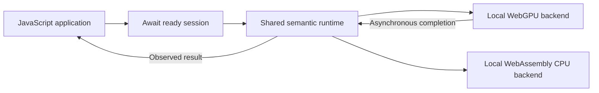
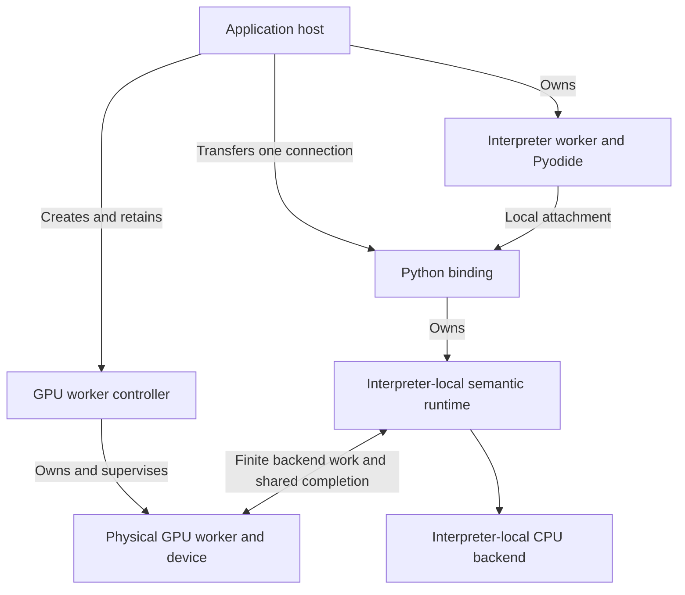

# Selecting and integrating WebGPU

A GPU kernel is only one part of a usable tensor backend. An application also
needs to acquire a device, learn what it can execute, connect it to the tensor
runtime and release it without abandoning pending work. Those obligations are
especially important in a browser: device acquisition is asynchronous, and an
ordinary Python observation may need to wait while GPU completion continues
elsewhere.

This chapter is for programmers integrating Tabgrad or extending its backend
boundary. It explains the accepted device-selection, readiness and ownership
contract, and why direct JavaScript and managed Python use different physical
placement while sharing one semantic runtime. It records an architectural
decision, not a runnable setup guide or a release-support claim. Exact supported
interfaces and qualified environments belong in the
[compatibility record](../compatibility.md).

The [backend chapter](backend-execution.md) defines common execution and
capabilities. [Python integration](python-integration.md) defines attachment to
a borrowed interpreter, and [ordinary Python observation](python-observation.md)
explains the independent-worker and shared-memory waiting mechanism. This
chapter owns the application-facing selection and setup decision that connects
those responsibilities. The [acceptance record](https://github.com/isaacperez/tabgrad/issues/98#issuecomment-5858112953)
identifies the approved contract and its research evidence.

## Select a device without promising another runtime

A tensor's device identifies the backend that owns its numerical execution.
Tabgrad uses the explicit name `webgpu`: JavaScript selects it through
`device: "webgpu"`, while Python uses `device="webgpu"` or
`torch.device("webgpu")`. The Python descriptor has type `webgpu` and index
`None`. This spelling is a Tabgrad extension, not a claim that upstream PyTorch
provides a WebGPU device or that browser execution has CUDA semantics.

The selection domain is one unindexed logical WebGPU device per runtime
session. There is no implicit current-device switch, indexed adapter selection
or CUDA alias. CPU remains the default even in a GPU-enabled session. Keeping
the default unchanged means an application makes accelerator placement
deliberately rather than acquiring different numerical behavior simply because
a GPU is available.

CPU and WebGPU tensors may coexist in the same session. Coexistence does not
authorize mixed-device operations, automatic CPU-scalar exceptions or implicit
transfers. The explicit transfer architecture has its own
[two-endpoint contract](backend-execution.md#transfers-are-programs-not-fallback);
it is not a side effect of enabling a second device. Unsupported operation,
layout, data-type or gradient combinations fail against the selected backend's
capabilities before unusable work is recorded when the failure is already
knowable. Enabling device creation must not accidentally enable every operator
exposed by a frontend.

## Device readiness is not eager numerical execution

The browser first supplies an adapter, which describes an execution target,
and then creates a device with actual features and limits. Both acquisition
steps are asynchronous and can fail. The device's capability snapshot, rather
than an assumption about a browser or graphics-card name, governs admission.

The additive `await createWebGpuRuntimeSession()` factory returns the ordinary
runtime session with its WebGPU device and capabilities ready. The existing
synchronous `createRuntimeSession()` keeps its CPU construction contract. The
new factory does not return a half-enabled session that accepts GPU tensors
before acquisition succeeds. CPU remains available within the returned session.

Readiness answers whether that backend context can accept work; it does not
prepare every possible pipeline or evaluate tensor expressions. Individual
program preparation and numerical execution remain lazy. For example, a caller
can obtain a ready session, create two explicit WebGPU tensor inputs, record
their sum and only then observe its numbers. The first observation can still
need upload, pipeline preparation and execution. This is a conceptual sequence,
not evidence that a particular distributed version implements those calls.

The factory owns what it acquires. Failure or setup cancellation releases
partial resources, including a device that arrives after cancellation. If a
setup AbortSignal is provided, it governs acquisition; it is not an implicit
lifetime cancellation channel for a successfully returned direct session.
Session closure owns that lifetime.

Tabgrad uses the browser-selected adapter. A browser may report it as a
fallback adapter. That is still WebGPU execution, not a silent switch to
Tabgrad's WebAssembly CPU backend, but it does not establish hardware
acceleration or useful speed. Qualification must identify the observed adapter
properties and limits without turning them into a performance guarantee.

## Direct JavaScript can await in its own execution environment

An asynchronous JavaScript observer releases its call stack while awaiting
completion. GPU submission and readback callbacks can therefore progress in
the same execution environment as the runtime. The direct factory keeps
physical GPU work in that calling environment; an application can choose to
place it in a worker, but Tabgrad does not require another worker merely for
symmetry with Python.

The diagram shows calls and ownership within the caller's environment. It is
not a second numerical path or a data copy at every arrow.

The selected backend executes each admitted numerical operation. GPU
intermediates can stay resident, while observation explicitly requests host
bytes. Direct JavaScript needs WebGPU's applicable browser prerequisites, but
this design does not add shared-memory isolation or a mandatory worker
transport to it. The stricter deployment requirements below belong to managed
Python's ordinary waiting behavior, not to WebGPU as a universal rule.

## Managed Python connects to a separately owned GPU worker

An ordinary Python `tolist()` cannot return before its values exist. Under the
accepted [waiting mechanism](python-observation.md), it can park the interpreter
worker. GPU preparation, execution and publication must then progress in a
different worker. The Python frontend and semantic runtime stay together:
moving physical execution does not move validation or create a remote tensor
engine.

The host calls `await createWebGpuWorker()` outside the interpreter worker.
This bounded helper creates and owns the packaged physical GPU worker and its
device. It returns a **controller**: a host-held object with a single-use
`connection`, its `transferables`, and asynchronous `close()`. The connection
is a library-issued bundle containing the transport endpoint, capability
information and shared control needed by the binding. It is not a public
backend plugin interface or a promise to accept arbitrary user-supplied ports.

The host transfers that connection once to its interpreter worker, using the
provided transferable list. In that worker,
`await attachPython(pyodide, { webgpu: connection })` consumes it for one binding.
The binding creates and owns its semantic session while continuing to borrow
the host's interpreter. The controller stays outside that worker so supervision
can act even while Python is parked.

The following map distinguishes ownership and setup from numerical requests.
The connection crosses the worker boundary once; subsequent backend work uses
that established connection, not a newly created worker per operation.

The library owns backend setup and transport; the application still owns
Pyodide loading, interpreter-worker placement, managed-script admission,
effective secure isolated deployment and reporting known interpreter
termination. A library import cannot configure hosting headers or migrate an
existing page-owned interpreter with its objects intact. A worker URL override
supports compatible packaged deployment under the application's content
security policy, not an arbitrary worker protocol. The
[deployment chapter](python-observation.md#hosting-requirements-are-part-of-the-decision)
explains the shared-memory requirements and their limitations.

Connection ownership remains explicit on unsuccessful paths. Failed
attachment retires the connection and releases its backend ownership; it
cannot be retried as a fresh attachment. The host closes a controller that was
never consumed or whose transfer failed. Setup failure or cancellation cleans
partially acquired resources, including late acquisition. Repeated close joins
the same outcome rather than creating independent cleanup operations.
Competing attachment cannot install another session, and neither attachment
failure nor successful closure destroys borrowed Pyodide.

## Graceful close and GPU revocation answer different questions

Closing a Python binding asks it to finish its owned lifetime cooperatively.
It stops admitting new managed entries, joins accepted preparation, scripts
and the tasks those scripts join, drains the session's accepted work and
releases owned integration resources. The helper then retires its worker.
The interpreter and unrelated host objects survive. As with the general
binding contract, closure cannot promise to interrupt an infinite Python loop.

Closing the GPU controller after attachment has a different meaning. It
**revokes GPU availability** from outside the interpreter. A helper AbortSignal
has this same lifetime meaning after setup. Revocation retires the GPU
generation, rejects new GPU admission and fails active GPU requests while
independently waking parked observers. It does not announce that the managed
script completed, that the binding closed gracefully, or that one observer
was merely detached from otherwise continuing GPU service.

The distinction matters when the host needs to stop using a failed backend.
Waiting for a callback inside parked Python would defeat supervision, but
terminating a worker immediately and claiming all its physical work drained
would lose the ownership truth. Accepted producer work keeps its resource
obligations until physical drain is confirmed or loss is explicitly accounted
for. That distinction is shared with
[the common request lifecycle](execution-lifecycle.md), not invented by the
Python connection.

| Event | Required meaning |
| --- | --- |
| Binding close | Stop new entries, join accepted work and drain owned resources without destroying the interpreter. |
| Controller close or lifetime abort after attachment | Revoke GPU service and wake observers independently; do not report successful script or binding completion. |
| Observed device or worker failure | Retire the affected generation, preserve explicit failure and loss accounting, and reject stale publications. |
| Host-reported interpreter termination | Retire the associated backend connection and retain truthful cleanup/loss accounting. |

A generation identifies one backend context's lifetime. A late completion from
a retired generation cannot publish into another context. GPU loss does not
silently replace the device, reconstruct lost tensors from empty handles or
invalidate unrelated CPU semantics. Broader recovery requires an explicit
design and a recoverable source of values.

Supervision covers observed errors and host-reported termination. It is not a
universal detector of silent hangs, nor a guarantee of progress after unexpected
loss of the supervisor itself. Worker termination is not evidence of completed
GPU drain. Resource reporting must distinguish owned allocations and pending or
unknown physical completion; it must not report invented zero usage or precise
available VRAM. Existing CPU/WebAssembly counters retain their CPU meanings.

## Preserve one runtime and separate the cost boundaries

Both integrations use the same operation admission, logical values, executable
program formation, materialization ownership and request advancement. Backend
capabilities describe supported variations; frontend-specific lists must not
become another authority on numerical support. Python transport carries finite
backend programs and bindings below the semantic boundary, rather than one
remote semantic call per tensor operation.

Observed output needs host-readable bytes; every intermediate does not.
Shared completion and result storage must be bounded by the accepted work and
requested observations. The physical backend owns resident intermediates,
staging and submitted-use leases. This preserves a path to larger programs
without claiming that additional operations or models already work.

Device acquisition, program preparation, input upload, resident execution,
readback, transport and Python container conversion have distinct costs.
Reasoning about their separation is not a measured claim that one placement
is faster. Production evidence follows the
[performance policy](../performance.md): first establish that workloads and
measurement resolution can expose the effect, then compare representative
sizes, depths or repetitions within explicit resource limits. Small numerical
correctness cases do not establish time or memory scaling.

Operation-specific numerical meaning remains independent of this placement
decision. The [WebGPU float32 addition contract](webgpu-float32-addition.md)
owns its accepted rounding, exceptional values and optimization constraints.
Neither helper convenience nor common program reuse permits a weaker result.

## Alternatives and why these boundaries were selected

The [research assessment](https://github.com/isaacperez/tabgrad/issues/98#issuecomment-5854250515)
compares device naming, readiness, host setup and representative creation,
observation, close and loss sequences. The
[consolidated recommendation](https://github.com/isaacperez/tabgrad/issues/98#issuecomment-5857919445)
resolves its earlier numerical gate and records independent challenge. The
following alternatives explain the lasting choice, not an implementation plan.

| Alternative | Benefit and reason for the selected boundary |
| --- | --- |
| CUDA alias or neutral accelerator name | Familiar porting syntax or less backend-specific naming, but it obscures the actual browser backend and can imply unsupported device semantics. Explicit `webgpu` keeps that difference visible. |
| Caller-supplied prepared device | Gives applications acquisition control, but requires borrowed-device shutdown and loss contracts. The factory instead owns the device it acquires. |
| Enable GPU on a live session | Avoids a separate creation entry, but adds readiness transitions to a session that may already accept work. A ready factory keeps that transition outside the live session. |
| Acquire a device only on first demand | Avoids unused startup, but defers capability discovery and setup failure beyond ordinary admission. Device-ready setup preserves immediate capability checks while leaving programs lazy. |
| Require a GPU worker for every JavaScript caller | Gives both frontends the same placement, but imposes transport and lifecycle obligations on callers that can already await local completion. Independent progress is required for parked Python, not for every asynchronous observer. |
| Host-implemented endpoints or a generic worker framework | Gives advanced hosts more control, but makes each application responsible for backend protocol, shared completion and cleanup. A bounded library helper owns those obligations without taking over the interpreter. |

The public factories and single-use connection are compatibility commitments;
private message encoding, kernel algorithms and module decomposition are not.
Changing those internals is legitimate when the same capability, ownership and
completion contracts remain true. A different public spelling of an async
factory alone is not a different lifecycle design.

Reconsider the boundary if applications require borrowed GPU devices, multiple
indexed devices, recovery, alternative interpreter placement or a general
backend extension interface. Such needs change ownership or compatibility and
require explicit evidence and decision. A required implementation optimization
does not automatically justify changing these public guarantees.

## Evidence and limits

The integration decision rests on source analysis and lifecycle reasoning,
with the accepted numerical evidence kept in its own topic chapter. The
[pinned WebGPU specification source](https://github.com/gpuweb/gpuweb/blob/454d33cfdf6b8c8a1efafe490623cf0905e6c245/spec/index.bs)
establishes asynchronous adapter/device acquisition and the distinction between
adapter hints and actual device capabilities. The
[HTML worker lifecycle](https://html.spec.whatwg.org/multipage/workers.html#terminate-a-worker)
does not make worker termination a successful-drain acknowledgment.
[PyTorch device conventions](https://docs.pytorch.org/docs/2.14/tensor_attributes.html#torch.device)
provide comparison context, not native support for Tabgrad's WebGPU spelling.

This evidence supports the integration boundaries, not a speed ranking,
universal browser coverage or complete-model readiness. Real packaged-artifact
qualification must establish the implemented interface on named environments,
including numerical and lifetime behavior. Neither a source-level design nor
a successful CPU test is evidence that a WebGPU integration works.
