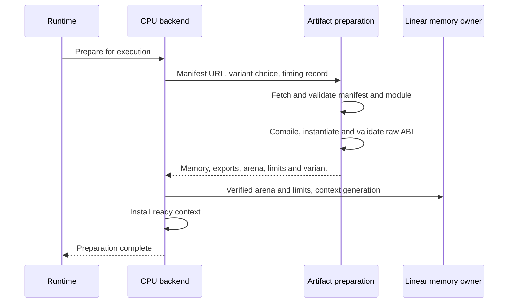

# Preparing a CPU artifact

This chapter is for contributors changing how the CPU backend becomes ready
to execute a program. Preparation is different from tensor computation: before
the first kernel call, the browser needs a compatible binary, a verified
interface and an instance whose memory has known bounds. A successfully fetched
file alone does not establish any of those guarantees.

The [CPU backend architecture](../architecture/webassembly-cpu-backend.md)
defines the artifact set and raw ABI. This page explains the concrete handoff
between [`CpuArtifactLoader`](../../src/backends/cpu/artifact-loader.ts) and
[`WebAssemblyCpuBackend`](../../src/backends/cpu/cpu-backend.ts).
Preparation does not form programs, schedule calculations or allocate tensor
payloads. [Invocation storage](cpu-invocation-storage.md) owns the explanation
of physical allocation and reuse during execution.

## One preparation policy, one backend lifetime

The loader receives the manifest URL, optional forced variant and the backend's
preparation-timing record. It owns fetching and validating the manifest, selecting
a supported variant, checking the module's length and SHA-256 digest, compiling,
instantiating and validating imports, exports, capability bits and arena bounds.
Relative artifact URLs are resolved against the supplied manifest, not against
the internal source module's location.

A successful load returns a physical result: the instance's memory and kernel
exports, verified arena start, maximum pages, alignment and selected variant.
It transfers those references, not copied tensor data. The loader does not
publish a runtime materialization or decide which logical value owns bytes.

The backend owns the single-flight preparation promise, including its cached
failure. It increments its load counter for that attempt and installs the
context only after validation succeeds. It then assigns the context generation
and constructs `LinearMemoryAllocator` from the verified arena and limits.
Generation, readiness, closure and quarantine after a kernel trap remain
backend state, not loader state. Creating another loader is not an alternate
session lifetime or a retry policy.

These are responsibility handoffs inside one backend, not separate workers or
a second scheduling layer. The backend's existing entry module and class remain
the integration point for the runtime and execution instrumentation.

## Failure is part of the boundary

Preparation errors retain a stage: manifest fetch, parse or validation;
capability selection; module fetch; integrity checking; compilation;
instantiation; or ABI validation. Existing structured errors retain their code,
details and native cause. Unexpected platform failures become the backend-load
error with the stage and manifest context. The same normalization policy covers
context construction after the loader's handoff.

A failure produces no ready context or tensor allocation. Unsupported SIMD is
explicit; neither selecting nor validating a variant silently falls back to
another artifact. Diagnostics keep completed preparation timings even if a
later stage fails. The backend supplies that timing record to the loader,
while execution, upload, readback and allocation counters remain with their
existing owners.

## Dependencies and costs

Preparation depends on the common error contract and internal CPU variant and
diagnostic types in `cpu-types.ts`; it does not import the backend implementation
or invocation storage. The backend composes preparation, the persistent linear
memory allocator and per-invocation storage. This one-way dependency keeps
artifact validation independent of program dispatch and allocation reuse.

Preparation performs network reads, hashing and platform compilation, and
creates the instance's initial linear memory. These costs happen at readiness,
not inside each numerical operation. Sharing the preparation promise prevents
concurrent consumers from duplicating that work within one backend. The result
does not authorize sharing an instance or allocations between independent
backend generations.

The numerical kernel algorithms, vectorization and memory-reuse policies remain
separate. Changing a preparation owner is not evidence of faster computation
or lower memory usage; such claims require the [performance policy](../performance.md).
