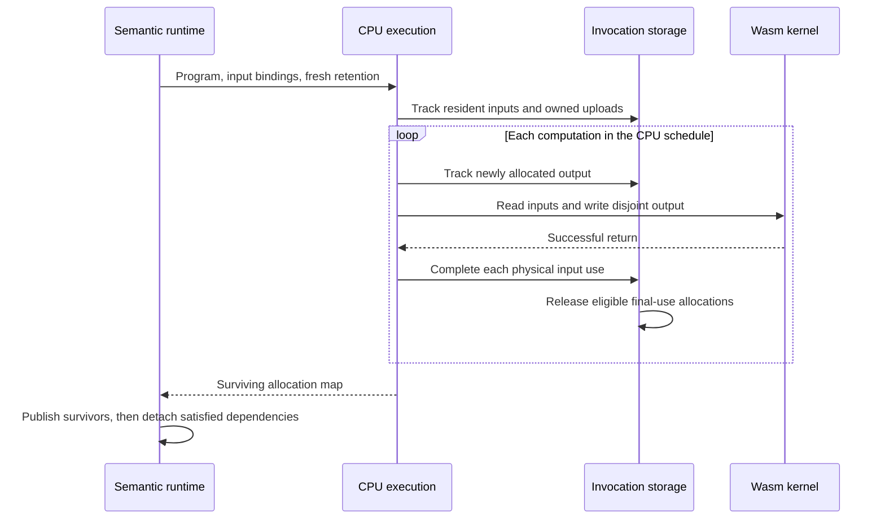

# Storage inside a CPU invocation

This chapter is for contributors changing how the runtime and CPU backend
exchange programs and allocations. A selected calculation can contain many
intermediate values, but not every intermediate needs permanent numerical
storage. The challenge is to reuse that storage without losing a value that
another handle, pending calculation or observation still needs.

The [reuse architecture](../architecture/cpu-intermediate-reuse.md) establishes
the separation between logical retention and physical last access. Here that
boundary connects `ExecutableProgram`, `RuntimeSession` and
`WebAssemblyCpuBackend`. The backend's private `InvocationStorage` accounts for
allocations during one synchronous execution; it is not a second allocator,
semantic reference counter or persistent program cache.

## Allocate from element count, not rank

Program slots carry the complete logical shape. The shared semantic shape
helper determines its element count; the CPU backend turns that count into
float32 byte lengths and its allocator enforces the physical address and memory
bounds. A scalar has one element, and a zero anywhere in the shape means zero
elements. The first dimension alone is never an allocation length.

Contiguous elementwise work uses the same flat kernel interface at every rank.
There is no per-row kernel dispatch, upload or readback. Rank contributes a
metadata walk when lengths are derived, not a multiplier in the numerical
loop. All allocation, reuse and rollback rules below apply equally to scalar,
vector, multidimensional and empty values. Shape metadata remains on the
logical value rather than being reconstructed from allocation size.

Input and output geometry are independent. Allocation always uses the value
being allocated; a kernel's iteration range comes from the operand or operation
that defines its work. Empty inputs do not imply an empty output. Dispatch must
not skip a computation solely because an input has zero elements.

## Structural uses and current owners answer different questions

An executable program numbers its values with logical slots. Its frozen
`inputUseCounts` array records how many selected input positions refer to each
slot. Repeated arguments count separately: a computation using the same value
twice contributes two occurrences. The count describes the selected program,
not the whole session and not a physical execution schedule.

Every numerical computation carries one ordered `inputs` list. Formation,
logical use counts, physical storage-use counts and retirement enumerate this
same list, including repeated slots. These owners do not infer operands from
binary field names or a kernel's signature. Operation admission establishes
arity and meaning; the backend's dispatch selects the corresponding physical
call. Adding a numerical signature must not require another lifetime algorithm.

The runtime knows the owners outside those selected input positions. Immediately
before calling `execute`, it compares each shared storage's aggregate reference
count with its program storage-use count. More references mean that the storage must remain
available beyond its internal uses. Open handles, outside pending consumers
and accepted observation requests can each establish that obligation. The
demanded result is protected by its observation reference even if its handle
has closed.

These booleans occupy canonical storage slots in the invocation's
`retainedSlots` array. They are supplied
separately from the immutable program. Preparation can suspend and let handles
close or requests enter the queue, so the runtime computes them after
preparation, with no suspension between that computation and CPU execution.
Freezing those obligations during formation would retain values unnecessarily
when their external owners disappear during preparation.

This comparison relies on the semantic owner's counting unit matching the
program's input occurrences. A new owner or representation cannot silently
reuse the subtraction if its references mean something different. The
[semantic lifetime contract](semantic-value-lifetimes.md) remains authoritative
for which values must survive.

## Physical storage follows actual kernel completion

The backend first binds resident inputs and uploads host inputs once per
canonical storage slot. Logical aliases neither upload nor allocate payload.
Numerical operands resolve their logical slot's `storageSlot`, preserving
their separate shape metadata in the program. A resident
allocation is borrowed from the runtime: even if its slot has no external
retention obligation, execution cannot overwrite it. It may be the only
recoverable source for a later attempt. Newly allocated host inputs and computed
outputs belong to this invocation until successful publication.

For each computation, the backend allocates its output before invoking the
kernel. This ordering preserves the raw ABI's requirement that the output not
overlap its inputs. Only after the kernel returns successfully does execution
retire the consumed physical input occurrences, aggregated across aliases.
When an invocation-owned, unretained
value has no remaining uses, its allocation is released and removed from the
active map. The existing allocator can then satisfy another output from those
bytes.

The following sequence describes that synchronous CPU boundary. The arrows
show calls and ownership handoffs, not separate execution threads.

The runtime does not install materializations for discarded scratch. It still
releases every selected producer's satisfied dependencies after installing the
survivors. A logical intermediate can therefore exist during execution without
requiring its own resident materialization afterward. Empty values participate
in the same ownership accounting even though their allocation has zero bytes.

## Failure cleanup must not destroy retry inputs

`InvocationStorage` retains only active allocation records. A released scratch
record leaves its map, so later reuse of the same physical range does not make
rollback release an obsolete record a second time. On execution failure,
rollback releases active invocation-owned allocations and excludes borrowed
resident bindings. Nothing is published and the runtime preserves pending
producer dependencies.

A nonzero kernel status is reported through the existing structured error
contract. When its underlying cause is recoverable, a subsequent observation
can retry from the preserved inputs. A Wasm trap quarantines the backend
context; retaining inputs does not authorize further kernels in that context.
Cleanup preserves the original error and its computation provenance.

Readback happens after successful execution and publication. A readback failure
therefore leaves valid resident results in place, rather than recreating the
released calculation history or rerunning kernels. Request retirement and
session drain remain with [runtime observation](runtime-observation.md).

## Costs and limits

For `V` selected values and `E` input occurrences, common use analysis takes
`O(V + E)` work and `O(V)` count storage. Admission builds `O(V)` retention
state. CPU execution keeps an invocation-local remaining-use array and an
active allocation map, with at most `O(V)` entries; it does not retain a second
list of every scratch allocation ever created. These are host metadata costs,
separate from numerical payload storage.

A chain of equally sized values with closed intermediates can rotate a small
working set. Retaining those intermediates intentionally prevents their reuse.
Shared graphs require enough storage for overlapping live values. Neither case
changes the algorithm into a promise of constant memory for arbitrary graphs.

Allocator search, alignment and free-range coalescing have their own costs.
Mixed sizes can fragment free ranges, and lowering peak payload does not shrink
already reserved WebAssembly linear memory. Measurements must distinguish these
quantities and the extra bookkeeping, especially when all values are retained.
The [performance policy](../performance.md) governs comparisons; this chapter
does not establish a general latency or total-process-memory guarantee.

A different physical schedule must establish its own completion points while
respecting the same logical obligations. The CPU counter updates cannot be
copied unchanged into asynchronous GPU dispatch or a fused schedule merely
because those implementations consume the same executable structure.
