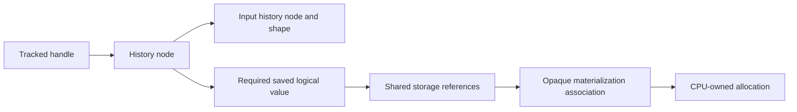

# Derivative history ownership

Contributors changing differentiation or storage need to distinguish an
execution dependency from a derivative dependency. A forward multiplication
needs both input values to compute its result. After that result is stored,
execution can release its producer inputs. Its derivative may still need one
of those input values, however, even if the public handle has disappeared.
Keeping the whole forward graph would preserve too much; keeping only its
result would preserve too little.

`DerivativeHistory` in
[`src/runtime/autograd/derivative-history.ts`](../../src/runtime/autograd/derivative-history.ts) owns the separate
dynamic history required by the
[autograd architecture](../architecture/autograd-and-training.md). Canonical
operation definitions bind their local recipes from
[`src/runtime/autograd/derivative-recipes.ts`](../../src/runtime/autograd/derivative-recipes.ts). History owns
traversal and saved logical pins; it does not interpret operation names or own
numerical memory. The runtime supplies ordinary operations and handle cleanup.

## Edges and saved values have different lifetimes

An ordinary tracked public handle owns one history node. A tracked operation's node owns
one edge for each tracked input occurrence. An edge preserves that input's
derivative identity and shape, even after its public handle closes. It does
not preserve the numerical input. Repeated operands own repeated references;
release decrements every occurrence through an iterative worklist.

Advertised tracking and a derivative entry are distinct. A no-grad-created
tracked view has no normal entry; runtime admission reports that view as an
invalid derivative output or unused input. An active operation involving it
can own a real recipe with all-null input edges. Such a node is a valid
derivative cutoff, not a fabricated leaf accumulator. Admission decides when
to record; `DerivativeHistory.record` preserves the admitted recipe even when
no input edge exists. The [recording reference](../reference/gradient-recording.md)
owns the observable scope/view contract.

A saved operand is a separate logical value pin. For `x * y`, differentiating
with respect to `x` needs `y`; differentiating with respect to `y` needs `x`.
If only `x` tracks, the node saves only `y`, including when `y` is nontracking.
Addition, sum and views save no numerical operands. Thus an edge can survive
forward completion while its old payload is correctly reclaimed.

The following relationships are ownership references, not numerical copies:

The runtime adds a saved pin to the same value and shared-storage reference
counts used by execution owners. During CPU invocation admission, that pin
therefore prevents scratch reuse of a still-needed saved value. The CPU
allocator remains the sole owner of physical storage. Forward materialization
can detach its ordinary producers because the independent pin has already
protected the saved payload.

History references belong to handles and history edges, separately from
numerical value references. Saving a value does not recursively retain that
value's history. This avoids ownership cycles and prevents a numerical consumer
from accidentally extending an unrelated derivative lifetime. Whole-storage
aliases continue to use the ordinary
[semantic lifetime rules](semantic-value-lifetimes.md).

## Validate, traverse and transfer ownership

Functional differentiation follows the
[CPU per-node contract](../architecture/cpu-gradient-state.md#progress-and-failure-belong-to-executing-nodes).
The [versioned evidence](../compatibility.md#functional-failure-progress) bounds
its correspondence with native scheduling and failure progress.

The runtime first validates handles, session, tracking, argument forms and seed
shape. History then builds an iterative input-before-output order and marks
nodes that can lead to requested inputs. It checks connectivity before any
derivative admission; saved-state checks wait until the owning recipe executes.
An intermediate can be a requested result and still forward contributions to
another requested ancestor. Merely reaching a requested node does not imply
that every ancestor must execute.

Selected incoming edge occurrences establish readiness counts. A private
maximum heap chooses the newest created ready node, matching the pinned native
sequence priority without executing a shared predecessor too early. Node
sequence is session-local metadata, not a numerical or storage owner.
Traversal asks each bound recipe to produce one contribution for each
needed input edge. Contributions meet through ordinary pure addition. Every
temporary and returned tensor is nontracking. Temporary handles retire when
their traversal use ends; admitted numerical producers keep the values needed
for later execution. Repeated requested inputs receive independently owned
result views, so closing one cannot invalidate another.

After its successful construction, each traversed multiplication releases all its
saved pins and marks its saved state consumed. The new pending derivative
operations now own their numerical operands. Payload-free pure/direct-copy history remains usable; traversed view-copy
history is consumable without saved payload. Every save of an executed node is
version validated before its recipe admits work, including pruned input positions.
Cutoffs do not execute their ancestors. Node controls capture relevant writers
and every returned gradient also retains root/history/seed controls, separately
from numeric saves. A construction failure closes newly created handles while
preserving consumption by earlier successful recipes. The failing recipe keeps
its saved state. A later backend failure belongs to ordinary observation: retained
results keep retry dependencies, and closing results releases them. Session
close also releases handles and history before draining accepted numerical
requests, whose own pins preserve work already admitted.

Saved-pin retirement first removes each pin from history accounting, then
attempts its ordinary value release. A release failure does not abandon other
saved pins or history edges. When one recipe succeeds, all of its saved owners
are logically retired and the recipe is marked consumed even if physical
release fails. Independent work and cleanup still receive their attempts.
Already retired pins must not
be reused as though construction had failed before consumption began. The
cleanup failure is reported, and newly constructed result handles are closed
instead of being returned. When a later semantic error also occurs, that error
precedes collected cleanup failures in the aggregate. Temporary and result
handles are retired per occurrence, including repeated operands and requests.

## Costs and extension boundary

For `V` history nodes and `E` edges reachable from the output, planning uses
`O(V + E)` work and metadata. It traverses history metadata to establish
connectivity but admits numerical work only on paths to requested inputs.
Traversal admits a bounded number of operations per selected edge. Readiness
counts use `O(V + E)` metadata; selecting ready nodes costs `O(V log R)` for
at most `R` simultaneously ready nodes. No global sequence sort replaces
dependency readiness, and the worklists do not survive the request.
Saved payload scales with the operands required by live multiplication recipes,
not with every historical tensor. Aliased saved operands may share storage;
pin counts are not byte counts. Release uses constant host call-stack depth.

`liveDerivativeNodes` counts owned history nodes, including tracked leaves.
`liveSavedValues` counts saved operand pins, including repeated occurrences.
Neither counter is a cumulative log. `liveTensorValues`, materialization and
allocation diagnostics continue to measure their respective runtime and CPU
owners. Closing all relevant handles and requests must return live counts to
zero; reserved allocator capacity and WebAssembly memory can remain pooled.

A further derivative recipe belongs to its canonical operation definition.
It identifies required saved operands and emits operations through the existing
runtime interface. History traversal, storage pinning and backend ownership do
not depend on the operation's name. A rule requiring another numerical
primitive would additionally extend the ordinary admitted vocabulary and its
backend capability profile; mutation versions use the independent shared counter under the
[persistent update contract](../reference/tensor-copy.md). The supported specialization is described in the
[functional API reference](../reference/functional-gradients.md).

Persistent gradient accumulation has a different ownership need: it changes
stable parameter state and must respect alias-visible mutation and version
order. Pure addition inside one functional request establishes no such effect.
The accepted architecture keeps that state at the semantic tensor/effect
owners while reusing the numerical execution path. The supported CPU copy updates stable state; persistent gradient accumulation
is a separate excluded API. Its accepted identity, retention and cycle
requirements live in the [CPU gradient-state contract](../architecture/cpu-gradient-state.md);
this component description does not claim they are implemented.
