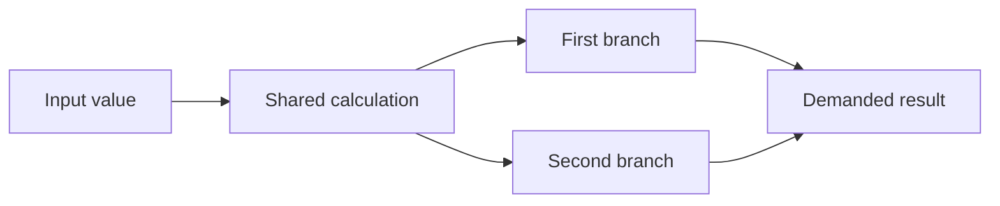

# Forming an executable program

This chapter is for contributors who need to understand how a demand for one
tensor becomes finite backend work. Recording operations establishes a graph:
each pending value refers to the inputs needed to compute it. A backend does
not need the whole session's graph, public tensor handles, or the history of
unrelated calculations. It needs a description of the work selected by this
demand and the data bound to that particular invocation.

[`formExecutableProgram`](../../src/program-formation.ts) owns this
transformation. The session calls it from the
[observation path](runtime-observation.md), before backend preparation and
execution. The [representation architecture](../architecture/internal-representations.md)
explains why semantic values, executable structure and physical execution are
separate descriptions. This chapter explains the concrete formation boundary,
not a second scheduler or a public tensor API.

## Inputs and the two parts of the result

Formation borrows a demanded value and a materialization lookup. A
materialization associates shared logical storage with host data or an opaque resident
backend allocation. The session owns those associations and the value graph;
formation neither releases them nor copies tensor payloads. Operation admission
has already validated the graph. It is acyclic and stable throughout this
synchronous call; formation is not a parser for arbitrary external graphs.

The result separates reusable description from invocation-specific references:

| Result | Meaning and consumer |
| --- | --- |
| `program` | An immutable `ExecutableProgram` containing numbered logical slots, metadata, dependency-ordered computations and diagnostic provenance. The backend consumes this structure. |
| `bindings` | Host arrays or resident allocations associated with input slots for this invocation. These payload references do not enter the program. |
| `valuesBySlot` | The original semantic value associated with each slot, allowing the session to publish returned allocations to the right owner. |
| `newlyComputed` | Selected computed values in dependency order, allowing the session to release producer dependencies after successful materialization. |

A **slot** is a local integer identifying one value in this program, not a
memory address. Program metadata and provenance are frozen copies. Keeping the
program therefore does not keep the invocation's arrays, allocations or
semantic graph. The accompanying maps do reference invocation state and must
not become a persistent program cache.

Each logical slot also names a canonical `storageSlot`. An alias retains its
own shape and view provenance but points to the originating storage slot.
Formation visits that origin once and emits any pending numerical producer
once, regardless of the number of selected aliases. Alias slots have source
`alias`, no payload binding and no numerical computation. The origin preserves
the producer's original shape and provenance; reshaping its result does not
rewrite the meaning of that producing call. Program format version 2 records
this distinction explicitly.

Each slot preserves the complete admitted shape, including scalar rank and
dimensions after a zero. Formation does not infer dimensions from a payload or
collapse a shape to its first dimension. The semantic helpers in
[`tensor-shape.ts`](../../src/tensor-shape.ts) own dimension validation, element
counting and exact shape comparison. Runtime admission validates and copies
external dimensions once; formation and the backend consume admitted metadata.
The [shape concept](../concepts/tensor-shape.md) explains why equal payload sizes
do not imply interchangeable shapes.

`ExecutableProgram` also derives frozen `inputUseCounts` from its selected
computations. Each input position contributes one use, including repeated
positions referring to the same slot. The runtime and backend share these
structural facts; they do not include current owners. The
[CPU storage contract](cpu-invocation-storage.md) explains how fresh runtime
retention and actual kernel completion combine with those counts.

The program separately aggregates numerical input occurrences into
`storageUseCounts`. Logical uses still identify which shaped operand the
computation consumes; storage uses identify the shared bytes that must survive
those physical accesses. A metadata alias itself contributes no physical use.
The CPU backend consumes the aggregate counts rather than retiring aliases
independently. For whole contiguous views every alias covers its storage's full
extent, so contiguous CPU kernels can use these associations directly.
Non-contiguous execution would need access/layout facts on logical operands
and backend support for them; it would not erase logical shapes or make the
shared storage owner depend on an operation's axes.

## Follow dependencies without using the call stack

Formation walks inputs before emitting their consumer. This dependency-first
order is called postorder. Each unfinished value has a frame on an explicit
array stack. The frame remembers the next input to inspect. Once all its inputs
have slots, the value receives its own slot and its frame is removed.

The slot map records completed values. If another input refers to an already
completed value, formation uses that slot rather than walking its ancestry
again. Inputs are considered in their recorded order, so branching and repeated
arguments preserve their meaning. The traversal policy is shared; operation
lowering still expresses the supported computation's own inputs and kind.

For a conceptual example, let a shared value feed two branches and let their
outputs feed a demanded result. The arrows below represent value dependencies,
not physical dispatches or resource ownership.

Formation emits the input and shared calculation before the first branch. When
it reaches the second branch, the shared slot already exists. The demanded
result comes after both branches. A calculation elsewhere in the session is
not visited just because it exists. No global graph scan or sort is needed.

Using an explicit stack makes traversal independent of the host engine's
recursive-call limit. It does not make graphs free: frames, slots and output
records still require memory proportional to the selected work.

## Resident values are boundaries

A value already resident in the selected backend is an input binding, even if
its producer reference is still attached. Formation stops at that value rather
than recomputing its ancestry. If the demanded root itself is resident, its
program contains one binding and no computations. Its original provenance
still identifies the operation that produced it.

This distinction matters when values have independent owners. Selecting one
result must not imply selecting every calculation that once contributed to it.
The session's [semantic lifetime owner](semantic-value-lifetimes.md) decides
when producer edges can be released; formation only reads the boundary it sees.

## Execution, failure and lifetime remain with their owners

Formation does not load a backend, execute kernels, read back data or advance a
request. This makes its transformation testable without numerical execution.
The session installs returned materializations before releasing the dependencies
of `newlyComputed` values. Failure must not imitate successful materialization
or detach inputs still needed for execution. Request retirement and causal
failure context remain in the observation owner.

For selected values and edges, each value is emitted once and each input edge
is considered once. Maps, frames and invocation associations grow linearly;
metadata snapshotting adds the cost of the selected compact metadata. There is
no traversal of unrelated session history or repeated scan of shared ancestry.
These are formation bounds, not claims about numerical allocations, tensor
release, end-to-end observation latency or total browser memory. Quantitative
evidence follows the [performance policy](../performance.md).
