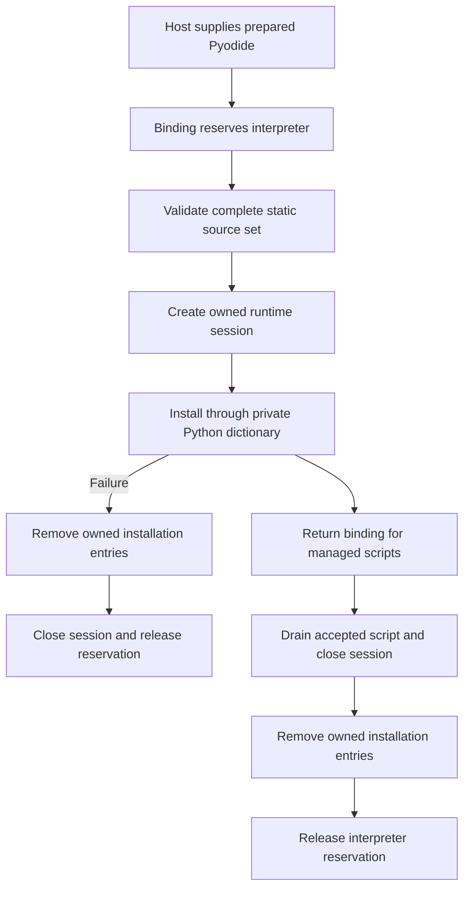
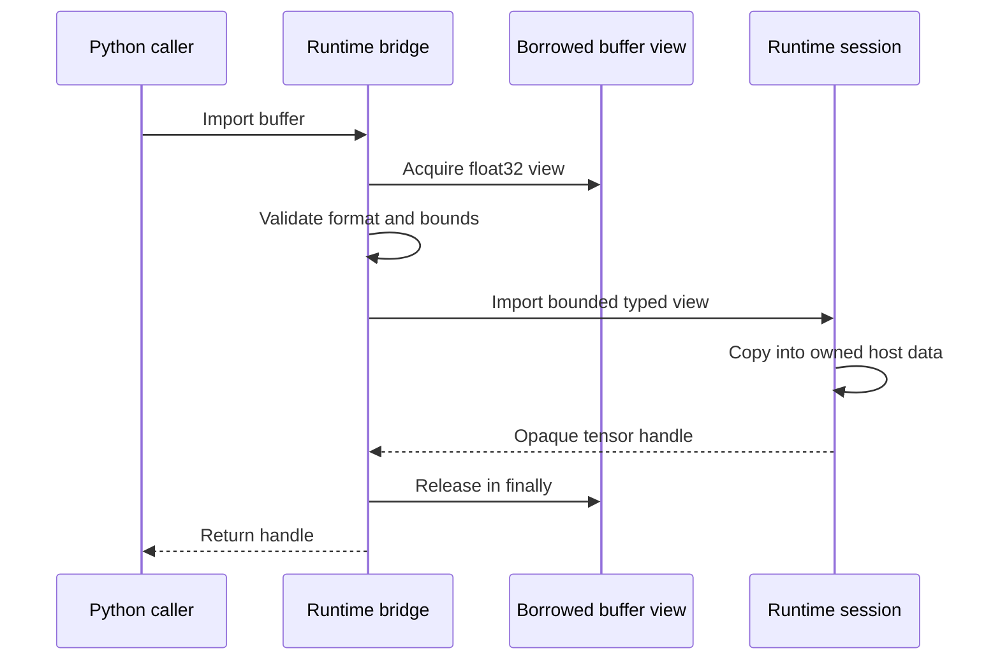

# Installing the Python package in a borrowed interpreter

Loading a Python interpreter and connecting it to Tabgrad are different
operations. The application supplies Pyodide, which already knows how to run
Python. Tabgrad supplies its compatibility source and connects that source to
one JavaScript runtime session. The application may already have variables,
packages and JavaScript modules in its interpreter. Installation must coexist
with those resources rather than treating the interpreter as an empty process
that Tabgrad can reset.

This chapter explains the component that makes that connection reversible. It
is aimed at contributors familiar with modules, files and asynchronous
JavaScript, but not necessarily Python's import machinery. Start with
[Python in the browser](../concepts/python-in-the-browser.md) for the interpreter
and language boundary, or the [script binding](python-script-binding.md) for
script admission and cooperative shutdown. The
[architecture contract](../architecture/python-integration.md#load-static-python-assets-transactionally)
defines the wider constraints; this page follows their concrete owners.

## Begin with ordinary source files

The Python package is maintained under [`python/`](../../python), separately
from native contributor tools. The build copies its source into `dist/python/`
and writes a manifest alongside it. A manifest is a small JSON description of
the files the installation expects: their exact relative paths, byte lengths
and SHA-256 hashes, together with the selected interpreter and bridge protocol
versions. The [generated-file register](../generated-files.md) owns the precise
source and reproduction command.

Copying Python source is intentional. Pyodide can compile and execute Python
itself; a wheel installer, native compiler and NumPy are not needed to make
these files importable. The browser receives ordinary static assets. This
does not make the Python compatibility layer a second numerical engine: the
private connection leads to the existing JavaScript runtime session, whose
backend remains responsible for numerical execution.

There are two maintained inputs with different jobs. `bootstrap.py` installs
and removes interpreter resources. `torch/__init__.py` is the imported package
initializer and captures its session from the private bridge. Package import
does not establish PyTorch operation coverage. That requires the separate
operation contracts and [compatibility evidence](../compatibility.md).

## Verify everything before executing anything

[`src/python-assets.ts`](../../src/python-assets.ts) owns artifact validation.
Its input is the manifest URL; its output is verified source text, not an
installed package. The default URL is `python/manifest.json` relative to the
emitted Python entry module. The host may provide `manifestUrl` when serving
the assets elsewhere; relative file locations still resolve beside that
manifest. Browser hosting must permit those requests and provide Web Crypto
for hashing. No Node filesystem API is imported by the delivered loader.

The loader requires the exact source set and supported protocol versions.
Unexpected paths, duplicate or missing entries, malformed metadata, failed
requests, incorrect byte lengths, mismatched hashes and invalid UTF-8 reject
with `PYTHON_ASSET_INVALID`. Both sources must validate before the binding
creates a session or calls Python. A broken second asset therefore cannot
leave the first one partly installed.

A hash detects different bytes relative to the supplied manifest. It is not a
signature or an independent trust authority: replacing both source and its
manifest could produce a matching pair. Applications must obtain the entire
distribution from their trusted release and hosting path. Installation is not
a sandbox for untrusted Python, and the host-provided interpreter is not a
security boundary against its own application.

## Install through a private namespace

Once validation succeeds, [`src/python-installation.ts`](../../src/python-installation.ts)
owns one Python dictionary proxy. A dictionary can be used as the globals for
a particular Python execution without becoming the interpreter's application
globals. The installer evaluates the verified bootstrap in this private
dictionary and passes the verified package text and a JavaScript bridge object
into it. Helper names, imports and temporary installation variables therefore
do not overwrite similarly named application variables.

The bootstrap's `Installation` object owns the interpreter-side transaction.
Before writing files or registering Tabgrad modules, it rejects an imported,
registered or discoverable module named `torch` or `_tabgrad_runtime_bridge`.
A name cached as `None` also counts as occupied. A package merely present on
Python's import search path is a conflict even when nobody has imported it.
Attachment never silently substitutes Tabgrad for an existing PyTorch package.

After that check it creates a unique directory in Pyodide's in-memory
filesystem, writes the package source, adds an owned import-search entry,
registers the private JavaScript bridge and imports the package. This is a
synchronous installation inside the asynchronous attachment operation. The
host must not independently drive the interpreter during attachment or a
managed script; the component is not a scheduler for concurrent host calls.

The following diagram shows ownership transfer, not separate worker threads.
Validation produces source, installation produces a connection, and only a
successfully installed connection can be returned to the application.

The private bridge carries the same session owned by the script binding. It
does not create a tensor registry, copy an execution engine, or choose a
different backend. A Python module retained by application globals continues
to refer to that particular session after close. Reattachment creates a new
session; it does not change the old module's connection.

## Import a buffer without retaining interpreter memory

The registered object is a
[`PythonRuntimeBridge`](../../src/python-runtime-bridge.ts), bound to that same
session. Its `tensorFromBuffer` method is an internal transfer boundary, not a
public tensor constructor or a second operation engine. It accepts a borrowed
Python buffer proxy and returns the runtime's existing opaque tensor object.
The [architecture's data-movement contract](../architecture/python-integration.md#move-bulk-data-only-where-the-user-imports-or-observes-it)
explains why numerical data crosses here rather than during every operation.

For example, a Python buffer can describe two numbers in the middle of a larger
array. Pyodide's `getBuffer('f32')` exposes a typed view and metadata describing
the selected region. The typed array is not permission to copy all of the
interpreter's memory: the bridge checks the original float format, element
size, rank, contiguity, offset and length, then selects only that bounded region.
Requesting the `f32` view alone would not validate the original element format.

The import is synchronous. The runtime owns its copy before the borrowed view
is released, and there is no `await` or deferred use of that view. Subsequent
changes to the Python input cannot change the imported tensor. An empty
rank-one float buffer follows the same route. This is a copy-ownership
guarantee, not a zero-copy or throughput claim: input conversion and the
runtime's owned copy remain real costs.

If acquisition fails, there is no acquired view to release. After successful
acquisition, `finally` releases the view even when validation rejects it or the
session has closed. The bridge does not destroy the borrowed argument proxy,
which belongs to Pyodide's call boundary. It does not load a numerical backend,
submit an operation or maintain a handle registry. Layout/format failures use
`INVALID_DATA`; runtime lifecycle failures keep their runtime error identity.
Python argument binding and exception presentation are separate responsibilities
from this internal buffer-import contract.

## Why cleanup needs more than unregistering a module

Python and Pyodide retain several kinds of state for different reasons.
`sys.modules` stores already imported modules, so another import can reuse
them. `sys.path` lists locations in which Python searches for source.
`sys.path_importer_cache` caches the finder associated with a search location.
Pyodide separately registers JavaScript objects that Python can import.
Removing one of these entries does not automatically remove all the others.

The installation therefore keeps a small ownership record:

| Resource | Evidence that the entry still belongs to this installation |
| --- | --- |
| Imported package and bridge | The exact module object remains in `sys.modules` |
| JavaScript registration | The registration still contains the captured proxy object |
| Import-search entry | The entry is the installation's distinct string object, not just an equal string |
| Cached finder | The cache still contains the finder captured after package import |
| Source file | Its filesystem identity and content still match the owned write |
| Package and root directories | Their filesystem identities match and they are empty |

These distinctions protect ordinary host intervention. Replacing a cached
module must not result in that replacement being deleted at close. Adding an
equal search-path string must not make it an owned entry. Editing the package
file or adding another file prevents cleanup from erasing those host bytes.
Directories are removed only when empty; there is no recursive deletion.

The private registration identity requires the pinned Pyodide importer's
`jsfinder.jsproxies` mapping. Pyodide's public unregister operation alone cannot
distinguish the original registration from a later replacement, and importing
the name can return a stale cached module. This dependency is isolated in the
bootstrap rather than spread through the tensor API. An interpreter upgrade
must recheck this behavior against Pyodide's source and the real-interpreter
identity tests, not simply change the accepted version string.

## Failure and lifetime boundaries

A partial installation rolls back the entries it acquired. File ownership is
recorded before writing can fail, so a partially written source file remains
eligible for cleanup. Initial import suppresses bytecode-cache writing only
for that synchronous operation and restores the interpreter's previous setting.
Bootstrap failure is reported as `PYTHON_INSTALL_FAILED`, retaining its Python
cause. If rollback also fails, the Python exception group retains both errors.
Attachment then closes any created session and releases the interpreter
reservation; a failed attachment never returns an apparently usable binding.

Normal close waits for the accepted managed script, closes the runtime
session, and removes owned installation entries. It attempts installation
cleanup even if session close fails. A single cleanup error remains that error;
multiple failures are reported together rather than allowing the last one to
hide the first. The private dictionary is cleared and its proxy released on
success and failure. Clearing matters because bootstrap functions refer back
to their globals: releasing only the JavaScript proxy would leave the retired
installation in a Python reference cycle until cyclic garbage collection.
Application globals and the borrowed interpreter survive.

Preserving host changes can intentionally leave files behind. That is not a
promise that every temporary directory disappears under every host action.
Likewise, a genuine filesystem cleanup error is reported, not converted into a
successful close. The installation owns its entries, not arbitrary mutations
of Python's standard import containers into incompatible objects.

## Costs and the evidence that matters

For total source size `S`, fetching, hashing, decoding and writing require
linear work and linear temporary storage. The files can be fetched together,
but no interpreter mutation starts until validation finishes. Source validation
is attachment work, not work repeated for each tensor operation or script.
The private dictionary drops the temporary source text after installation.
Retained files and their ownership fingerprints also occupy linear space;
there is no global history of completed installations.

Import-name checks use Python's normal discovery facilities, whose costs
depend on the host's import configuration. Removing a search entry scans the
host's path list, and checking whether an owned directory is empty depends on
its entries. These are lifecycle costs, not constant-time claims about an
arbitrarily large host environment. Close also compares owned file contents,
deliberately spending linear work to preserve host edits.

The [Node integration cases](../../js-tests/unit/python-binding.test.mjs)
exercise real built source, integrity failures, conflicts, rollback, replacement
identities, retained closed sessions and repeated attachment bookkeeping.
The [browser lifecycle page](../../js-tests/browser/python-lifecycle.html)
checks the delivered files with actual Pyodide in the configured browsers.
Deterministic resource checks do not establish a bound on the whole browser
process's memory. Quantitative claims require the bounded, comparable
measurements described by the [performance policy](../performance.md).
