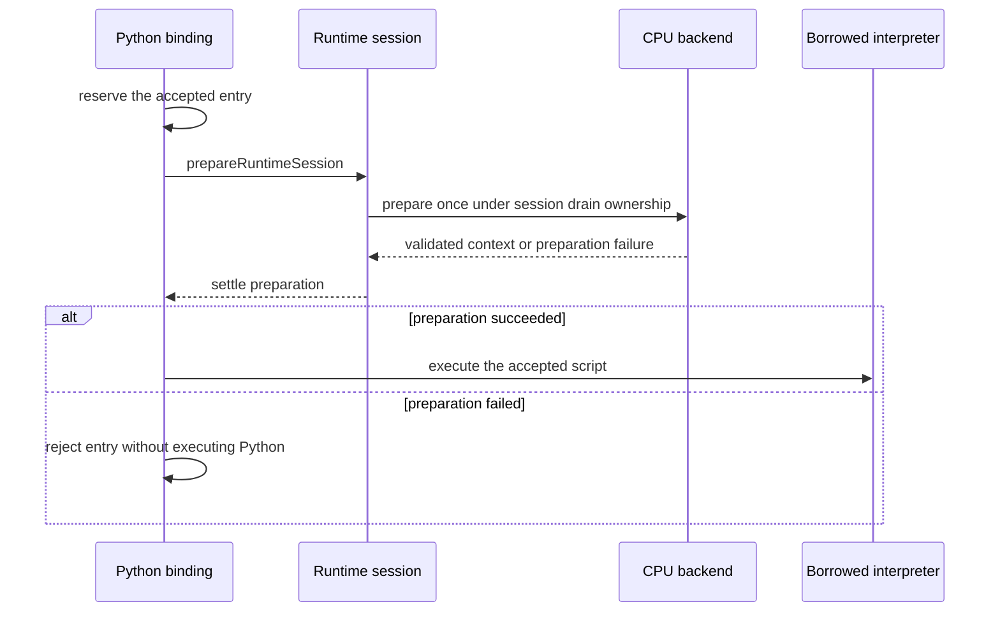
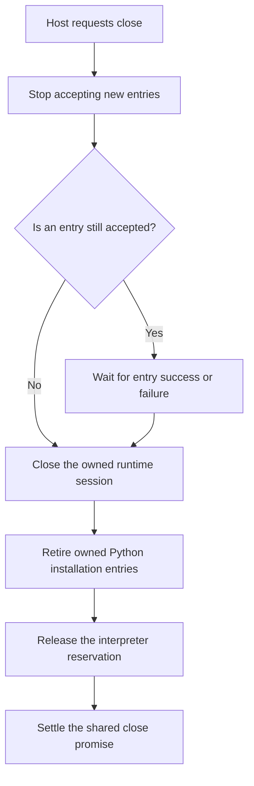

# The Python script binding

A browser application can use Python for more than one purpose. It might keep
user settings in Python variables, run a calculation when someone presses a
button, and leave the interpreter available for another interaction. Releasing
the resources of one calculation should not erase that entire environment.
Conversely, keeping Python available should not require retaining every tensor
resource until the page disappears.

Tabgrad addresses this distinction with a runtime session: an owner that
groups tensor work and its resources under one lifetime. The application owns
the Python interpreter, while the Python script binding owns a Tabgrad session
and coordinates its relationship with that interpreter. Closing the binding
finishes the session's work without taking over interpreter shutdown.

A tensor is a collection of numbers arranged in dimensions. Its numerical
storage and pending computation need a lifetime distinct from the Python
objects through which a program refers to it. This chapter explains the
connection's owner, not the representation of the tensor itself.

This page explains the managed-entry and session-lifetime owner in
[`src/python.ts`](../../src/python.ts). The wider
[Python integration architecture](../architecture/python-integration.md)
defines the separate tensor-wrapper, static-loading and observation contracts.
This component description is not a Python operation-support record.

This owner lives with its borrowed interpreter. The
[worker connection](python-worker-connection.md) places an additional admission
boundary outside that worker, so a host can reject overlap while Python is
occupied. It transports whole scripts and closure, not tensor operations.
The [host reference](../reference/python-host.md) describes their composition.

This chapter is for contributors familiar with Python, JavaScript and promises
who need to understand this concrete owner. Pyodide is the Python interpreter
distribution used inside the browser; its language bridge lets JavaScript
invoke Python and receive Python objects. It does not perform Tabgrad's tensor
arithmetic. The [integration architecture](../architecture/python-integration.md)
explains the wider division of responsibilities. Here the focus is the script
boundary: what gets accepted, what completion means, and what closure releases.

## Start with one application interaction

Imagine that the host has assigned a Python variable named `host_value`. The
application attaches a binding, runs a script that reads this variable and
assigns another, and then runs a second script using the first script's result.
Both scripts see the same interpreter globals. The binding does not create a
fresh Python namespace for each interaction, so ordinary state survives from
one managed entry to the next.

The host eventually closes the binding. After that completion it can still
read `host_value` through the interpreter, but it cannot submit more scripts
through the old binding. These are not contradictory outcomes: the variable
belongs to the host environment, whereas admission of scripts belongs to the
closed connection. The lifecycle tests linked below exercise this distinction
with real Pyodide rather than a substitute interpreter.

Three methods describe the host interaction. `attachPython(interpreter, options?)` creates
the association and returns a binding asynchronously. The binding's
`runPythonAsync(source)` accepts one script and returns its completion promise.
Its `close()` returns the completion of cooperative shutdown. The asynchronous
types describe when the host can observe completion; they do not imply a
background thread or a queue of scripts waiting to run.

## Inputs, ownership and boundaries

`attachPython` accepts a prepared interpreter and creates one runtime session.
An incompatible interpreter rejects with `UNSUPPORTED_PYODIDE`; an interpreter
whose previous binding has not finished closing rejects with
`PYTHON_ALREADY_ATTACHED`.
Attachment first validates the static Python artifact set, then creates the
session and installs its private connection. An optional `manifestUrl` locates
that artifact set; the default is `python/manifest.json` relative to the emitted
Python entry module. Asset validation and installation have separate failure
codes and owners, described in
[Python package installation](python-package-installation.md).
`PythonInterpreter` describes only the browser-facing methods and identity
information this owner consumes. It is a structural TypeScript interface, not
another interpreter implementation or an adapter that copies tensor data.
Its `PythonNamespace` parameter describes the dictionary-proxy methods used
for isolated bootstrap execution, not the host's application globals. Both
structural types remain in the emitted declarations so TypeScript consumers
can check the boundary without importing private installation machinery.
The narrow type avoids exposing Pyodide's Node-specific declarations to browser
consumers. The selected dependency and setup belong to
[the development stack](../development.md#prepare-python-integration-and-its-compatibility-oracle).

The interpreter check is deliberately about the consumed interface and selected
version. It does not certify an arbitrary object as a complete or secure Python
environment. The host supplies the real prepared interpreter. Attachment is
not an interpreter downloader, and this component's version check is not a
claim that every browser capability needed by other integration features is
available.

The binding owns its session and accepted script completion. It borrows the
interpreter and its global namespace. It neither clears user variables nor
destroys unrelated host objects. An interpreter-identity reservation prevents
two bindings from owning overlapping sessions for the same interpreter; the
reservation lasts through asset loading, installation and final cleanup. It is weakly keyed and does
not maintain a numerical tensor-identifier table.

Weakly keyed means the reservation mechanism does not itself become a global
strong reference keeping every interpreter alive. It does not make closing
optional: a live binding still holds its interpreter and session, and its
caller remains responsible for requesting close. The attachment failure path
releases its reservation and drains any created session rather than leaving
the interpreter permanently advertised as attached.

## One managed entry at a time

`runPythonAsync(source)` admits one script, reserves its completion before
calling Python, and returns a promise that resolves without a result value.
Reserving first matters: two consecutive JavaScript calls must not both enter
Python before the first call has had an opportunity to start.

The concrete implementation records an entry promise before invoking the
interpreter. Consider two immediate submissions from host code: the first call
reserves its place, so the second sees an active entry even if Python has not
begun evaluating the first script yet. Waiting until the interpreter starts
would leave a gap in which both submissions could be accepted. The invariant
is one accepted entry, not merely one Python function observed running at a
particular instant.

There is no queue or task scheduler. A competing entry rejects with
`PYTHON_ENTRY_BUSY`; entry after a close request rejects with
`CLOSED_PYTHON_BINDING`. A script exception stays on that script's promise and
releases the entry reservation, permitting a later script while the binding
remains open. Repeated scripts share the host's existing Python globals.

The completion reservation is released when the accepted entry settles,
whether it succeeds or rejects. A Python `ValueError`, for example, is delivered
to the entry caller rather than converted into a successful empty result. The
binding can then accept another script if close has not been requested. A
busy rejection is different: the competing script never entered Python and
must not have changed the shared globals.

## Prepare CPU before handing control to Python

A managed script can request numerical values from an ordinary Python method.
At that point, asking the same interpreter to wait for an asynchronous module
download would leave preparation dependent on the event loop occupied by
Python. Preparation therefore belongs before the script starts, inside the
already reserved asynchronous host entry. Even a first script containing only
`pass` pays this startup cost; attachment alone does not.

The binding calls the internal `prepareRuntimeSession` entry in
[`src/runtime.ts`](../../src/runtime.ts). The session owns one preparation
completion and includes it in its normal drain ordering. The CPU backend owns
the actual work: selecting, fetching, checking and compiling its module,
creating its bounded context and validating the kernel interface. The binding
does not have another loader or inspect backend memory itself. Subsequent
entries reuse the same completion, including a failed completion: another
script does not silently retry a failed artifact load.

Preparing the complete context validates the actual instance's ABI before
Python runs, rather than discovering an incompatible export on the first
tensor observation. The version 1 manifest reserves 32 WebAssembly pages
(2 MiB) for that context, including its private static data and stack. These bytes
are not tensor payload allocations: preparation copies no tensor data and
executes no numerical kernel. Closing the session releases its context
reference. This is an explicit startup/resource contract, not a measurement
of total browser memory or a guarantee of a particular startup latency.

Preparation failure belongs to the accepted run's caller. It retains the
backend error code, phase and cause where present, but has no tensor operation
or executable program to name: no script has run yet. Close still waits for
that accepted entry and reports its own cleanup outcome, without repeating the
preparation failure. A busy or closed rejection also cannot start preparation
for the rejected script. Direct JavaScript sessions retain lazy startup on
first numerical demand; this internal frontend preparation entry is not a new
method on the public JavaScript session interface.

## Why an unused result still needs cleanup

A **proxy** is a JavaScript object that gives access to an object living in
Python. Its reference can keep that Python object alive. It is therefore
possible to retain Python objects accidentally without retaining an ordinary
Python variable in the application code.

Pyodide can return a JavaScript proxy for the final Python expression. That
proxy carries an owned Python reference even though the binding does not
export the expression to its caller. The binding destroys that specific proxy
before completion. It identifies proxies through the interpreter's public
`ffi.PyProxy` class; a JavaScript object with a method named `destroy` is not
therefore owned and must not be destroyed.

Suppose a script constructs an object and leaves it as its final expression. Even though the
managed host API returns no value, the underlying interpreter may have created
a proxy while returning from evaluation. Ignoring that JavaScript result would
not be equivalent to releasing it.

The binding resolves this ownership at the entry boundary. It receives the
interpreter result, identifies an actual Python proxy and destroys that owned
proxy before reporting completion. If Python globals also reference the
original object, those references remain. Destroying the proxy releases one
reference; it is not an instruction to erase the original object everywhere.

The distinction also prevents accidental destruction of host data. A script
can return a JavaScript object previously exposed to Python. A coincidentally
named `destroy` method does not establish that the binding owns that object.
The public `ffi.PyProxy` identity check distinguishes this case from the
owned Python result. The tests cover both sides of the boundary: release of
an unexported Python result and preservation of a host-owned JavaScript object.

## Close is a drain, not an interrupt

Closing rejects new entries immediately, waits for accepted preparation and
the script, then closes the session and retires the owned Python installation. Repeated
close calls return the same completion
promise. Script failure does not skip session cleanup: the entry caller
receives the script exception, while close reports its own cleanup outcome.

There are two promises to keep distinct when close overlaps a script. The
entry promise belongs to the caller waiting for that script; the close promise
belongs to whoever needs to know that the connection has drained. Suppressing
the script error inside the drain's wait does not erase the rejection of the
entry promise. It lets cleanup continue without reporting the same script
failure as though session cleanup itself had failed.

The arrows show the binding's ordering, not a thread schedule. The wait joins
the entry promise described above; it does not inspect Python's global task
list. The binding attempts installation cleanup even if session close fails,
then releases the interpreter reservation after both attempts. The close
promise preserves a single cleanup error or aggregates multiple failures, so
a rejection must not be interpreted as a successful drain. Installation
retirement follows the [identity-aware ownership rules](python-package-installation.md#why-cleanup-needs-more-than-unregistering-a-module);
it does not clear host globals or delete host replacements.

| Condition | Managed entry | Close |
| --- | --- | --- |
| Open, no script accepted | Accept one script | Drain the session |
| Open, script accepted | Reject overlap | Stop admission and wait for that script |
| Close requested | Reject new work | Share the existing close completion |
| Close settled | Reject new work | Share the same settled completion |

After close settles, the interpreter may receive another binding. References
to the closed binding remain closed; they cannot start using the new session.
The old object's lifetime and the interpreter's reservation are different
things.

This prevents a subtle form of stale-reference reuse. If host code retains an
old binding while another part of the application creates a replacement, the
old object's closed state does not change. Calls through it still fail. The
replacement owns a new association, not permission for every previous caller
to start using its session.

The host must cooperate: it must not run raw interpreter calls concurrently
with a managed script, and scripts must await or join their tasks before
returning. An infinite loop or a script waiting forever also prevents close
from finishing. This owner does not claim to detect or cancel arbitrary Python
background work.

The same restriction explains what close cannot promise. Returning a promise
does not make a synchronous infinite Python loop interruptible, and waiting
for one managed entry does not prove that an escaped background task has
stopped. Applications that need termination must address the lifetime of the
execution environment separately. The binding must not destroy the borrowed
interpreter merely to make its close promise settle.

## Costs and verification

The owner stores one accepted-entry promise and one close promise per binding,
not a growing collection of finished scripts. Its coordination does not read
tensor payloads or execute kernels. Python evaluation and any returned Python
object still have their own allocation costs; destroying the returned proxy
releases that reference, not every object retained by the script or traceback.

The coordination state is bounded by the number of live bindings, not a
history of every script they have run. That is a structural property of the
owner, not a measured bound on total process memory. User globals can grow,
Python may retain objects through exceptions, and other runtime owners have
their own allocations. Likewise, a short script and a long numerical workload
have very different execution costs even though they use the same admission
path. Quantitative claims require [separate measurements](../performance.md).

[`python-binding.test.mjs`](../../js-tests/unit/python-binding.test.mjs) checks
these ownership and admission rules with the pinned interpreter, including an
ordinary weak-reference check without forced collection. The
[browser lifecycle check](../../js-tests/browser/python-lifecycle.html) loads
the built JavaScript and local Pyodide assets in real browsers. Neither check
establishes tensor-operation parity or whole-application performance.

When investigating a problem, start at the boundary that owns the symptom.
Rejected attachment concerns interpreter validation or association. Rejected
entry concerns overlap or closure. A rejected accepted entry concerns script
execution or result cleanup. A close that cannot finish may still be waiting
for accepted work. Following those distinctions is more useful than treating
every failure as an interpreter error, and it preserves the shared runtime as
the owner of tensor behavior rather than duplicating it in the binding.
