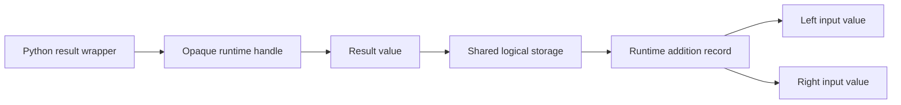

# Python tensors over runtime handles

A Python tensor needs to feel like a Python object, but it must not become a
second tensor engine. Argument binding, operator dispatch and familiar metadata
belong to Python. The meaning of the tensor, its deferred dependencies and its
numerical storage belong to the shared runtime. This chapter follows the small
owner that connects those responsibilities: the Python `Tensor` wrapper.

Start with [Python in the browser](../concepts/python-in-the-browser.md) if the
interpreter boundary is unfamiliar. The [integration architecture](../architecture/python-integration.md)
explains why this division exists. The [creation and addition reference](../reference/python-tensors.md)
defines the bounded Python spellings, rather than a promise of the entire
PyTorch API.

## A wrapper is an owner, not another graph node

The implementation lives in [`python/torch/__init__.py`](../../python/torch/__init__.py).
`Tensor` retains one opaque JavaScript tensor object in its private `_handle`
slot. That object is the public handle already understood by the runtime; it
is not an integer looked up in another registry. The wrapper does not retain
a Python copy of the numbers, a Python operation history or a list of input
wrappers. The runtime remains the sole owner of those semantic relationships.

This distinction matters for a temporary expression. When two temporary
Python tensors are added, Python can release their wrappers immediately after
admission. The runtime keeps the input values needed by the surviving result.
Keeping the values does not require keeping the input Python objects alive.

Arrows show retained relationships, not copies of numerical payloads. There
are no Python input-wrapper arrows in this diagram. The runtime's resource
owners decide when values, operations and materializations can be released.

## Import numbers once, pass handles to operations

Shape-only views follow the same ownership rule: the wrapper normalizes
positional dimensions or one built-in list/tuple, checks their Python types,
and passes one compact JavaScript dimension array to the handle. Runtime
admission owns inference, representability, count checks and shared storage.
The new wrapper owns its returned handle without retaining the base wrapper
or copying its data. See the [view reference](../reference/tensor-view.md).

`torch.tensor` checks explicit options and normalizes the documented scalar or
rectangular built-in containers into an `array('f')` plus dimension lengths.
The buffer is flat in row-major order regardless of the logical rank. See
[tensor shape](../concepts/tensor-shape.md) for why rank and buffer length are
different facts.

Normalization uses an explicit traversal of the active ancestor path rather
than recursive Python calls. Each depth has one expected dimension length;
numerical leaves must occur at a consistent depth. The traversal tracks active
container identities to reject a cycle without rejecting a finite child reused
by two different rows. Its time depends on numerical leaves and container
occurrences, and its auxiliary traversal state on rank. Empty containers still
have traversal cost. Invalid input fails before the bridge imports any tensor.

The resulting shape crosses as one JavaScript metadata array, separately from
the numerical buffer. This is frontend syntax normalization, not a second
semantic validator: the runtime admits the dimensions and checks their count
against the owned payload. No bridge call is made for each numerical element.

The [buffer bridge](python-package-installation.md#import-a-buffer-without-retaining-interpreter-memory)
borrows that array synchronously, validates its bounded view, and asks the
runtime to make an owned copy. It releases the borrowed view before returning
the runtime handle. The wrapper then owns that handle. Mutating the original
Python input does not mutate the imported tensor.

For addition, no numerical buffer is passed across the boundary. `torch.add`
validates its functional-call options and delegates to `Tensor.add`. Tensor
`+` first applies Python's operator-dispatch rule: an unrecognized right-hand
operand receives `NotImplemented`, allowing its reflected operator to run.
The accepted tensor case reaches that same `Tensor.add` path.

Python checks argument forms and the bounded `alpha`/`out` policy. The runtime
checks handle identity, lifecycle, session association and shape compatibility,
and records the canonical addition. No kernel runs merely because a wrapper
is created for its result. Demand and execution remain the runtime's concern.

## Observe without retaining a wrapper-side payload

`Tensor.tolist()` asks the registered bridge to observe its opaque handle.
The bridge checks managed-entry context before admitting work; the runtime
then validates identity, session and lifetime and owns demand, execution and
readback. There is no Python-side graph traversal or numerical fallback.

The returned `Float32Array` owns its bytes. Pyodide's `to_py()` converts it to a
Python memory view. A scalar reads one float; a vector uses bulk `tolist()`;
higher ranks build the outer containers with an explicit ancestor stack and
convert contiguous leaf rows in bulk. Memoryview row slicing borrows the same
buffer and does not perform another runtime readback. Traversal state grows
with rank, while the returned floats and containers account for the result's
actual size, including child lists in empty tensors.

The wrapper releases temporary memory views through context managers and
returns the owned number or lists to the caller. It does not cache them or
retain the intermediate buffer. Narrow type casts reflect that
typeshed describes a general memory view's list as integers, while this checked
bridge returns float32 elements; real interpreter tests check the element type
and independent copies.

The [runtime observation owner](runtime-observation.md) explains how this same
request serves JavaScript promises without requiring a Promise callback to run
inside a blocked Python call. Exact call and error forms belong to the
[tensor reference](../reference/python-tensors.md#observe-numerical-values).

## Present metadata without duplicating its authority

Each `shape`, `dtype` or `device` access reads the handle's runtime property.
Python does not infer a shape from the original list or keep a separate mutable
metadata cache. A closed handle therefore fails even if its shape was read
earlier. The properties cannot be assigned through the Python tensor API.

The resulting objects are Python presentations: `Size` is an immutable integer
tuple with its own representation and shape-preserving tuple operations;
`float32` is the exposed `dtype` constant; and `device('cpu')` is an immutable
CPU descriptor. Their bounded behavior is contrasted with the native oracle.
Constructing these descriptors does not itself admit tensor data, enable
another numerical type or perform a backend transfer.

## Release according to the actual owner

`Tensor._from_handle` is the internal ownership-transfer point. It constructs
the wrapper and registers `weakref.finalize(wrapper, handle.close)`. The
callback captures the JavaScript handle, not the wrapper. Otherwise the
finalizer itself would keep the object it was supposed to release alive.
Failure to finish wrapper construction closes the unreturned handle.

Ordinary acyclic temporaries release through Python reference counting. Cyclic
containers require Python's cycle collection, and a user-held result or
exception traceback can legitimately retain a tensor. These are different
lifetimes, not interchangeable ways to demonstrate cleanup. Tests separately
exercise ordinary temporary expressions, explicit cycle collection, retained
tracebacks and failed finalizer registration.

The script binding still supplies the deterministic outer boundary: closing
it drains the runtime session. Finalizers may run afterward; runtime handle
close is idempotent. A retained old module, function or tensor remains attached
to its old session after reattachment. Installing a fresh package cannot turn
an old tensor into a handle in the new session.

## Keep Python errors and runtime failures distinguishable

Invalid Python forms fail during the call, before numerical work. A runtime
shape mismatch is presented as Python `RuntimeError`, with the originating
`JsException` retained as its chained cause. Lifecycle and handle-identity
errors retain the original `JsException` and its JavaScript error code. The
exact distinction is documented in the reference; this component does not
define the separate contract for backend failures delivered at tensor observation.

The private [bridge declarations](../../python/_tabgrad_runtime_bridge.pyi)
describe only the methods and metadata consumed by maintained Python source.
They are type-checker input, not another implementation and not distributed
Python modules. A narrow declaration also records Pyodide's runtime
`JsException.js_error` attribute, which is absent from its bundled Python
declaration. Real-interpreter tests cover that boundary; a cast alone is not
evidence that the attribute exists.

## What the evidence establishes

The fixture generator runs pinned native PyTorch with one intra-operation and
one inter-operation thread. Normal test runs consume its committed expectations
without importing native PyTorch. Tests compare metadata and error classes,
exact float32 bits except NaN payloads, lazy admission, copied input and handle
lifetimes. The [generated-file register](../generated-files.md#python-tensor-oracle-fixtures)
records reproduction and drift checks.

These observations do not measure total interpreter memory, count every proxy,
or establish a throughput claim. Quantitative conversion, dispatch, demand and
cleanup costs use the
[Python boundary measurement procedure](../reference/python-boundary-measurements.md),
with conclusions constrained by the [performance policy](../performance.md).
