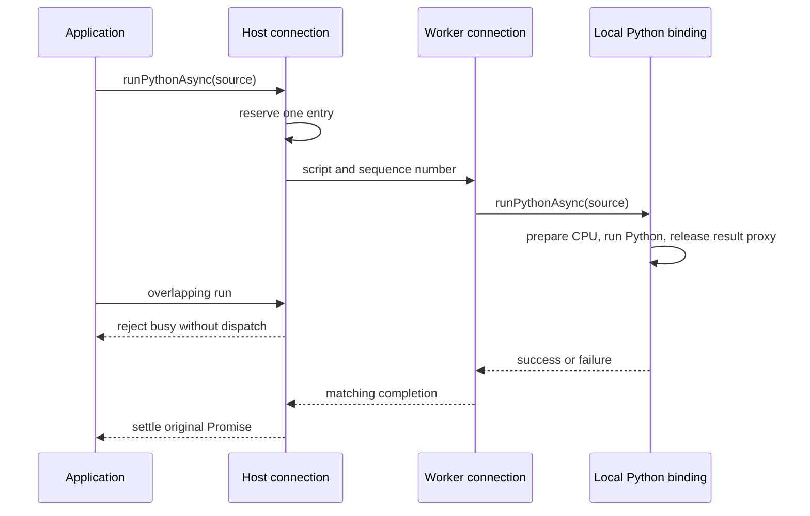

# Keeping Python entry responsive outside its worker

A Python calculation can occupy its interpreter thread until it has an answer.
That is compatible with an ordinary `result.tolist()`, but creates a separate
application problem: a second request must be rejected while the interpreter
is busy, not accepted after it eventually notices a queued message. Likewise,
pressing a close button must stop admission immediately even if releasing the
calculation's resources takes longer.

This chapter is for contributors familiar with JavaScript promises and workers.
It explains the concrete lifecycle connection in
[`src/python-worker.ts`](../../src/python-worker.ts), above the
[local script binding](python-script-binding.md). A worker is an execution
realm with its own event loop. A `MessageChannel` supplies two connected
`MessagePort` objects: each side posts a message that the other side receives
when its event loop can process it. Neither mechanism moves a live Python
interpreter or makes a blocked event loop responsive.

## Give admission to the participant that can answer

The application creates its interpreter worker and a dedicated message channel.
It keeps one port outside the worker and transfers the other to its worker
bootstrap. The bootstrap loads Pyodide, calls `attachPython` there, and exposes
that local binding through `servePythonWorker`. Outside the worker,
`connectPythonWorker` returns a host-facing binding with the same asynchronous
script and close methods. Exact signatures and application obligations are in
the [host API reference](../reference/python-host.md).

The host-facing owner reserves a script before posting it. It keeps that
reservation until the worker's completion reply arrives. A competing call
therefore rejects without posting another script, whether the first script is
waiting for CPU preparation, executing Python or completing result cleanup.
The local binding retains its own admission guard because it owns the actual
interpreter invocation; the host guard owns the earlier transport boundary.
These are two checks at different boundaries, not two tensor schedulers.

The diagram follows one request. Message arrows cross realms; the interpreter
and runtime calls on the right remain local. A host rejection never reaches
the worker's message queue.

The application still uses asynchronous JavaScript to observe a script's
completion. Inside that script, Python uses ordinary methods. The connection
does not translate individual tensor operations into messages: opaque tensor
handles, logical values, numerical allocations and the semantic runtime all
remain in the interpreter worker.

## Keep the protocol smaller than a worker manager

The dedicated port carries only script requests, close requests and their
completion replies. A monotonic sequence number associates a reply with its
accepted request. There is no map retaining every completed script. The client
holds at most one outstanding transport completion, one accepted script and
one close completion. A stale, malformed or unexpected response cannot settle
a different invocation; it fails the connection.

The service validates commands before using them and accepts one invocation at
a time. It normalizes synchronous throws as well as rejected script promises,
so failure cannot leave its transport admission occupied. A port may be
consumed only once by these helpers, and one local binding may have only one
active service. The channel is private to this protocol: host bootstrap and
diagnostic messages use the worker's separate application channel.

The connection owns its port and event listeners. It does not create, load,
replace, terminate or restart a worker, and it does not inspect Python's task
scheduler. The host must not use the local binding directly while its service
is active. The existing cooperating-host and joined-task requirements still
apply to the interpreter itself.

## Close admission before waiting for cleanup

Calling the client `close()` reserves closure immediately. New scripts reject,
while repeated closes share the same Promise. The client first joins the
accepted script, including a script that fails. It then requests local binding
closure. That binding drains its runtime and removes its owned integration
resources without destroying the interpreter or clearing host globals.

After local cleanup settles, the service sends its close reply and then
releases its port. The client settles close from that reply and releases its
own port and listeners. A script failure belongs to the script Promise; it is
not repeated as a cleanup failure. A genuine cleanup failure rejects close
and the service's completion. Their callers must observe those separate
results rather than letting one error hide another.

An acknowledged close is different from a disconnected channel. Closing a
port or terminating a worker does not demonstrate that accepted runtime work
drained. The connection never treats disappearance as a successful close.

## Report connection loss without inventing recovery

A message port does not provide a general proof that its peer is alive.
Successful posting also does not prove that the peer processed a request.
Automatic timeouts could misclassify a slow valid script, while automatic
worker replacement would violate the borrowed-interpreter contract.

The application therefore reports known loss through an optional `AbortSignal`
supplied when establishing each endpoint. This signal describes connection
lifetime, not cancellation of a Python observation. The host must signal when
its bootstrap fails, when it observes an unusable worker, or before it forcibly
terminates the worker. It must forward a worker-side service failure through
its application control channel if the protocol port can no longer deliver it.
Unreported peer death or an infinite script cannot acquire an automatic
completion guarantee from this API.

Host-side loss rejects an outstanding request and any unacknowledged close
with `PYTHON_CONNECTION_LOST`. It releases local listeners and port state;
it does not claim remote cleanup. Worker-side loss stops admission and
cooperatively closes the local binding, joining accepted execution first.
Its service Promise rejects after that cleanup attempt, retaining cleanup
failure separately when both fail. Loss during an already pending close
cannot turn into a successful service completion.

## Transport diagnostics, not exception ownership

Structured cloning a native JavaScript `Error` is not enough to retain custom
Tabgrad fields. The connection explicitly describes error name, message,
stack, Tabgrad code and details, cause chain, and aggregate failures. When a
runtime error has private execution context, it includes the diagnostic
operation, provenance, value slot, domain, backend endpoints and phase, but
does not export the executable program or tensor state.

The host receives a `PythonWorkerError`: a local diagnostic object, not the
original exception or a live Pyodide proxy. Its name preserves the remote
error name. A Python exception retains Pyodide's formatted traceback;
Python exception identity and semantic timing remain within the interpreter.
The transport does not manufacture an underlying JavaScript cause when
Pyodide has not exposed one. Similarly, a setup failure has no fabricated
tensor-operation context.

The decoder validates the envelope before using it. Cause and aggregate
relationships can refer to the same diagnostic, including cycles, without
duplicating exception ownership. Unserializable or malformed diagnostics are
connection failures, not successful empty results. Error text can contain
application source or data; delivery to the local host is not authorization
to publish it in telemetry, logs or GitHub.

## Costs and evidence

There is one script-source copy across the channel and one completion reply per
accepted entry. Numerical payloads do not cross this lifecycle channel merely
because Python performs another operation. Transport bookkeeping is bounded
by active work; script text and diagnostic size remain proportional to the
content being transmitted. This is not a measured claim about total browser
memory or the latency of a model.

The [endpoint tests](../../js-tests/unit/python-worker.test.mjs) exercise real
message ports with controlled local bindings. The
[browser check](../../js-tests/browser/python-worker.html) uses an
application-owned [worker bootstrap](../../js-tests/browser/python-worker.mjs),
real Pyodide and built Tabgrad artifacts. Normal CPU cases run without
cross-origin isolation and with native or controlled-absent JSPI. A separate
isolated test parks Python on a bounded shared-memory test gate and proves
that host rejection and closure admission still progress. That gate is test
coordination, not a CPU runtime dependency or GPU implementation.
