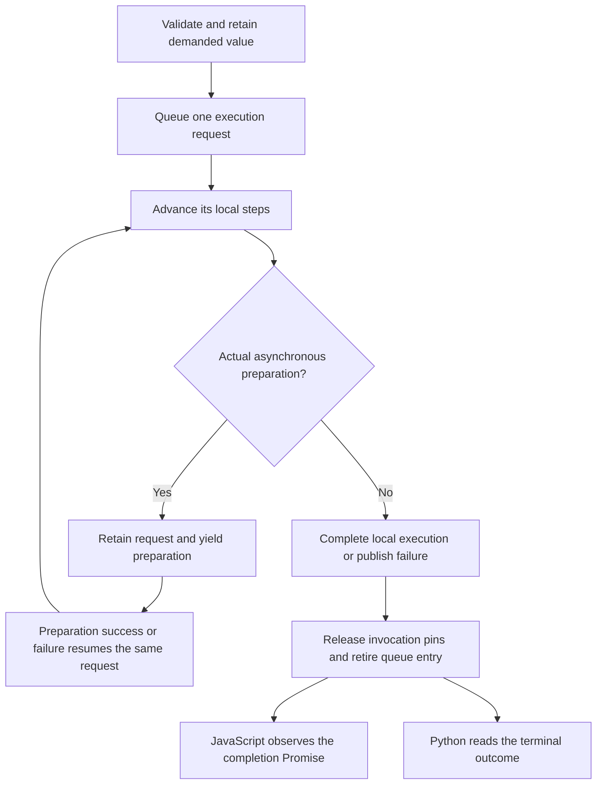

# Runtime observation: progress is not a Promise

Recording an addition says which numbers a result depends on; observing that
result asks for the numbers themselves. That distinction is easy to lose when
an implementation expresses every step with `async` and `await`. A ready CPU
kernel does not need to wait for a browser event, yet an unnecessary `await`
still postpones its continuation. Ordinary Python cannot depend on such a
continuation while occupying the same interpreter thread.

The solution is to distinguish doing the work from notifying a caller that
the work is done. The runtime owns a finite execution request and advances it
until it either has a terminal result or encounters genuinely asynchronous
preparation. JavaScript can observe its completion through a Promise. A
synchronous frontend can read its already completed outcome. These are two
ways to consume one request, not two execution engines.

The [observation architecture](../architecture/python-observation.md) establishes
the broader CPU/GPU contract. This component describes local request ownership
in [`src/runtime.ts`](../../src/runtime.ts) and
[`src/execution-request.ts`](../../src/execution-request.ts). It does not own
worker transport, kernel scheduling on a GPU or a general Python task manager.

## Follow one observation

The session validates the tensor handle and retains the demanded value before
placing a request in its queue. That reference belongs to accepted work rather
than to the user's handle: releasing the handle cannot erase an accepted
calculation. The request selects the necessary finite program, establishes
backend readiness when necessary, materializes its result and copies the
observed bytes. A finalizer releases its reference on success or failure.

[Program formation](program-formation.md) owns the selected dependency traversal
and returns executable structure separately from invocation bindings. It does
not execute numerical work or change semantic ownership.

Ready host data takes a shorter route inside this same owner. It already has
numerical storage, so the runtime copies that storage directly rather than
uploading it into WebAssembly and immediately downloading it. Neither the
Python wrapper nor the result consumer owns a competing data cache.

The final arrows are alternative consumers, not two calculations. A failed
preparation resumes the request by throwing into its suspended steps, so the
same finalizer releases ownership even when numerical execution never starts.
The session can then advance the next admitted request.

## The request owns state; the session owns ordering

`ExecutionRequest` holds a pending, successful or failed outcome. Its local
steps are represented by a JavaScript generator: advancing it executes
ordinary synchronous code until it returns or yields a preparation Promise.
This generator is a private control-flow mechanism, not a tensor graph, a
second operation representation or a scheduler in the CPU kernel module.
Backend preparation owns the genuinely asynchronous operation being yielded.

The session has one linked queue with constant-time insertion and retirement.
Only its head advances. A guard prevents recursive advancement while a local
step is already running. Once preparation settles, its notification resumes
the same queue; it does not create another invocation. Completed entries are
unlinked rather than accumulated as a history of observations.

The request does not allocate a Promise merely because it exists. A synchronous
consumer reads its terminal value or throws its terminal failure directly.
For JavaScript, `asPromise()` returns a completion observer. Its callbacks keep
normal JavaScript Promise scheduling even if local execution already finished.
A failure consumed synchronously therefore creates no unobserved rejected
Promise. Public JavaScript handle/admission errors retain their synchronous
validation timing; failures of accepted execution reject its Promise.

## Preparation and managed Python context

Managed entry prepares CPU before handing control to Python, as described by
the [script binding](python-script-binding.md#prepare-cpu-before-handing-control-to-python).
The CPU backend then executes its finite program synchronously from that ready
context. Direct JavaScript can instead yield preparation on first demand.
Both paths use the same program formation, backend execution, materialization
updates and readback.

The binding owns a registered `PythonRuntimeBridge` and activates its
observation context around the accepted interpreter call and cleanup of its
owned result proxy. A finalizer triggered by that cleanup can still observe
tensors before entry completion. A `finally` restores inactive state after
success or failure. Nested Python functions and
permitted callbacks remain inside that entry; explicit Python await points do
not end its ownership. This relies on the cooperating-host and joined-task
contract, not on inspecting every Python coroutine or securing private bridge
methods against a hostile interpreter.

Before synchronous runtime admission, local readiness and queue ownership must
permit immediate completion. An unsupported context is rejected before adding
a request or executing a kernel. Such rejection must not enqueue work and then
abandon its resources when a synchronous caller cannot wait. The exact errors
are listed in the [Python reference](../reference/python-tensors.md).

## Failure, drain and copying

Execution and readback failures retain the immutable program and causal
operation for that invocation. A pre-script preparation request has no tensor
operation to name. These contexts remain request-scoped; a resident allocation
does not retain a completed program merely because another tensor uses it.

Session close stops admission, releases public handles and awaits queue drain
before releasing backend resources. Drain is fulfilled when accepted requests
have retired, including failed requests. The request caller owns its failure;
close does not replay that failure as a cleanup error. This local CPU boundary
does not equate logical publication with physical GPU drain.

Request pins are distinct from the producer edges needed to compute a pending
value. The [semantic lifetime owner](semantic-value-lifetimes.md) releases those
edges after materialization or final value release, while preserving independently
owned values and causal metadata.

Each returned array or Python list is an owned observation. Reading a resident
CPU result copies its bytes out of WebAssembly; Python conversion also creates
interpreter-side storage and boxed list elements. Ready host data avoids the
WebAssembly round trip but still needs an independent result copy. These costs
are linear in output length. Operation dispatch is not a bridge call per
element, and numerical kernels are not implemented by the Python conversion.
Queue state scales with live requests rather than completed history. Actual
latency, transient peaks and total interpreter/browser memory require the
separate [performance measurements](../performance.md), not deductions from a
passing functional test.
