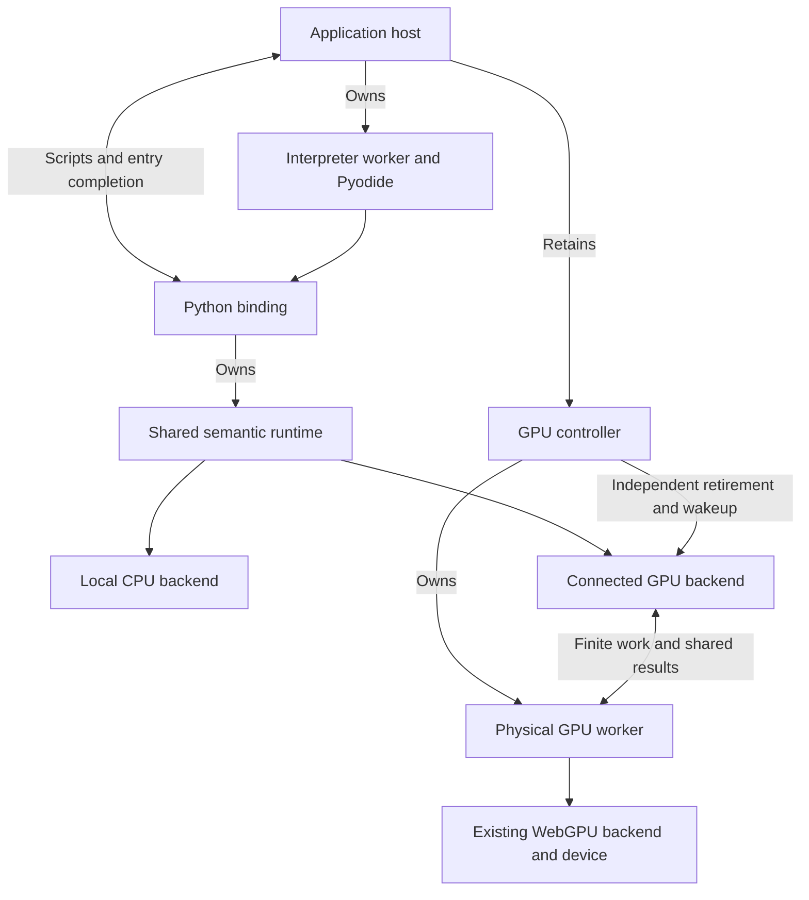
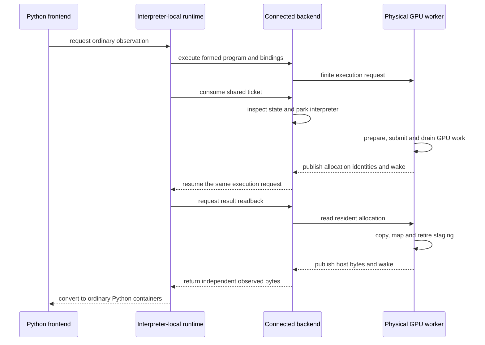

# The managed WebGPU connection

An ordinary Python call can only return a tensor's numbers once those numbers
exist. In a browser, however, GPU submission and readback complete through
asynchronous JavaScript callbacks. If Python blocks the same worker that must
run those callbacks, both sides wait for each other. The connection described
here places physical GPU work in an independent worker while keeping Python
and tensor semantics together.

This chapter is for contributors extending or diagnosing managed WebGPU
execution. It explains the concrete ownership boundary, not a new tensor
engine or a general worker framework. The
[integration architecture](../architecture/webgpu-integration.md) owns the
accepted placement and setup decision; the
[host reference](../reference/python-host.md) owns application-facing signatures.
The [physical backend](webgpu-backend.md) continues to own GPU numerical work.

## Separate the two connections

A managed application has two different reasons to communicate across workers.
The host needs to submit a Python script and learn when that script finishes.
Separately, the interpreter-local runtime needs to prepare and execute a finite
GPU program and obtain its result. These responsibilities have different
payloads, owners and failure meanings.

The [Python worker connection](python-worker-connection.md) carries scripts and
entry completion. The WebGPU connection carries backend programs, invocation
bindings, allocation identities and requested readback. It does not carry
remote `torch` calls or Python tensor wrappers. Tensor creation, shape
validation, derivative-history admission and program formation remain in the
interpreter's shared semantic runtime.

A **controller** is the host-held owner of the physical worker. A **connection**
is the single-use bundle passed to one Python binding. A **generation** denotes
that backend context's lifetime; retiring it permanently stops GPU admission
and publication. These names describe distinct ownership, not three workers.

The map shows ownership and communication. The supervision route belongs to
the host, so it can revoke GPU availability even while the interpreter is
parked. A port message is a delivery hint; shared state is the authority used
by the blocked consumer.

The physical worker is not another `RuntimeSession`. Moving execution there
does not create a competing operation registry, graph planner or
materialization policy. The connected backend implements the same physical
execution contract as the local backend used by direct JavaScript.

## Setup establishes one owner before work is admitted

`createWebGpuWorker` constructs the packaged worker, acquires its browser device
and waits for its capability snapshot. Device readiness does not evaluate an
expression or compile every possible pipeline. Program-specific preparation
stays with the physical backend and is performed on demand.

The returned controller remains in the host. Its transferable connection is
claimed atomically when `attachPython` begins, before interpreter validation,
asset loading or installation can fail. A second attachment cannot consume
that connection, including through a structured clone that shares its control
storage. A losing claimant does not retire the winner. A claimant that later
fails retires its own connection; retry requires a fresh owner, not reusing
the consumed bundle.

Attachment checks that the consuming execution environment permits
`Atomics.wait`. A page-owned interpreter cannot use this worker-wait profile.
Rejecting it before installation and numerical admission prevents a binding
that appears usable but deadlocks on its first observation. Attachment still
borrows Pyodide: neither failure nor close destroys host globals or the
interpreter.

Worker-construction failure releases locally created channel endpoints.
Cancellation during acquisition rejects setup promptly, but the controller
keeps ownership until late acquisition and cleanup are accounted for. It
does not terminate a still-acquiring producer and call that successful drain.
The host must likewise close a ready controller whose connection it never
consumes or cannot transfer.

## Send finite execution, not one message per tensor operation

The runtime first forms a demanded executable program and selects fresh
invocation bindings and retention obligations. The connected backend sends
that complete execution request to the physical worker. The worker reconstructs
the program and invokes the existing backend's preparation and execution
methods. A chain with many operations can therefore cross this boundary as
one finite program rather than many semantic remote calls.

The current numerical payload domain is contiguous float32. Host input bytes
are copied before transfer so sending them cannot detach storage still owned
by the semantic runtime. Resident bindings instead use opaque allocation
identities belonging to this connection. Resident results and aliases retain
those identities; they do not read intermediate tensors back into Python.
An observation separately requests the demanded result's host bytes.

The invocation owns its program definition. Neither endpoint stages the last
full program between requests or retains it merely because an allocation
remains resident. The physical backend may reuse its prepared pipeline, which
is different from keeping a completed invocation's graph and bindings alive.
Adding a supported computation extends the existing admission, lowering and
backend owners, not a Python-specific operation list in the transport.

This private wire representation is not a public extension interface. Its
encoding may change together with both endpoints while preserving the
capability, lifetime and observation contracts. Its float32 specialization
does not imply that arbitrary data types are already supported.

## Shared completion separates publication from physical drain

Each accepted physical request owns a bounded completion record. It contains
fixed control fields, bounded failure diagnostics and a payload sized to the
requested result. It is not a global queue of completed tensor data. The
producer writes bytes and then atomically publishes their status. A shared
pulse wakes the consumer; the consumer reads that pulse before checking status
so publication between inspection and waiting cannot be missed.

A successful result is published after the physical ticket drains. Python can
then consume it and retire the request without running interpreter-local
callbacks. Failure is different: the producer can publish an error while
submitted work, staging or mapping still has obligations. The request reports
the error promptly, but its semantic pins remain until drain or explicit
terminal loss accounting.

The sequence follows one ordinary observation. Preparation and submission
callbacks run in the physical worker, which stays active while Python waits.
The runtime request resumes its existing steps rather than starting a second
calculation.

Promise observers are optional notification mechanisms over that same state.
The connection creates them only when an asynchronous consumer requests one.
Ordinary synchronous observation does not enqueue unused Promise reactions
that retain its result until Python returns to JavaScript.

The failure path needs the same discipline. Python may catch an error and
continue within one uninterrupted entry. Physical drain can finish meanwhile,
but local port callbacks still cannot run. The connected backend therefore
checks outstanding shared records at subsequent synchronous backend
checkpoints. Drain listeners retire the corresponding request pins directly,
without requiring Promise reactions. Completed records leave the pending set
before semantic retirement can trigger a nested allocation release. Work
whose drain is still outstanding remains owned; the check is not an early
release policy.

## Supervision is independent; reclamation is not guessed

Controller close or lifetime abort retires the generation and wakes observers
from outside the interpreter. New GPU work is rejected, and an already parked
observer reports failure instead of accepting stale success. Independent CPU
work keeps its own semantics. This revocation does not report that a Python
script or binding has closed gracefully.

The physical worker joins accepted preparation and work before closing its
backend. A graceful acknowledgement allows the controller to release its
worker and channel ownership. Repeated close shares the same result. The
Python binding's cooperative close joins the script and session before
retiring its installation; the controller's revocation is a separate lifetime
action.

An observed worker failure without acknowledgement is explicitly accounted as
unknown physical completion. It wakes waiters, but does not manufacture zero
GPU usage. Diagnostics retain the producer's last known owned and pending
counters and mark those owned obligations as unknown. Those snapshots are not
the hardware's exact live VRAM, and cannot include bytes the producer never
had an opportunity to report. The host must report known interpreter
termination by revoking its controller as well as its script connection.
Silent hangs and loss of the supervisor itself are not automatically detected.

Physical error transport preserves the error code, message, bounded scalar
locators such as backend, phase and program slot, and the immediate native
cause's name and message. The consumer reconstructs a diagnostic cause rather
than retaining the original exception identity. It does not transfer a live
exception, nested cause graph, arbitrary object fields, complete program or remote stack.
Truncation is explicit. The semantic runtime can attach its own invocation
context to the received diagnostic. Applications must not infer cross-realm
exception identity from that information.

## Costs and qualification boundaries

Program transfer scales with the selected definition and required host
bindings, not every operation ever recorded in the session. Result storage
scales with demanded output, and resident identity maps scale with live owned
allocations. Pending completion records scale with accepted, not-yet-retired
work. Completed observation history is not a transport cache. A request that
is still physically draining remains part of that live set even after its
logical error is delivered.

Readback needs shared result storage and an independently owned host array;
Python list conversion adds interpreter-side containers and numeric objects.
These are real linear costs in output length, not free consequences of shared
memory. GPU counters describe device-owned buffers and boundary bytes, not
total browser memory, garbage-collector retention or process RSS. Quantitative
claims require the separate [performance procedure](../performance.md),
including an adequate representative workload and declared limits.

The [managed GPU browser check](../../scripts/run-python-webgpu-tests.mjs)
qualifies ordinary observation without JSPI, numerical transport, competing
attachment, independent revocation before delayed acknowledgement and rejected
placement. Separate profiles exercise deliberate device destruction, physical
worker failure and host-reported interpreter termination, including truthful
unknown-completion accounting and alias lifetime. The test-only acknowledgement
gate follows real GPU queue completion; it controls publication timing, not
natural pending-hardware behavior, acquisition or arithmetic. Controlled unit
tests supplement those integrated failure boundaries. Named qualification does not
establish universal browser support or whole-model throughput.
