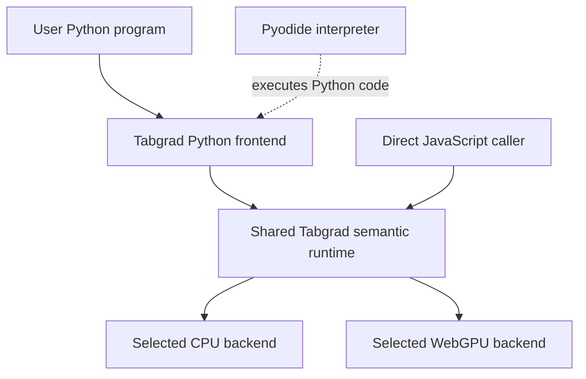

# Python in the browser: understanding Pyodide's role

A Python program normally begins with an assumption that is easy to overlook:
something on the machine already knows how to execute Python. On a development
computer that is usually a Python installation. A person opening a web page
has not necessarily installed Python, and a browser does not interpret a
Python source file merely because the server sends it one.

Tabgrad wants that person to write familiar Python tensor code while keeping
the computation on their own device. Understanding how this can work requires
separating two jobs: executing the Python language and executing tensor
operations efficiently. Pyodide supplies the first. Tabgrad supplies the
tensor library and its connection to numerical backends.

A **tensor** is a collection of numbers arranged along dimensions. A vector
of four measurements has one dimension of length four; a table with two rows
and three columns has shape `(2, 3)`. Shape describes that arrangement, while
data type describes how each number is represented. A tensor's device
identifies where its numerical work or storage belongs, such as the central
processor or a graphics processor. These properties matter because a request
to add two tensors needs more meaning than a request to add two individual
Python numbers.

This introduction is for programmers who know functions, objects and ordinary
asynchronous programming but are new to browser Python or deep-learning
runtimes. It explains the mental model before introducing the detailed
[integration architecture](../architecture/python-integration.md). It is not
an installation tutorial or a list of supported PyTorch operations; those
questions belong to [development](../development.md) and
[compatibility](../compatibility.md).

## A browser needs an interpreter, not different Python spelling

Python is a language; an interpreter is the program that executes it. CPython
is the implementation on which Pyodide is based. Pyodide packages a version
of CPython compiled for WebAssembly, together with facilities for connecting
Python and JavaScript. WebAssembly is the browser-executable target for that
interpreter; it is not a new Python syntax. The Python program runs in the
loaded interpreter rather than being rewritten into JavaScript source. See
[Pyodide's project introduction](https://pyodide.org/en/stable/).

This matters for the experience Tabgrad is trying to provide. Python functions,
modules and objects remain Python constructs. The integration does not need to
invent a JavaScript equivalent of each control-flow statement in a user's
model. It does need to supply the library objects and operations that the
program expects. Preserving a language and implementing a library are different
responsibilities, so success at the first does not establish the second.

The host application initializes Pyodide before asking it to run Python.
Initialization is asynchronous: downloading and preparing an interpreter is
not the same action as evaluating a line in an already prepared environment.
Pyodide's [usage guide](https://pyodide.org/en/stable/usage/index.html) explains
that loading boundary. In Tabgrad, the host owns this preparation rather than
making every tensor operation responsible for starting Python.

## Why running Python does not mean running PyTorch

An interpreter can evaluate an import statement only if the requested module
is available to it. Knowing Python syntax does not provide the implementation
of every Python library. Pyodide also has package-loading facilities, but
packages are distinct from the interpreter itself; its
[package documentation](https://pyodide.org/en/stable/usage/loading-packages.html)
explains that distinction and the formats it can load.

For Tabgrad, the important point is not how to install official PyTorch. The
project implements its own documented compatibility layer. Within the
controlled Python environment, the name `torch` identifies that layer, which
presents supported PyTorch-like calls and connects them to Tabgrad. Pyodide
does not create that module automatically, and Tabgrad does not use the
official PyTorch numerical runtime behind it. The project's
[public identity](../../README.md) makes this distinction explicit.

Consider the request to add two tensors. Python determines how the expression
is evaluated and which method is called. Tabgrad determines whether the tensor
shapes, data types and devices make sense, which result the operation denotes,
and what numerical work is needed. The backend runs that work. Being able to
execute a Python method is therefore necessary for the Python-facing call,
but insufficient to make the tensor operation correct or efficient.

## Where the work goes

Three participants are useful to name before looking at the system map. The
**Python frontend** is Tabgrad's Python-facing compatibility layer. The
**semantic runtime** is the shared authority on tensor meaning and resource
lifetimes. A **numerical backend** executes the arithmetic selected for a
device. Pyodide hosts the frontend's Python code; it is not a fourth numerical
backend. Tabgrad's CPU backend executes on the central processor through
WebAssembly. Its GPU backend uses **WebGPU**, the browser API that provides
access to graphics-processor computation. A kernel is a computational routine
that performs numerical work; GPU kernels are expressed in WebGPU Shading
Language (WGSL). These are two numerical execution routes below the
same runtime, not two Python interpreters.

The solid arrows show the logical route of a tensor request; the dotted arrow
shows who executes Python code. The two backend arrows represent the supported
architectural choices, not automatic fallback or a promise to execute one
request on both. The map omits result and cleanup paths, which the
[session flow](../flows/managed-python-session.md) explains separately.

The direct JavaScript route joins the same runtime without passing through
Pyodide. That is why Pyodide is required for Tabgrad's Python experience but
not for every use of Tabgrad. This is a property of the chosen architecture,
not a claim that no other technology could ever execute Python in a browser.
The [frontend boundary](../architecture/frontends-runtime-backends.md) records
the shared-runtime decision and what each frontend must preserve.

## Two uses of WebAssembly do not imply one engine

There are two distinct reasons to encounter WebAssembly here. Pyodide uses it
to run its interpreter. Tabgrad's CPU backend uses it to run numerical kernels:
small computational routines authored in Rust and compiled before distribution.
The interpreter handles Python execution; a kernel handles numerical input
under Tabgrad's backend contract.

Sharing an executable technology does not mean that these systems share one
memory allocation, one resource owner or one job. A Python object that refers
to a tensor is not necessarily where the tensor's numerical values live.
Likewise, preparing the interpreter is not the same as preparing a numerical
kernel. Keeping those distinctions visible prevents an application from
mistaking interpreter startup for tensor execution or interpreter memory for
all of the memory used by the library. The
[CPU backend architecture](../architecture/webassembly-cpu-backend.md) owns
the exact module and memory boundary.

## Crossing languages means more than calling a function

Pyodide's language bridge is a foreign function interface: a way for code in
one language to call or access objects in the other. Some values are converted
to a corresponding value; others are exposed through a **proxy**, an object
that forwards access to the original. A `PyProxy` exposes a Python object to
JavaScript, while a `JsProxy` works in the opposite direction. The official
[type translations guide](https://pyodide.org/en/stable/usage/type-conversions.html)
defines those rules.

A proxy is not automatically a copy of all the data behind an object. Nor is
it automatically free of ownership obligations: a retained proxy can keep the
original object alive. Pyodide requires explicitly owned Python proxies to be
destroyed when no longer needed. Releasing a proxy is different from deciding
that the application no longer needs a tensor's numerical storage.

This distinction explains why Tabgrad's bridge needs a design of its own.
Passing a tensor reference between languages should not mean exporting its
entire payload for every operation. Conversely, importing input values or
observing a numerical result really can require data conversion. The
[integration contract](../architecture/python-integration.md#give-wrappers-proxies-and-requests-different-owners)
assigns those obligations. The existence of a language bridge alone proves
neither zero-copy execution nor acceptable performance.

## Loading files is different from installing tools on the user's machine

The application serves prebuilt browser assets. Its user does not run the
Rust compiler, build CPython or install a native tensor engine to use the page.
This does not mean there is no loading cost: the browser still obtains and
initializes the required files. A server distributing static files is different
from a server executing the user's tensor computation.

Python modules also need to be visible inside the interpreter's environment.
Pyodide provides an Emscripten-backed virtual filesystem; its default in-memory
filesystem is not automatically the user's disk and does not survive a page
reload. Persistent or native-file access requires additional mechanisms. See
[Pyodide's filesystem guide](https://pyodide.org/en/stable/usage/file-system.html).
This is why a browser URL, a Python import path and a local development path
must not be treated as interchangeable locations.

Tabgrad's accepted delivery contract uses static Python source and a controlled
connection to JavaScript. It does not require the application user to run a
Python package installer. Loading the compatibility module is nevertheless a
real lifecycle operation: it can fail and must not overwrite unrelated host
state. The architectural chapter explains that transaction without turning
this introduction into a package-loader reference.

## Local execution still has browser constraints

Pyodide does not turn the browser into an unrestricted desktop operating
system. Its [Python compatibility notes](https://pyodide.org/en/stable/usage/wasm-constraints.html)
document differences in standard-library and platform behavior. An arbitrary
desktop Python dependency cannot be assumed to work just because its imports
are written in Python. Tabgrad's supported API and backend capabilities need
their own evidence rather than inheriting a blanket guarantee from Pyodide.

Asynchronous APIs also do not make synchronous Python computation harmless to
the interface. Long-running Python on the main browser thread can block the
page. Pyodide documents running in a
[web worker](https://pyodide.org/en/stable/usage/webworker.html) to separate that
work from the interface, but the worker has a different global environment.
An asynchronous return type alone does not create a worker or make it safe to
block one. Managed Tabgrad Python places the interpreter and semantic runtime
together in an interpreter worker. A separate GPU backend worker can finish
pending numerical work while ordinary Python waits. Prepared CPU computation
remains local. This placement preserves local tensor handles without making
the interpreter responsible for the callbacks that must wake it.

The host loads Pyodide in that worker from the outset; an existing interpreter
on the page cannot be moved with all of its live objects. Shared GPU completion
also requires cross-origin isolation, a hosting policy that enables shared
memory under restricted cross-origin interactions. The
[observation decision](../architecture/python-observation.md) introduces the
waiting mechanism, explains those hosting requirements and compares the
alternatives. Ordinary Python methods and an asynchronous host call are
compatible: the host awaits a complete script while a method inside that
script waits for its numerical value. Explicitly awaitable tensor methods are
optional when Python tasks need to cooperate during observation.

For performance, ask where time and data go: interpreter startup, Python call
overhead, language crossings, numerical execution and result conversion are
different costs. For memory, distinguish live references, interpreter storage
and backend allocations. An efficient kernel cannot compensate for copying
every intermediate tensor through Python. These are reasons for the design,
not benchmark results. Comparable evidence belongs under
[the performance policy](../performance.md).

## From technologies to an application lifecycle

Imagine an application that already uses Python in its worker to retain user settings. It
wants to run a tensor calculation and later release its numerical resources,
without losing those settings. Destroying the interpreter would release too
much; keeping every tensor resource until the page closes would release too
little. Tabgrad therefore distinguishes the host's interpreter from a runtime
session, which groups its tensor work and resources under one lifetime.

A **binding** coordinates that relationship. It borrows the interpreter, owns
a runtime session and controls managed script entry and closure. You now have
the background needed to ask why attachment is exclusive, what close waits
for, and why a returned Python object may need explicit release. Continue with
[the architecture](../architecture/python-integration.md) for those contracts,
then [the managed-session flow](../flows/managed-python-session.md) to follow
them through a complete interaction.
