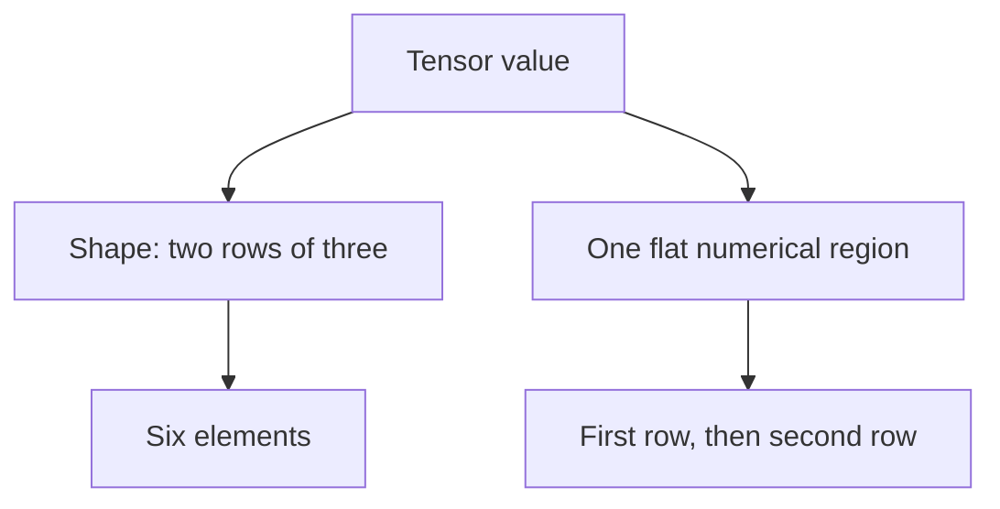

# Tensor shape and contiguous values

A tensor contains numbers, but its meaning is not determined by those numbers
alone. Six values might describe a vector, two rows of three values, or three
rows of two values. All three arrangements can occupy the same number of bytes.
They are nevertheless different inputs to an operation that interprets axes.
This chapter explains that distinction for programmers learning tensor-runtime
design. Exact accepted calls belong in the [Python](../reference/python-tensors.md)
and [JavaScript](../javascript-api.md) references.

## Shape describes dimensions; rank counts them

The **shape** is an ordered sequence of dimension lengths. A shape of `(2, 3)`
means two groups, each containing three elements. Its **rank** is two because
the sequence contains two dimensions. Rank is not the number of numerical
elements and is unrelated to matrix rank from linear algebra.

For a nonempty contiguous tensor, multiplying the dimension lengths gives the
number of numerical elements. For example, `(2, 3)` and `(3, 2)` both contain
six elements. The ordering and lengths still differ. An operation requiring
equal shapes must compare every dimension, not merely the product.

This explains why a shape belongs to the tensor's semantic metadata rather
than being inferred from a physical allocation. An allocation can tell us how
many bytes are available; it cannot tell us what those bytes mean as axes.

## A scalar has no dimensions, not no values

A scalar is one number without a surrounding axis. Its shape is `()` in Python
or `[]` in JavaScript. The product of an empty sequence of dimensions is one,
so a scalar stores one element. A vector of shape `(1,)` also stores one element,
but has one axis. These shapes are distinct even when their numbers are equal.

| Shape | Rank | Numerical elements | Python presentation |
| --- | --- | --- | --- |
| `()` | 0 | 1 | A number |
| `(1,)` | 1 | 1 | A list containing one number |
| `(2, 3)` | 2 | 6 | Two lists, each containing three numbers |
| `(2, 0)` | 2 | 0 | Two empty lists |
| `(0, 3)` | 2 | 0 | An empty outer list |

The presentation column describes structure, not a separate kind of numerical
storage. Python can reconstruct that structure when a caller asks for values;
the backend does not need a Python list for each row.

## Empty dimensions preserve information

Any zero dimension makes the element count zero. It does not remove the other
dimensions. Shapes `(2, 0)` and `(0, 3)` both have no numerical payload, but
remain different shapes. An empty returned list cannot encode every possible
trailing dimension: `(0, 3)` and `(0, 7)` both present as `[]`. The tensor's
shape is the authoritative record of that distinction.

There is also a difference between empty numerical storage and free processing.
Constructing a Python presentation for `(1000, 0)` creates one outer list and
one thousand empty child lists. Traversing an input with that structure must
inspect its containers even though it contains no numbers. Resource reasoning
must count containers as well as numerical elements.

Shape arithmetic must respect these rules before allocating anything. A zero
later in a shape makes the count zero even when an earlier product would be
too large to represent. Every dimension must still be valid: a zero elsewhere
does not make a negative or fractional dimension meaningful.

## Contiguous storage separates structure from bytes

In the contiguous representation, values occupy one flat region in row-major
order: the last dimension varies fastest. Consider two rows of three numbers.
The first row's numbers are followed immediately by the second row's numbers.
There are no row objects, row pointers or gaps in this numerical region.

The following diagram shows two descriptions of the same tensor. Arrows show
the relationship between semantic structure and storage, not a data transfer.

An elementwise operation whose inputs have exactly equal contiguous shapes can
process those six numbers with a flat kernel. It does not require a separate
kernel for each rank. Shape validation determines whether that flat calculation
has the required meaning; the backend then checks byte ranges and performs
the numerical work. More general layouts or broadcasting require additional
contracts and are not implied by support for higher rank.

## Shared storage does not mean shared shape

A **view** separates a tensor's shape from ownership of its numerical storage.
Imagine six flat numbers with two handles: one describes a vector and the other
describes two rows of three. A shape-only view changes how those numbers are
grouped without changing their order or making another numerical region.
Neither handle's shape changes when the other handle is created.

Shared storage also separates handle lifetime from data lifetime. Closing the
vector's handle cannot discard data still needed by the matrix's handle or a
pending calculation that consumes it. The storage becomes disposable only
when all those obligations end. Observing either handle can still return a
copy owned by the caller; sharing inside the runtime does not make an ordinary
returned list a mutable window into storage. This distinction explains both
why views avoid a copy at creation and why observation may still copy numbers.
Exact supported calls and limits belong in the [view reference](../reference/tensor-view.md).

## Language containers are an input and output convention

Python nested lists express shape through their structure. Every sibling must
have the same dimensions, and every numerical leaf must occur at the same
depth. This is a rectangular input. A repeated reference to a finite child
list can represent two equal rows; a list that eventually contains itself
cannot represent a finite tensor. Cycle detection must distinguish these cases.

An empty sequence ends what can be inferred from that branch. Input `[[], []]`
describes `(2, 0)`, not `(2, 0, 3)` or any other invented trailing dimensions.
By contrast, an API accepting explicit shape metadata can retain dimensions
that cannot be recovered from an empty nested list.

JavaScript's direct API uses flat numerical data and separate shape metadata.
Its readback remains flat as well. Python's observation presents a number or
nested lists. These conventions do not require two runtime representations:
both frontends describe the same immutable shape and the same contiguous
numerical values.

Continue with [Python tensor wrappers](../components/python-tensor-wrappers.md)
for container normalization, [program formation](../components/program-formation.md)
for preserving metadata during deferred execution, and
[CPU invocation storage](../components/cpu-invocation-storage.md) for physical
allocation and lifetime rules.
