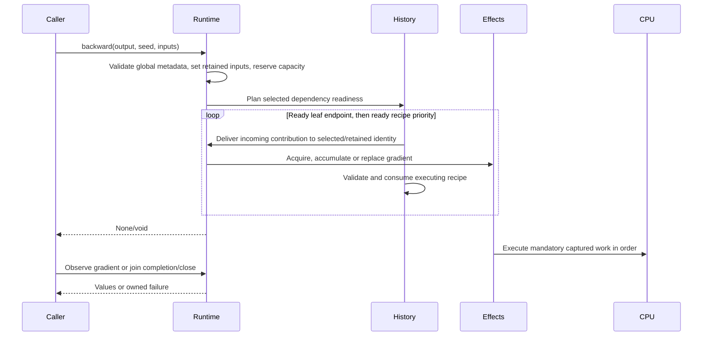

# From backward to a persistent gradient

A caller starts this flow by invoking `Tensor.backward` on one tracked CPU
output. It completes when accepted gradient effects have published or their
failure obligations have reached observation, managed entry completion or
session close. The [backward reference](../reference/backward-gradients.md)
owns call forms; the [gradient-state architecture](../architecture/cpu-gradient-state.md)
owns the participating identities and effects.

Python normalizes binding syntax and passes opaque tensor handles to the shared
runtime. Modes, root/seed validity and shape checks precede selected-input
metadata setup. The runtime then installs nonleaf retention in input order;
a later invalid target can leave an earlier valid destination retained. History
planning establishes dependency readiness and selected numerical paths.
Capacity checks bound the full planned effect count and conservative temporary
owner/backing peak before traversal consumes a recipe.

Gradient reception happens before saved-version validation of that node's
recipe. Earlier committed slots and successful recipe consumption therefore
survive a later semantic error. A failed recipe does not consume its own saves.
Backward validates explicitly selected nonleaf recipes even when ancestor
numerical contributions are pruned; functional cutoffs keep their distinct
traversal behavior while updating already retained destinations.

The runtime first acquires a leaf gradient by conditional shared numerical
family or exact captured clone. Subsequent leaf accumulation updates its
existing identity; nonleaf accumulation replaces its slot. Public exposure
leases and canonical wrappers are separate from those hidden associations.
Clearing or dropping a wrapper can retire the semantic slot without canceling
an accepted effect's independent value/control pins.

Replacement registers its mandatory effect before publishing the new
association and retiring the previous semantic owner. A failure while retiring
that owner's hidden associations cannot cancel the committed replacement's
work. Public gradient views retain acquisition controls independently of their
shared numerical family and of the original gradient exposure.

Affected observation joins captured root, seed, relevant history and previous
writer outcomes. Managed Python entry completion joins mandatory effects even
when the script drops every gradient wrapper. Session close retires semantic
owners, collects unreachable associations, drains independent physical pins and
attempts remaining cleanup. A physical writer failure prevents later writes;
cleanup failures remain observable without abandoning independent retirements.
Collector mechanics and costs belong to the
[semantic lifetime component](../components/semantic-value-lifetimes.md).
