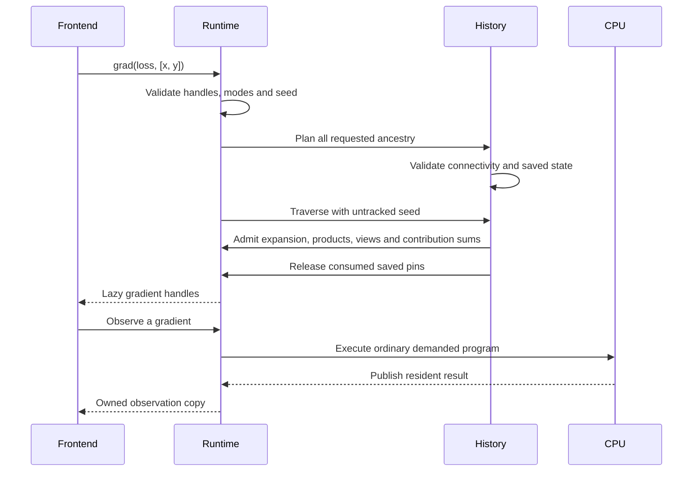

# From tracked computation to a functional gradient

This flow is for contributors who understand tensor operations and want to
follow how differentiation can outlive forward execution without keeping a
second numerical engine. It starts with tracked tensor creation and ends when
the returned gradients are observed or discarded. The
[API reference](../reference/functional-gradients.md) owns supported syntax;
the [history component](../components/derivative-history.md) owns the detailed
lifetime contract.

Consider the supported expression `(x * y + x * x).sum()` with tracked `x`
and `y`. Forward admission creates ordinary pending numerical operations.
Alongside them, canonical definitions attach derivative recipes to history:
multiplication saves the opposite operand for each tracked input, addition
records its two edges, and sum records the input shape. Python wrappers only
forward handles and present the returned metadata.

Observing the loss executes the forward program. The CPU publishes values that
still have external owners, including history's saved pins. The runtime then
reclaims normal producer ancestry. Losing the expression's temporary public
handles does not lose derivative identity or the required operands: those
have independent history owners.

The participants below exchange logical records until an ordinary observation
requests numerical execution. The seed is the incoming gradient, which weights
the output; for a scalar loss its implicit value is one.

Sum expands its incoming scalar across the original input shape. The addition
passes that incoming tensor to each branch. The `x * y` branch contributes
`incoming * y` to `x` and `incoming * x` to `y`; `x * x` contributes twice to
`x`. Pure additions combine the three contributions to `x`. None of these
steps copies a tensor into host language arrays. They create the same lazy
operations that a frontend could admit, plus the internal CPU scalar expansion.

On return, the gradient tensors own their pending execution dependencies and
no longer need the multiplication's saved pins. Observing `dx` may execute
shared work that `dy` can reuse; closing a returned handle only retires that
handle. Dropping every result before observation releases the derivative work
without running it. Python wrapper finalizers and explicit JavaScript close
meet the same runtime owner.

Validation failure occurs before this ownership transfer, so correcting a
seed or removing a disconnected requested input can reuse the intact history.
Saved-state consumption occurs at successful derivative construction, not at
observation. Consequently a backend failure does not make the original
multiplication history reusable. The failed result instead follows normal
[observation failure and request cleanup](../components/runtime-observation.md).
An already accepted observation remains pinned when its result or session
closes, and session shutdown waits for that request to drain.
