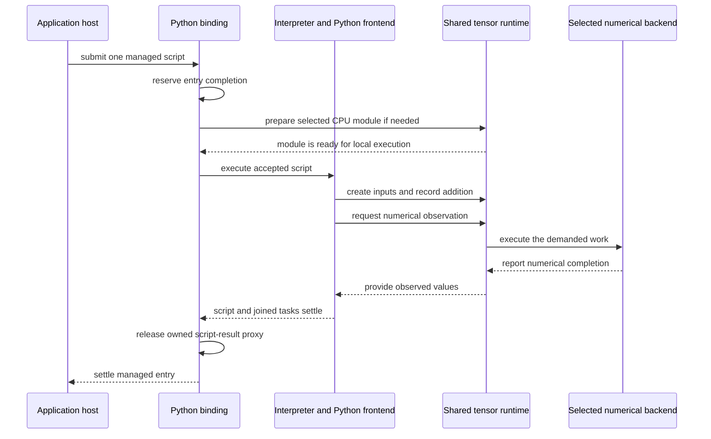
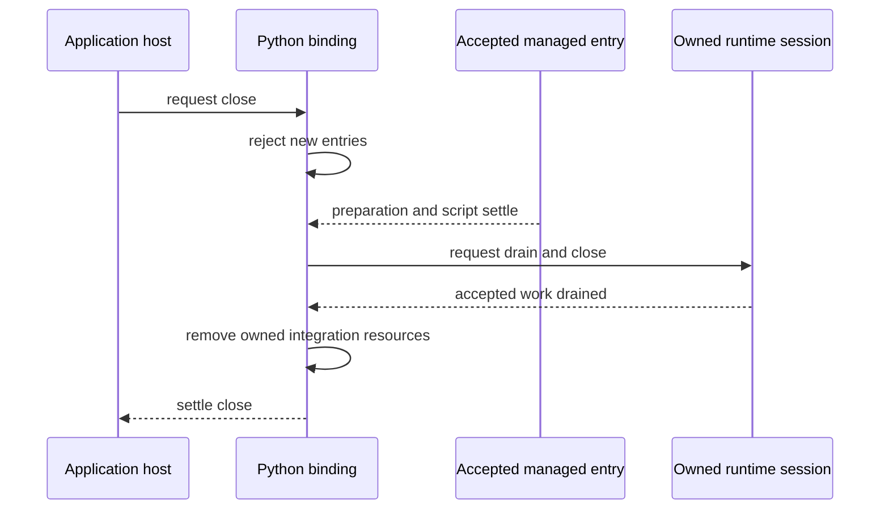

# Following a managed Python session

A list of components tells us where responsibilities live. It does not yet
show what happens when an application starts a calculation, the calculation
waits or fails, and the application asks to close it. This chapter connects
those events into one sequence so their ownership rules have a practical
meaning.

The starting point is an application that wants to run Python tensor work in
the browser. The endpoint is a closed Tabgrad connection whose owned work has
drained, while the application's Python interpreter remains available. This
is a conceptual walkthrough of the
[accepted integration contract](../architecture/python-integration.md), not
an executable installation example or a release-support claim. If the role of
Pyodide is unfamiliar, read [Python in the browser](../concepts/python-in-the-browser.md)
first. Exact supported behavior belongs in [reference](../reference/README.md)
and [compatibility](../compatibility.md).

## Meet the participants before following the calls

The **host** is the application code arranging the work. It prepares Pyodide
in an interpreter worker, retains the interpreter and decides when it no
longer needs a Tabgrad
connection. The **interpreter** executes Python and holds its environment,
including variables and imported modules. It can serve purposes other than
tensor computation.

The **binding** connects that interpreter to one Tabgrad runtime session. It
controls managed script admission and owns the session's closure, but borrows
the interpreter. A **session** groups tensor work and resources managed by the
shared runtime. The **Python frontend** translates the supported Python calls
into that runtime's operations; the **backend** performs the selected numerical
work. These names describe responsibilities, not a sequence of separate
servers or a requirement for a new thread at each step.

Python and the semantic runtime share the interpreter worker. CPU arithmetic
uses a prepared local backend; GPU execution uses an independent backend
worker so it can complete while ordinary Python waits. The host's admission
endpoint remains responsive outside the blocked interpreter. The
[observation architecture](../architecture/python-observation.md) explains this
placement and its shared-memory hosting requirements. Neither an existing
page interpreter nor its objects can be silently relocated by attachment.

Keep one application situation in mind. An application retains a Python setting used
by several interactions. For one interaction it wants to create two small
vectors, add them, inspect the result, and release the tensor session. The
setting should survive that session. This situation exposes why script
completion, numerical completion and interpreter lifetime are not synonyms.

## Preparation: make the environment ready without taking it over

The host first loads the interpreter and the static assets needed by the
integration. Preparing Python establishes somewhere to run code; preparing
Tabgrad establishes the connection through which tensor calls acquire their
meaning. Neither action is equivalent to executing a numerical operation.

Attachment must establish exclusive ownership of the interpreter/session
association. Without that boundary, two independently closing bindings could
both believe they control the same installed Python interface. The accepted
contract rejects a competing pending or active attachment rather than trying
to infer which session the next Python call intended.

Installing integration resources is also fallible. A file may be invalid or a
module name may already belong to the host. The installation is
**transactional**: either the required association is established, or the
attempt removes what it owns without leaving a partially usable frontend.
Rollback must preserve pre-existing resources and host replacements. The
exact integrity, naming and identity rules remain in
[the loading contract](../architecture/python-integration.md#load-static-python-assets-transactionally).

The important boundary is the successful attachment, not merely the completion
of an individual file download. A caller must not receive an apparently ready
connection whose Python modules refer to an incomplete or different session.

## Execution: one admitted script, several kinds of work

After attachment, the host submits a script through the binding's managed
`runPythonAsync` entry. Admission means accepting responsibility for that
script's completion. One script is admitted at a time, with overlap rejected
rather than silently queued. The host endpoint reserves the entry before
asynchronous CPU-module preparation, not after the script starts. It rejects
busy or closed calls before posting to a worker that may already be blocked.
This rule therefore applies even when the host makes two consecutive calls
without waiting.

Before the first accepted script enters Python, the selected CPU module is
fetched, checked and compiled once for reuse. That preparation makes ordinary
local CPU execution possible without waiting on a local initialization Promise
from inside Python. It does not evaluate tensors. Failure here settles the
accepted entry without starting its script; close still joins the accepted
preparation. Later entries reuse the prepared module.

In the vector situation, Python calls the frontend to create its inputs and
record their addition. The runtime validates and records tensor meaning.
**Observation** means asking for actual numerical values, such as the result
needed by the application. That request demands the necessary computation;
recording a pure operation does not by itself require immediate arithmetic.
The distinction is part of [bounded lazy execution](../architecture/bounded-lazy-execution.md).

The diagram also follows completion, not only arithmetic. A script must join
its asynchronous tasks before it returns, so their work is included in its
completion. Pyodide may return a **proxy**, a JavaScript object referring to a
Python object, for the script's final expression. Managed entry releases that
owned reference rather than exporting an arbitrary result. The next section
explains why this small cleanup step matters even after numerical work ends.

Read the arrows from top to bottom as ordering, not elapsed time. The Python
participant groups interpreter execution and frontend calls for readability;
the interpreter does not independently decide tensor semantics. The diagram
also abbreviates preparation and transfer work inside the runtime. It shows
the successful path when observation is requested, not a promise that every
script submits a kernel or performs an observation.

The script must await or join the asynchronous tasks it starts. Otherwise its
return would not identify a point at which it has stopped using the binding.
Likewise, the host must not run raw interpreter calls concurrently with a
managed entry. These are cooperation requirements: admission control does not
inspect every possible Python task or turn arbitrary code into a sandbox.

For a pending GPU observation, the backend worker publishes committed shared
state and requested bytes. The interpreter worker checks that state directly
when it wakes; completion cannot depend on a callback queued on that parked
worker. Local Python tasks are parked too, whereas optional awaitable
observation lets them cooperate at await points. Ready host values and prepared
CPU numerical execution need no remote round trip. The sequence above shows
logical collaboration, not a requirement to send every tensor operation to a
worker or to read intermediate tensors back to Python.

## A return value has a lifetime too

Pyodide can expose the final expression of a script to JavaScript through an
owned Python proxy. Even if the application does not care about that result,
the proxy can retain the Python object. Managed entry deliberately resolves
without exporting an arbitrary result and releases any owned result proxy
before it settles. Otherwise, simply evaluating expressions could silently
accumulate references on the host side.

This does not discard the script's globals or promise to free every object it
created. The application setting survives because the interpreter still owns
its environment. A tensor referenced by Python and numerical state needed by
pending runtime work have their own owners. The
[resource ownership contract](../architecture/python-integration.md#give-wrappers-proxies-and-requests-different-owners)
distinguishes those lifetimes rather than treating script return as a universal
garbage-collection event.

## Failure: distinguish a rejected request from accepted work

Suppose a second host interaction tries to submit a script while the first is
waiting for observation. The second entry is rejected; it has not joined the
first script and should not mutate its Python globals. The host receives an
explicit failure rather than an unexpectedly delayed interaction. This differs
from an exception raised inside the first, already accepted script.

An accepted script may fail through an ordinary Python exception, an invalid
tensor request or an asynchronous execution failure. Its caller receives that
failure, but the binding still has to finish the associated cleanup. A script
error does not authorize bypassing session drain or destroying the borrowed
interpreter. Error type, timing and runtime provenance follow
[the frontend error contract](../architecture/python-integration.md#keep-python-tensors-thin-but-genuinely-python-facing)
and [the asynchronous observation contract](../architecture/python-integration.md#observe-results-without-blocking-browser-progress).

These distinctions matter to recovery. A host can handle an ordinary script
error and decide whether to submit different work or close the binding. A
closed binding is a different state: retrying through it cannot reopen the
old session. Neither case permits the integration to hide the problem by
switching to another backend.

## Closure: stop admission before releasing the session

The host can request close while a script is still active. Close first stops
new entries at the independently progressing host endpoint and then waits for
accepted preparation and script execution to settle. Only then can
the session drain its accepted work and release owned resources. Repeated
close calls share completion rather than initiating competing shutdowns.

The script arrow is conditional on an entry being active. Its failure still
counts as settlement; it does not skip the rest of the sequence. The arrows
after it show why close is a **drain**, not an interrupt: it waits until owned
work no longer needs its resources. The diagram does not imply that a host can
stop an infinite Python loop by obtaining a close promise.

If the script waits forever, cooperative close may wait forever too. Forceful
termination is an application-lifecycle decision outside this binding
contract. For example, controlling a worker has different ownership and data
loss consequences from closing a tensor session; the two must not be silently
substituted for one another.

An entry cannot await the close that is itself joining that entry; doing so
creates a dependency cycle. Backend worker failure has a separate retirement
path: an independent supervisor can invalidate its generation and wake waiting
consumers, but worker termination does not prove GPU drain. Unconfirmed physical
resources remain accounted for rather than being declared reusable. These
failure rules do not make arbitrary user-code interruption part of close.

## After close: preserve the interpreter, not the old connection

Once close settles, the host still owns its interpreter and unrelated Python
state. It may establish another binding, but references to the old binding's
tensors, modules or functions must not silently begin using the new session.
Reattachment creates a new association; it does not rewrite the identity of
objects retained from the old one.

Return to the application setting from the beginning. Preserving that setting
is compatible with releasing the tensor session because their owners are
different. Preserving a Python variable that refers to an old tensor does not
make that tensor valid in a new session. This is the practical payoff of
separating host environment, connection and numerical work.

The sequence establishes where to look when debugging: preparation for
installation failures, entry admission for overlap, script/runtime boundaries
for execution errors, and drain for cleanup that cannot yet finish. It does
not establish timing or memory bounds by itself. For those claims use
[performance evidence](../performance.md); for each participant's complete
obligations return to [the architectural contract](../architecture/python-integration.md).
