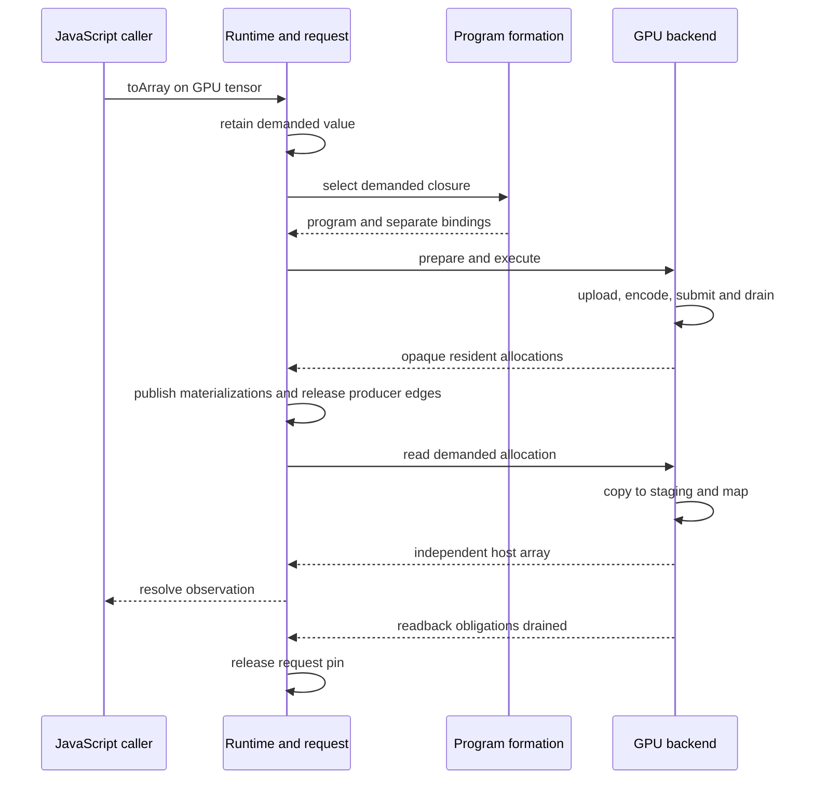

# From a GPU tensor to an observed host array

Calling `add` records a dependency; calling `toArray()` asks the runtime to
realize it. This flow follows that demand through the shared semantic owner and
the GPU physical owner. It starts after the application has acquired a ready
[GPU-enabled session](../reference/webgpu-runtime.md) and ends when the result
has been delivered and its physical work has been accounted for. Those need
not be the same moment.

The participating contracts are the
[common request](../components/runtime-observation.md),
[program formation](../components/program-formation.md) and
[GPU backend](../components/webgpu-backend.md). The application sees tensor
handles and a Promise, not buffers or command encoders.

## Normal demand

The session retains the demanded value before queueing the observation. That
pin protects dependencies even if the application closes all relevant handles
while waiting. Formation selects only the needed closure, stopping at resident
values. It returns immutable executable structure separately from the payload
bindings for this invocation.

The runtime does not traverse unrelated work. Repeated observation of the same
resident value forms a binding-only program and performs readback, without
rerunning its producer. Views retain their own logical shape but refer to the
same full storage; they do not add a GPU copy or arithmetic step.

## Failure is not permission to reuse memory

Suppose mapping fails while the submitted copy is still pending. The backend
returns the failure through the ticket's result. The request attaches the
program's causal context, rejects the caller's Promise and allows the next
logical request to progress. Independent CPU work need not wait for that failed
copy to finish.

The failed request nevertheless keeps its semantic pin, and the GPU owner keeps
the staging allocation. Only physical completion, or accounted terminal device
loss, permits retirement. Closing the session joins that retirement even if
the observation's rejection was already delivered. Mapping continuations are
also joined: a completed queue alone does not authorize destroying memory that
a pending mapping callback may still access.

If the device is lost before observation starts, formation still gives the
failure its demanded operation and program context, but no new GPU execution
is attempted. Loss during execution invalidates that owner and prevents late
callbacks from publishing a valid result. Unknown completion remains visible
in diagnostics; it is not relabeled as a successful drain measurement.

## What this flow does not imply

This is direct JavaScript observation, with ordinary asynchronous browser
progress. It needs no interpreter worker or shared-memory wait mechanism and
does not establish Python GPU support. The
[Python observation architecture](../architecture/python-observation.md) defines
that distinct transport requirement over the same semantic lifecycle. Its
[concrete GPU connection](../components/webgpu-worker-connection.md) follows
shared observation and independent supervision; a direct JavaScript Promise
run cannot qualify those parked-interpreter boundaries.
CPU tensors keep their local synchronous execution path and ordinary default
device. There is no automatic CPU/GPU transfer or fallback in this flow.
