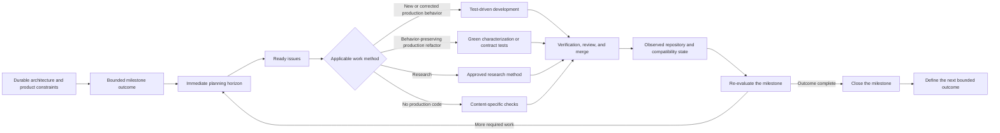
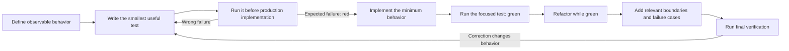

# Planning and implementing Tabgrad capabilities

This guide explains how Tabgrad turns its lasting architecture into small,
testable repository changes without trying to predict the complete
implementation in advance. It is intended for contributors who understand
ordinary software development but need to know how milestones, issues, tests,
performance evidence, and documentation fit together in this project.

The guide connects several authoritative policies rather than replacing them:

- [`project-management.md`](project-management.md) defines GitHub issues,
  milestones, relationships, classification, and the active planning horizon.
- [`quality.md`](quality.md) defines test-driven development, test quality,
  design quality, and required evidence.
- [`performance.md`](performance.md) defines comparable performance and
  resource measurements.
- [`documentation.md`](documentation.md) defines where lasting facts and work
  state belong.
- [`CONTRIBUTING.md`](../CONTRIBUTING.md) defines the complete contribution
  workflow.

## Start with outcomes, not a predicted file tree

Architecture documentation describes responsibilities and invariants that an
implementation must preserve. It deliberately does not prescribe one class or
module for every named concept. Implementation planning therefore starts from
an observable capability, not from a checklist of architectural nouns.

For example, “add a scheduler” names a possible mechanism but does not say what
a user or another component can do afterward. A better planning result states
that a bounded demanded computation is transformed into ordered backend work,
completes correctly, and exposes its failure and resource lifetime. The
implementation can then use the smallest structure that owns those guarantees.

Different records answer different questions:

| Record | Question it answers |
| --- | --- |
| Architecture documentation | Which lasting responsibilities and invariants must every implementation preserve? |
| Milestone | Which bounded integrated outcome must exist before this objective is complete? |
| Issue | Which independently completable and verifiable result is being changed? |
| Compatibility record | Which public behavior is actually supported, in which environments, with what evidence? |
| Pull request | Which exact repository change proposes the issue's result, and how was it checked? |

None is a substitute for another. In particular, an architecture chapter is
not a backlog, and a list of unimplemented API names is not a useful set of
implementation issues.

## Plan through bounded vertical capabilities

A milestone represents a complete capability or release outcome that crosses
the layers necessary to make it real. It does not permanently partition the
project into topics such as the frontend, automatic differentiation, WebGPU,
or WebAssembly. Those topics remain labels and responsibility areas.

A useful milestone states:

- the integrated result that can be observed;
- the conditions that demonstrate completion;
- the deliberately excluded behavior;
- the environments and compatibility scope to which the result applies; and
- the performance or resource consequences that require evidence.

This vertical boundary exposes integration problems early. A collection of
isolated frontend, runtime, and backend implementations can each appear
complete while no supported computation crosses all three. A vertical result
cannot complete until the participating boundaries work together.

## Keep a small active planning horizon

Tabgrad uses progressive planning. For one implementation stream, detailed
planning covers the active milestone and the immediate dependency frontier
that contributors need to choose or start next. Unrelated maintenance or
research may proceed independently under the normal overlap rules.

The planning cycle is:

Possible later work is not expanded into placeholder issues merely to make the
project look complete. A new issue is created when its expected result,
boundary, dependencies, and completion evidence are understood. If an unknown
could materially change those facts, a bounded research issue resolves it
first.

This approach is sometimes called rolling-wave planning: near work is precise,
while distant work remains at the level justified by available evidence. The
planning horizon is not a fixed number of issues or a time-box. It ends where
the next issue would require an unsupported prediction.

## Choose issue boundaries from verifiable results

An implementation issue should normally fit one coherent branch and pull
request. It is large enough to leave the repository with a meaningful result
and small enough to verify, review, merge, and reverse independently.

Good boundaries often follow one observable contract through every layer it
needs. Poor boundaries merely request a file, class, manager, or optimization
whose value cannot be demonstrated on its own.

Use:

- a parent issue when one outcome requires several independently completable
  results;
- sub-issues for those results;
- a dependency when one result cannot truthfully proceed without another;
- a research issue when evidence is needed before implementation can be
  specified; and
- a related link when work shares context but neither contains nor blocks the
  other.

Do not split tests, implementation, documentation, and compatibility updates
into separate issues when they are inseparable parts of one behavior change.
They belong to the same completed result.

## Grow operation coverage from real needs

Broad PyTorch compatibility does not require one speculative issue for every
operation. [`compatibility.md`](compatibility.md) records the support that has
actually been established. Issues describe the next coherent change needed to
extend that support.

Several operations may share one issue when they use the same semantic rule,
backend mechanism, tests, and review boundary. An operation deserves separate
work when it has independent semantics, numerical risk, performance behavior,
backend constraints, or failure modes. Model and application slices help
prioritize which operation families provide useful integrated capability.

This keeps the compatibility record factual and the issue tracker actionable.
Neither has to pretend that the final operation grouping is knowable before
the shared implementation exists.

## Drive production code with tests

After the expected behavior and material design decisions are settled, every
production-code change that adds or corrects executable behavior follows the
test-driven development cycle defined in
[`quality.md`](quality.md#develop-production-behavior-test-first):

The red result matters because it proves that the test can observe the missing
or incorrect behavior. A syntax error, unavailable tool, wrong test name, empty
test selection, or unrelated setup failure is not that evidence. The
contributor records the command, the relevant failure, and why it represents
the intended missing behavior.

The repository does not require a failing commit to be published. Commits can
remain coherent while the issue or pull request preserves concise red and
green evidence. The final test must still be understandable from its
assertions; historical output cannot rescue a test that does not inspect the
promised behavior.

The cycle repeats at the smallest useful behavioral step. It does not mean
writing an entire milestone's test suite before any implementation, nor does
it justify implementing only the example that first failed.

## Keep non-code work outside TDD

For this project, production code is the code distributed as the Tabgrad
library: its runtime, frontends, backends, and packages. TDD applies to new or
corrected behavior in that code. It does not apply to documentation, project
policies, issues, agent instructions, pull request templates, configuration,
repository and test tooling, or research artifacts. Those changes use the
review, validation, and reproducibility checks appropriate to their content;
they do not invent a failing test.

When one repository change contains both documentation and executable code,
only the code behavior uses the red-green-refactor cycle. The documentation is
checked against the resulting code, tests, and authoritative sources.

Related code work begins from the evidence appropriate to its purpose:

- A behavior-preserving production refactor starts from passing
  characterization or contract tests that protect the behavior being
  preserved.
- Exploratory code in an approved research experiment follows the experiment's
  method; production code resulting from the decision returns to TDD.

The pull request records the route that actually applied:

- new or corrected production behavior records its red and green evidence;
- a behavior-preserving production refactor records the passing
  characterization or contract baseline and the final passing result; or
- a change without production code states that TDD is not applicable and
  reports its content-specific checks.

## Test the contracts at the layers that claim them

One test layer cannot establish every Tabgrad claim. A change selects the
smallest applicable combination:

- semantic runtime tests cover values, shapes, data types, aliasing, effects,
  errors, and derivative rules without depending on a private backend schedule;
- backend contract tests run common expectations against WebAssembly and
  WebGPU where both claim support;
- cross-backend comparisons detect physical implementations that disagree;
- compatibility tests compare documented behavior with an independent
  PyTorch development oracle;
- automatic-differentiation tests use analytical references, finite
  differences, or the PyTorch oracle as appropriate; and
- browser, Pyodide, worker, and frontend integration tests exercise the real
  boundaries that the public behavior crosses.

Mocks can isolate a boundary while developing an owner, but they do not prove a
real integration claim. A backend or browser capability skip must be explicit,
and at least one required supported environment must execute the behavior
before it is reported as supported.

## Measure performance and memory separately

Functional TDD establishes correctness, not speed or bounded resource use. A
hot-path change also follows [`performance.md`](performance.md): define the
relevant metric and acceptable consequence, measure a comparable base, make
the change, and compare the exact final state under equivalent conditions.

The measurement should expose the costs that the architecture makes material,
including allocations, retained state, transfers, materializations,
synchronization, compilation, dispatch, and bundle size. Small deterministic
functional tests remain separate from bounded benchmarks. A noisy benchmark
does not become a blocking unit test until its environment and threshold are
stable enough to produce actionable results.

Performance work uses representative inputs without consuming all available
memory or processor capacity merely to produce a larger number. The workload
must be large enough to expose the cost at issue and small enough to run safely
and reproducibly.

## Make documentation concrete with the implementation

Documentation is part of each implementation result. It becomes more concrete
when code and tests establish a fact, not before. The same pull request updates
the authoritative place in which a reader would otherwise receive incomplete
or incorrect information.

| Established fact | Durable location |
| --- | --- |
| Public purpose or high-level execution behavior | Root `README.md` |
| Lasting responsibility, invariant, ownership, or cross-component data flow | Relevant architecture chapter |
| Supported public interface, errors, and examples | API documentation |
| Verified PyTorch support and environmental scope | `docs/compatibility.md` |
| Reproducible setup, command, or required tool version | `docs/development.md` |
| Non-obvious local invariant or implementation contract | Source-level type, function, module, or focused internal documentation |
| Work progress, missing behavior, sequencing, or an unresolved choice | Issue, project item, or pull request |
| Released historical behavior or migration | Changelog and release documentation |

A source file or class does not deserve architectural documentation merely
because it exists. Record a concrete internal detail when another contributor
needs it to preserve a contract across modules, understand a non-obvious
lifetime or cost, or use a supported extension point. Keep ordinary local
mechanics beside the code.

Do not create empty documentation sections for anticipated modules. Do not
describe an intended implementation as implemented behavior. When an
implementation replaces an earlier mechanism while preserving the same
architectural invariant, update the implementation-facing explanation without
rewriting the durable decision as project history.

## Finish an increment before expanding it

An implementation increment is complete only when its issue result, production
change, tests, documentation, compatibility record, performance evidence, and
configured checks agree for the exact final state. Independent verification
and review examine that same state before publication or merge.

Newly discovered required work is classified before the current issue grows.
A defect introduced by the change remains in the issue. A prerequisite blocks
it through a recorded dependency. An independent result becomes separate work.
Optional work does not silently expand the milestone.

After merge, the milestone is evaluated against its outcome rather than its
original ticket count. The next planning wave reflects what the repository now
proves, which is the mechanism that lets Tabgrad learn from implementation
without accumulating a speculative backlog.
