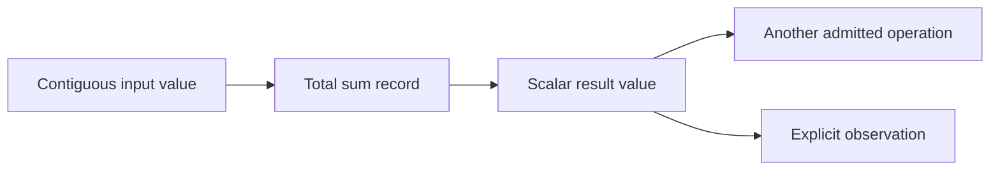

# Total tensor sum

This reference is for Python and JavaScript users who want to reduce a tensor
to a single total, and contributors maintaining that operation. A reduction
combines many input elements into fewer output elements. Total sum combines
every element, so its result is a scalar tensor regardless of the input rank.
It is not a request to copy the input into a Python list or JavaScript array.

Read the [tensor shape explanation](../concepts/tensor-shape.md) for the
difference between a scalar and an empty tensor. Creation and observation are
covered by the [Python tensor reference](python-tensors.md) and
[JavaScript API](../javascript-api.md). This page owns sum-specific signatures,
numerical behavior and limits; it does not claim all PyTorch reduction overloads.

## Call forms and result

Inside a managed Python entry, the three forms below have the same meaning:

```python
import torch

x = torch.tensor([[1.0, 2.0], [3.0, 4.0]], dtype=torch.float32)
a = x.sum()
b = torch.sum(x)
c = torch.sum(input=x)
assert a.shape == torch.Size([])
assert a.tolist() == b.tolist() == c.tolist() == 10.0
```

`Tensor.sum()` accepts no arguments. `torch.sum(input)` accepts exactly one
tensor, positionally or by the `input` keyword. In JavaScript, `input.sum()`
also accepts no arguments and returns a `Tensor`; its shape is `[]`, and
`await result.toArray()` returns a one-element `Float32Array`. JavaScript
callers close their input and result handles under the ordinary session
lifetime contract.

The supported input domain is contiguous CPU `float32`, including scalar,
singleton, multidimensional and empty shapes and whole-contiguous views. The
result preserves dtype and device and owns a distinct scalar value. Empty
input produces positive zero, not an empty tensor. A scalar input also creates
a reduction result rather than returning the original handle.

Dimension selection, `keepdim`, explicit `dtype`, `out`, promotion,
non-contiguous inputs, differentiation and other devices are outside this
operation's contract. Even apparently redundant options such as `dtype=None`,
`dim=None`, `keepdim=False` or `out=None` are rejected, not silently ignored.

## Admission, observation and ownership

The frontend passes an opaque tensor handle to the semantic runtime. Admission
checks that handle and records one input occurrence and scalar output metadata.
It does not load the backend, read tensor elements or run a kernel. Consequently
the result can participate in another calculation before it has numerical data.

The following diagram shows dependency direction, not payload copies. The
reduction's scalar result is also an ordinary input to subsequent operations.



Observation forms the selected program and dispatches the CPU kernel through
the shared execution path. Output allocation uses the scalar shape; input
traversal uses the input's element count. Confusing those counts would read
only one element of a non-scalar input or skip an empty reduction's required
output write. The [CPU storage component](../components/cpu-invocation-storage.md)
explains allocation, last-use retirement and rollback.

Closing the input handle after successful admission does not invalidate the
result. A pending result retains the logical input it needs, including shared
view storage. Dropping the final owner of unobserved work releases it without
executing it. Repeated observation reuses a computed value. Python uses ordinary
`tolist()` inside managed entry, without a new asynchronous method or JSPI.

## Floating-point accumulation is not exact arithmetic

Float32 has finite precision and a finite range. Adding small values to large
ones can lose low-order information; adding sufficiently large values can
overflow. Changing the grouping of additions can therefore change the result,
even though the mathematical expression is the same. Compatibility does not
mean reproducing every bit of one native CPU's reduction algorithm.

Tabgrad accumulates in float32 without implicit widening or a fallback. The CPU
kernel divides large ranges into a balanced tree. Leaves contain at most 128
elements, accumulated in four lanes, then combined pairwise with a scalar tail.
The leaf limit bounds each lane to 32 additions. Scalar and fixed-vector
artifacts implement the same association; SIMD changes how the four lanes run,
not the intended summation order.

For ordinary finite inputs, tests use exact comparison where the chosen values
and intermediate sums are exactly representable. Other fixtures use an
absolute error bound based on input magnitudes and accumulation depth. A small
relative tolerance on the final answer is misleading near cancellation: for
example, the exact sum of float32-converted `[1e20, 1, -1e20, 1]` is 2, while
different float32 orders can give 0 or 1. Neither result should be described as
high relative accuracy. The fixtures retain the native result as well as a
high-accuracy reference and the conditioning information.

### Intermediate overflow and special values

Near the dtype's range limit, backend-dependent differences may include finite
versus infinite results, or infinity versus NaN. This is an explicit numerical
boundary, consistent with [PyTorch's accuracy documentation](https://docs.pytorch.org/docs/2.14/notes/numerical_accuracy.html#extremal-values),
not permission to accept arbitrary incorrect ordinary results.

For `[M, M, -M, -M]`, with `M` the largest finite float32 value, the CPU kernel's
grouping forms positive and negative infinity before combining them into NaN.
The pinned native oracle returns positive infinity for this case. The
mathematical result is zero, but neither float32 algorithm preserves it.
Tabgrad records both outcomes and does not claim classification equality when
intermediate overflow changes the computation. It does not detect and repair
these inputs by switching precision. Applications that require stronger
accuracy must not infer such a guarantee from a float32 return type.

Fixtures containing explicit NaN or infinity still check their specified
classification; NaN payload bits are not compared. Empty and all-negative-zero
fixtures check positive zero. Non-finite values do not disable bounds checks,
change memory ownership or trigger another backend.

## Internal kernel and cost contract

The private raw export is
`tabgrad_sum_f32(input_offset, output_offset, input_length) -> status`.
Offsets and length are unsigned 32-bit values across the WebAssembly interface.
It validates four-byte alignment, the input range and a distinct four-byte
output range. The output cannot overlap a nonempty input. A zero-length input
may point at the end of memory because no input read occurs; the scalar output
must still be writable. Status codes and error transport follow the
[CPU ABI contract](../architecture/webassembly-cpu-backend.md#version-1-raw-abi-and-module-capabilities).

Kernel work is linear in input elements. It creates no per-element runtime
nodes and no input-sized scratch tensor. Balanced subdivision uses at most 26
recursive subdivision levels for an unsigned 32-bit length, plus bounded leaf
state in the module's private stack. Actual accepted lengths remain constrained
by the backend memory limit. Output storage is four payload bytes, with the
allocator's ordinary alignment reservation counted separately.

Admission depends on compact metadata, not payload size. Selected graph
formation and retirement depend on selected values and operand occurrences.
Payload uploads and result readback retain their existing ownership; measuring
only the kernel does not measure those costs, browser startup or Python entry.
Performance claims require the [measurement policy](../performance.md).

## Compatibility evidence and comparison method

The maintained [oracle fixture](../../js-tests/fixtures/python-tensor-oracle.json)
records the pinned PyTorch build, input bits, scalar metadata, native outputs
and comparison category. Its generator fixes native intra-operation and
inter-operation thread counts to one. Tests exercise both raw CPU variants,
direct runtime composition and real Pyodide observation. Browser integration
also exercises worker execution with JSPI disabled.

For finite non-exact fixtures without overflow, let `n` be the element count,
`u = 2^-24`, `A` the sum of absolute input values and
`gamma(k) = k*u / (1-k*u)`. The CPU comparison uses
`k = 37 + ceil(log2(max(1, n/128)))` and the forward bound
`gamma(k)*A + n*2^-149` against `math.fsum` of float32-converted inputs. The
37 allowance covers leaf accumulation, pairwise combination and tails; the
second term conservatively accounts for subnormal rounding. Against the native
oracle, the comparison adds its conservative `gamma(n)*A + n*2^-149` bound,
only for fixture sizes with `n*u < 1`. These are conditioning-aware test bounds,
not a universal relative-accuracy promise or evidence of good performance.

Selected malformed Python calls have native error-class fixtures. Excluded
options have separate Tabgrad-only assertions: PyTorch supports many of those
forms. Invalid Python receivers or arguments raise `TypeError`; closed runtime
handles preserve the usual `JsException` and code. JavaScript rejects forged
receivers with `INVALID_TENSOR` and extra arguments with `TypeError` before
recording work. Kernel errors retain operation provenance and use the shared
rollback and context-quarantine rules.

The scope and accepted numerical boundary are tracked by
[issue #91](https://github.com/isaacperez/tabgrad/issues/91). Release support
claims still require a named release and environment under the
[compatibility policy](../compatibility.md).
