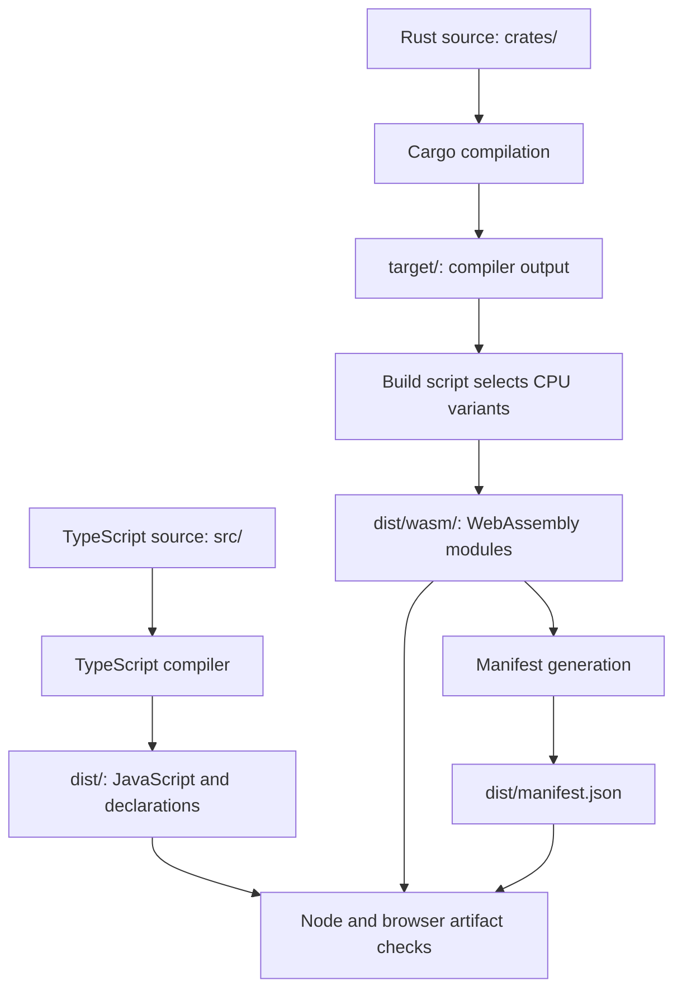

# Repository structure and content placement

This guide is for a contributor who understands programming but is unfamiliar
with Tabgrad's source tree and mixed-language build. It explains where to look,
where a change belongs, and how maintained inputs become browser artifacts.
It is a map of responsibilities and locations, not a catalogue of every file.

Start by separating two questions: **what belongs to the library**, and **what
helps us develop the library**. A browser application needs executable
JavaScript and WebAssembly artifacts. Contributors also need source code,
compilers, test runners, documentation and project automation. Those things
coexist in a checkout, but they do not all become application dependencies.

For the design behind the runtime boundaries, use the
[architecture guide](architecture/README.md). For installation and exact
commands, use [development](development.md). This document owns the repository
map and placement guidance; it links to those more detailed authorities rather
than maintaining another copy of their contracts or version tables.

## Read the tree in three groups

The first group is maintained content: source, tests, tools, documentation and
configuration that contributors deliberately change and review. The second is
committed dependency resolutions, such as lockfiles, which constrain how tools
reproduce an environment. The third is local state created by installation,
compilation or verification. A large local directory can belong entirely to
that third group without representing another Tabgrad subsystem.

The following table covers the maintained top-level directories. Paths are
relative to the repository root. Each row describes a different contribution
responsibility, not a separately published product.

| Location | Purpose | What belongs elsewhere |
| --- | --- | --- |
| [`src/`](../src) | TypeScript source for runtime semantics, browser coordination and backend adaptation, plus internal access used to test those contracts | Build orchestration and executable test cases belong under `scripts/` and `js-tests/` |
| [`crates/`](../crates) | Rust packages, called crates, compiled by Cargo; `tabgrad-wasm-kernels/` owns CPU numerical kernel source | Emitted WebAssembly belongs in build output, not beside the maintained Rust source |
| [`js-tests/`](../js-tests) | JavaScript/Node test cases and browser test or measurement pages | General runner infrastructure belongs in `scripts/`; these pages are not a public example gallery |
| [`tests/`](../tests) | Python tests of repository tooling, including the policy checker and test discovery | Browser runtime tests use the separately configured `js-tests/` route |
| [`scripts/`](../scripts) | Maintained build, check, test-runner and measurement tools used by contributors and CI | Tensor semantics and numerical implementations belong to their runtime or kernel owners |
| [`docs/`](README.md) | Technical explanations, references and durable contributor rules | Work status and unresolved design discussions belong in issues and pull requests |
| [`assets/brand/`](../assets/brand/README.md) | Maintained vector brand artwork and its palette, typography and usage guide | Runtime artifacts belong in `dist/`; font software and temporary design studies are not brand source files |
| [`.github/`](../.github) | GitHub issue forms, the PR template and CI workflow configuration | Complete project rules live in their indexed documents, not only in a template |
| [`.agents/`](../.agents) | Repository-specific skills that apply the documented contributor workflow | Skills do not establish competing technical or project policies |

This separation lets us change how a check is launched without moving the
behavior being checked into the launcher. It also gives readers a way to
distinguish a runtime change from a tooling change before studying individual
functions. Language helps identify the toolchain, but responsibility remains
the stronger placement criterion: Python used for a contributor check is not
the same thing as Python compatibility code executed by a user.

### Source locations are not public interfaces

In `src/`, the runtime coordinates operations and resources, while the CPU
adapter connects executable work to WebAssembly. Numerical CPU source lives
in the Rust crate. These locations implement the accepted responsibilities;
they do not define new architectural boundaries merely by being directories.
A cohesive owner may span files, and a small module need not become a package.

[`src/index.ts`](../src/index.ts) selects the direct JavaScript exports.
[`package.json`](../package.json) defines the package entry through its
`exports` map. The [JavaScript reference](javascript-api.md) defines the
maintained public contract. An internal file or type is not public simply
because a developer can see it in the tree or load an emitted file directly.

For example, `src/testing.ts` exposes internal access used by tests and is
compiled with the TypeScript source. It is not exported by the package's root
entry. That distinction matters when navigating the code: compiled output can
include implementation and test-access modules without promising them as
supported application interfaces. Do not infer supported behavior from a
filename; consult the API and [compatibility record](compatibility.md).

### Why there are two test roots

The roots correspond to different execution environments and configured
discovery paths. `scripts/run_tests.py` discovers Python `test_*.py` files in
`tests/`. Those tests protect repository tooling. They do not execute the
browser tensor runtime merely because they are written in Python.

The Node command in `package.json` discovers `js-tests/unit/*.test.mjs`.
Despite the `unit` directory name, these files include runtime integration,
WebAssembly boundary, public-type and harness checks. The word is a location
label, not a guarantee that every test isolates a single function.
`js-tests/browser/` holds HTML entry pages loaded by the browser harness,
including pages for bounded measurements. The runner and loopback server
support live in `scripts/` so test pages can focus on what they exercise.

When adding a test, identify its subject, required environment and actual
runner before choosing its location. A test file that no configured command
discovers is not useful verification. The
[quality policy](quality.md#select-checks-from-the-affected-risks) determines
the evidence a change needs; the [command registry](development.md#configured-commands)
determines how to run it. Adding a new test environment requires deliberate
wiring and documentation, not just a directory with a familiar name.

## Follow source code into browser artifacts

TypeScript and Rust are maintained inputs, not the files that an application
executes directly. TypeScript becomes JavaScript, with `.d.ts` declaration
files describing types for consumers. Rust becomes WebAssembly, a binary
instruction format executable by the browser. Cargo's `target/` directory
holds compilation output; the distribution build selects artifacts from it.

The build also writes a manifest: a JSON description of the WebAssembly
variants, their requirements and their hashes. It connects the runtime's
artifact loading to the binaries produced by that build. A hash identifies
the selected bytes; it is not a replacement for reviewing the source.

The diagram follows build inputs into outputs. Arrows mean “produces or
supplies input to,” not runtime method calls or permission to publish.

The two compilation paths meet in `dist/`. The JavaScript runtime can load
the manifest and matching numerical modules from that distribution. Tests
exercise those generated artifacts rather than treating the presence of
source files as proof that browser delivery works. The diagram omits the
toolchain configuration and individual test cases to keep that relationship
visible; neither omitted category is optional to a reproducible build.

[`package.json`](../package.json) orchestrates the build: clear `dist/`, build
the CPU variants, compile TypeScript, and write the manifest.
[`tsconfig.json`](../tsconfig.json) maps `src/` into `dist/`.
[`scripts/build-wasm.mjs`](../scripts/build-wasm.mjs) compiles and copies the
CPU modules, and
[`scripts/write-wasm-manifest.mjs`](../scripts/write-wasm-manifest.mjs)
describes the resulting bytes. Edit those maintained inputs when changing
their behavior, not the generated JavaScript, manifest or binary.

A build output directory is not a release. The package's `files` field selects
`dist/` for package content, while its `exports` field selects package entry
points; those are different decisions. Publishing and release verification
follow [the release policy](releases.md). The exact generated paths, sources,
reproduction commands and commit policy belong to the
[generated-file register](generated-files.md#browser-distribution).

## Understand the files kept at the root

The root is the entry point for repository readers and several tools. Moving
its configuration into a generic folder can change discovery, relative paths,
build inputs or automation. Keep those locations explicit rather than treating
root-file count as a reason for a cosmetic move.

| Files | Role and authoritative detail |
| --- | --- |
| `README.md`, `CONTRIBUTING.md`, `AGENTS.md` | Public identity, the contribution entry point, and agent routing instructions; detailed rules are indexed in [docs/README.md](README.md) |
| `LICENSE`, `SECURITY.md`, `CHANGELOG.md` | Project license, security reporting, and versioned change history; [releases](releases.md) owns release procedures |
| `package.json`, `package-lock.json` | JavaScript package definition, scripts and dependency constraints, paired with npm's exact resolution |
| `Cargo.toml`, `Cargo.lock` | Rust workspace membership and shared build profile, paired with Cargo's resolution; each crate has its own manifest |
| `requirements-dev.lock` | Hash-locked Python repository-tool dependencies used by the prepared development environment |
| `tsconfig.json`, `pyrightconfig.json`, `rust-toolchain.toml`, `.node-version`, `ruff.toml` | TypeScript compilation, Python type checking, Rust toolchain selection, Node version selection and Python formatting/lint configuration |
| `.editorconfig`, `.gitattributes`, `.gitignore` | Editor text conventions, Git text/binary handling, and exclusions for local state |

The package manifests describe accepted dependencies; lockfiles preserve the
resolution used to reproduce checks. They belong in Git even though a package
manager may generate them. Installed dependency directories do not. Use the
[dependency policy](dependencies.md) for updates and attribution, and the
[development guide](development.md) for the selected versions and preparation
commands. This map deliberately does not repeat those version values.

## Recognize local state without confusing it with source

A prepared checkout can look much larger than a fresh clone. `node_modules/`
contains installed JavaScript development packages, while `.venv/` contains
the Python tooling environment. Cargo writes compilation state to `target/`;
the Tabgrad build writes browser artifacts to `dist/`; measurements write
reports beneath `test-results/`. Caches such as `.ruff_cache/` and
`__pycache__/` are also local, not additional source owners.

[`.gitignore`](../.gitignore) expresses the exclusions, including other
temporary, report and editor paths. `.git` is different: it is Git's own
repository metadata, or a pointer to that metadata in a worktree. It is not
application output or a disposable cache.

Ignored does not mean empty, valueless or safe to delete indiscriminately. A
temporary directory may contain evidence someone still needs, and an installed
environment may support another task. Check the exact target and ownership
before cleanup. Follow [generated-file cleanup guidance](generated-files.md)
and the [development commands](development.md#configured-commands); do not
treat this map as authorization to remove local state. Disposable experiments
and logs remain governed by their issue and the relevant project policies,
not by a new permanent source directory invented for each experiment.

## Choose a home for a change

Begin with the responsibility being changed and its existing callers. A
runtime semantic rule belongs with the runtime owner, numerical CPU work with
the kernel source, and build orchestration with the build tools. Keep an
internal helper beside the cohesive responsibility it serves; do not put it
in a generic shared folder simply because more than one file calls it.
The [quality policy](quality.md#give-each-unit-one-clear-responsibility)
provides the design criteria, including when a genuinely shared invariant
deserves its own abstraction.

A useful boundary case is a test helper. Code that launches a browser or
serves test assets belongs with harness tooling. Internal access that tests a
runtime-owned invariant can remain beside that owner, as the existing
compiled test-access module illustrates. Neither case should turn the test
runner into an alternative tensor implementation. Determine the behavior and
consumers before deciding from a filename or language alone.

For an explanation, choose the reader's question rather than copying the
source tree into `docs/`. The [documentation index](README.md) leads to
architecture, concepts, components, flows and reference; the
[placement policy](documentation.md#navigate-technical-documentation-by-reader-question)
defines their boundaries. This repository map does not introduce a sixth
technical perspective or require a document for every module.

### Add structure when a responsibility needs it

A subdirectory is useful when it groups a cohesive responsibility and makes
its files easier to locate. A separate package is a stronger boundary: it
adds a manifest and build/dependency relationships that must be maintained.
Consider that extra boundary when there is an actual independent compilation,
dependency or distribution need, not merely because an architectural diagram
contains another box. The Rust crate is a concrete build boundary, not a rule
that every runtime concept must become its own crate or package.

Apply the [abstraction criteria](quality.md#build-abstractions-from-real-invariants)
before adding indirection. Explain which owner or invariant the proposed
location clarifies, which consumers use it and why the existing location no
longer expresses that responsibility clearly. Do not create empty folders,
reserve a path for every anticipated feature, or split cohesive code solely
to reduce file counts. A change to lasting architectural or distribution
boundaries still follows the decision process in
[CONTRIBUTING.md](../CONTRIBUTING.md#making-architectural-decisions).

## Keep the map connected to changes

Update this map in the same pull request that adds, moves, removes or changes
the purpose of a maintained top-level location, root configuration group or
documented source-to-output relationship. An ordinary file added within an
accurately described responsibility does not need another inventory entry.
If a nested responsibility becomes important enough to explain here, add its
reason and boundary rather than enumerating all of its files.

Update directly affected links, manifests, discovery paths and other consumers
when their inputs change. Use [the documentation update rule](documentation.md#update-documentation-with-each-change)
to keep each detailed fact in its primary source: this map for placement,
development for commands, generated files for reproduction, and architecture
for lasting system boundaries. Register changes to source ownership through
the existing [documentation index](README.md#sources-of-truth).

The map describes the repository's maintained organization. Issues, pull
requests and project fields record what is being proposed or implemented;
they are not permanent substitutes for updating it. Conversely, the map must
not become a roadmap of missing directories or unfinished components.
